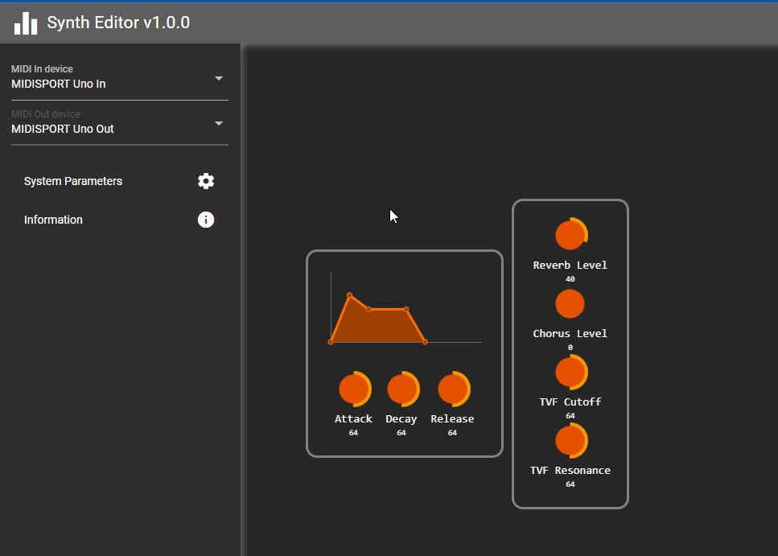

# Audio/MIDI Workshops

Topics covered:

- How to parse various audio file formats.
- How to build a simple synthesizer in Java.
- How to make a native tool to convert an entire MIDI synthesizer into SFZ/Decent Sampler presets
- How to parse proprietary SysEx MIDI messages, especially the Roland ones
- How to backup and restore hardware synthesizers state using SysEx MIDI
- How to build a preset manager for any Synthesizer using https://openjfx.io/ and [SpringBoot 3](https://spring.io/projects/spring-boot)
- How to build a MIDI Editor for any Synthesizer using [Quasar](https://quasar.dev/)/[VueJS](https://vuejs.org/) and [SpringBoot 3](https://spring.io/projects/spring-boot)

|  |  |
|-----------------------------------------------------------------------------------------------------------|---------------------------------------------------------------------------------------------------|

⚠️ **This project is in constant "work in progress"**

# Status

## MIDI workshop

- Midi Sequencer with various clock implementations
- Various Memory maps are provided: **Boss DS-330** (= Sound Canvas), **Roland D-70**
- SysEx are available for various devices allopwing full backup/restore:
  - **Yamaha TG-33**
  - **Yamaha TG-77**
  - **Yamaha TG-500**
  - **Yamaha TX-81z**
  - **Yamaha AN1x**
  - **Yamaha CS1x**
  - **Yamaha Motif Rack XS**
  - **Roland JV-880**
  - **Korg Tr-Rack**
  - **Boss DS-330**
  - **Alesis QS6.1**
  - **AKAI MPK-261**: early stage


The core API rely on a **Midi Device Library** which use a powerful macro system to handle all kind of SysEx. Here an example for the Yamaha TG-33:

```yaml
deviceName: "TG-33"
brand: "Yamaha"
macros:
  - "System Data()       : 0001B : F0 43 20 7E 'LM  0012SY' F7"
  - "Multi Internal()    : 00D12 : F0 43 20 7E 'LM  0012MU' F7"
  - "Multi Edit Buffer() : 000E2 : F0 43 20 7E 'LM  0012ME' F7"
  - "Voice Internal()    : 092FF : F0 43 20 7E 'LM  0012VC' F7"
  - "Voice Edit Buffer() : 0025D : F0 43 20 7E 'LM  0012VE' F7"
  - "Everything()        : System Data();Multi Internal();Multi Edit Buffer();Voice Internal();Voice Edit Buffer()"
  - "setRemote(code)     : F0 43 10 26 07 code F7"
  - "setVoiceMode()      : setRemote($06)"
  - "setMultiMode()      : setRemote($07)"
```  

Available presets are organized by **"device mode"** and **"banks"** allowing easy selection via Bank Select, Program Change or Sysex messages.
It is possible to retrieve automatically all the device preset names (if possible)
```yaml
deviceModes:
  MultiMode:
    command: setMultiMode()
    banks:
      "Preset 1 Multis":
        command: $0010
        queryName: getMultiName()
        presetDomain: 64-79
  VoiceMode:
    command: setVoiceMode()
    banks:
      "Preset 1 Voices":
        command: $0002
        queryName: getVoiceName()
        presetDomain: 0-63
      "Preset 2 Voices":
        command: $0005
        queryName: getVoiceName()
        presetDomain: 0-63
      "Internal Voices":
        command: $0000
        queryName: getVoiceName()
        presetDomain: 0-63
```

Presets can have categories with aliases:
```yaml
    categories:
      - "Piano: AP"
      - "Keyboard: KY"
      - "Brass: BR"
      - "Wind: WN"
      - "String: ST"
      - "Guitar: GT"
      - "Bass: BA"
      - "Ensemble: ME"
      - "Organ: OR"
      - "Ethnic: FI"
      - "Synth Pad: SP"
      - "Synth Lead: SL"
      - "Synth Choir: SC"
      - "Synth Ensemble: SE"
      - "Combination : CO"
      - "Choir: CH"
      - "Chromatic Percussion: TP"
      - "Drum: DR"
      - "Percussion: MI"
      - "Sound FX: SE"
      - "Sequence: SQ"
```
        
## AUDIO workshop

#### Topics

Record and Play audio from/to WAV files.

Support audio channel assignation

#### Supported PCM convertions

|                             | From [0,1] float | To [0,1] float |
| --------------------------- | ---------------- | -------------- |
| Signed 32 bit Little Endian |                  | ✔️ |
| Signed 24 bit Little Endian | ✔️ | ✔️ |
| Signed 16 bit Little Endian | ✔️ | ✔️ |
| Signed 8 bit Little Endian  | ✔️ | ✔️ |
| Signed 32 bit Big Endian    |                  | ✔️ |
| Signed 32 bit Big Endian    |                  | ✔️ |
| Signed 24 bit Big Endian    |                  | ✔️ |
| Signed 16 bit Big Endian    |                  | ✔️ |
| Signed 8 bit Big Endian     |                  | ✔️ |
| Unsigned 32 bit Little Endian |                  | ✔️ |
| Unsigned 24 bit Little Endian |                  | ✔️ |
| Unsigned 16 bit Little Endian |                  | ✔️ |
| Unsigned 8 bit Little Endian  |                  | ✔️ |
| Unsigned 32 bit Big Endian    |                  | ✔️ |
| Unsigned 32 bit Big Endian    |                  | ✔️ |
| Unsigned 24 bit Big Endian    |                  | ✔️ |
| Unsigned 16 bit Big Endian    |                  | ✔️ |
| Unsigned 8 bit Big Endian     |                  | ✔️ |

#### Supported file formats

| Format     | PARSER | READ | WRITE | Comment                                           |
| ---------- | ------ | ---- | ----- | ------------------------------------------------- |
| WAV        | ✔️      | ✔️    | ✔️     | Parse many proprietary chunks                     |
| ACID       | ✔️      | ✔️    |       |                                                   |
| AIFF       | ✔️      | ✔️    |       |                                                   |
| AIFC       | ✔️      |      |       | Compressed AIFF                                   |
| FLAC       | ✔️      |      |       | With metadata like Vorbis comment and ID3 picture |
| ID3        | ✔️      |      |       | In RIFF, Text frames only                         |
| Gigastudio | ✔️      | ✔️    |       | Is an extension of DSL2                           |
| DSL2       | ✔️      | ✔️    |       |                                                   |


#### Audio synth example

- Filters are not implemented yet
- ADSR envelopes are still in early stages.
- The documentation does not cover all the code yet.

Anyway, the VCOs are working and they respond to MIDI. The java synth is working.

## MBT: Midi Backup Translator

A CLI application that will help you to backup and restore the state of your hardware synths in one shot.

## MPM: Midi Preset Manager

A  JavaFX application that will help you to browse and score your favorite synth patches.

We provide a brand new way to use FXML and SceneBuilder together inside Intelliji  without pain.

## Synth Editor

This tool allow you to edit your synthesizer (typically Roland Sound Canvas) using SysEx MIDI messages



- It is in early stage
- The frontend ([Quasar](https://quasar.dev/)+[VueJs](https://vuejs.org/)) communicate with backend with **WebSocket** and **REST**. 
- Components can update the hardware memory in real-time

## Synth Ripper

This little CLI will help you to convert any MIDI synthesizer to [SFZ](https://sfzformat.com/) and [Decent Sampler](https://www.decentsamples.com/product/decent-sampler-plugin/) presets (SFZ works nicely with [TX16Wx](https://www.tx16wx.com/) sampler).

- Everything is automatised: program changes, note changes, velocities
- See YAML configuration files as example
- ⚠️It is not finished yet, need loop detection and trim start and end samples

This tool requires 3 device interfaces:

- It send MIDI notes to a MIDI OUT device, towards your synthetizer
- It record samples from an AUDIO IN device, from your synthetizer
- it monitor the record to an AUDIO OUT device, in order to ear what's going on

You can compile it into **native executable** using [GraalVM](https://www.graalvm.org/) and [Visual studio build tools 2022](https://learn.microsoft.com/en-us/cpp/build/building-on-the-command-line?view=msvc-170#download-and-install-the-tools)

- `build-analysis.cmd`: run the tool in order to prepare the native compilation
- `build-native.cmd`: run the compilation of `synth-ripper.exe`

Usage:

```
>synth-ripper.exe info
 _______ __   __ __   _ _______ _     _       ______ _____  _____   _____  _______  ______
 |______   \_/   | \  |    |    |_____|      |_____/   |   |_____] |_____] |______ |_____/
 ______|    |    |  \_|    |    |     |      |    \_ __|__ |       |       |______ |    \_

synth-ripper 1.0.0
Powered by Spring Boot 3.2.4
Available devices:
MIDI OUT : Microsoft MIDI Mapper
MIDI OUT : Microsoft GS Wavetable Synth
MIDI OUT : ToDAW
MIDI OUT : FromDAW
MIDI OUT : MidiClock
MIDI OUT : 4- MIDISPORT Uno Out
AUDIO IN : Pilote de capture audio principal
AUDIO IN : Microphone (Realtek High Definition Audio)
AUDIO IN : VoiceMeeter Output (VB-Audio VoiceMeeter VAIO)
AUDIO IN : VoiceMeeter Aux Output (VB-Audio VoiceMeeter AUX VAIO)
AUDIO IN : Mixage stéréo (Realtek High Definition Audio)
AUDIO IN : VoiceMeeter VAIO3 Output (VB-Audio VoiceMeeter VAIO3)
AUDIO OUT: Périphérique audio principal
AUDIO OUT: Haut-parleurs (Realtek High Definition Audio)
AUDIO OUT: VoiceMeeter Input (VB-Audio VoiceMeeter VAIO)
AUDIO OUT: VoiceMeeter VAIO3 Input (VB-Audio VoiceMeeter VAIO3)
AUDIO OUT: VoiceMeeter Aux Input (VB-Audio VoiceMeeter AUX VAIO)
AUDIO OUT: Realtek Digital Output (Realtek High Definition Audio)
```

Then edit your YAML configuration file to use the right devices: `config/config.yml`

```yaml
devices:
  inputAudioDevice: "Microphone (Realtek High Definition Audio)"
  outputAudioDevice: "Périphérique audio principal"
  outputMidiDevice: "4- MIDISPORT Uno Out"
```

Then start the rip:

```
>synth-ripper.exe rip -c config/config.yml
```

Presets will be generated in `output`folder

# Audience

Most workshops are made for Java developers knowing zero about MIDI and Audio, nevertheless some projects are much more advanced:
- **Synth Editor**
- **Synth Ripper**
- **MBT: Midi Backup Translator**
- **MPM: Midi Preset Manager**

We are targeting Windows OS but things should work on OSX in the same way.

# Documentation

Go to the [website](https://hypercube-software.github.io/Audio-Workshops).

