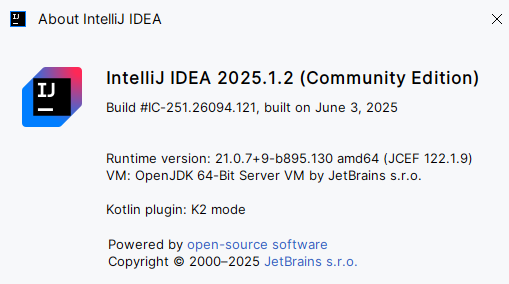
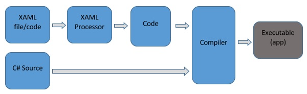

# Deep introduction to JavaFX


# Ecosystem

**JavaFX**, also known as **OpenJFX**, is an open-source framework for creating cross-platform desktop applications.

* Binaries are distributed by [Gluon](https://gluonhq.com/products/javafx/). They can also be found on GitHub [here](https://github.com/SkyLandTW/OpenJFX-binary-windows).
* There is a free visual editor called [SceneBuilder](https://gluonhq.com/products/scene-builder/), also published by Gluon.
* The framework contains native libraries specific to each OS, so there are binaries per OS.
* Gluon offers paid support for businesses.

# Front-end frameworks

If you are a beginner in front-end, it is important to have a good overview of the entire landscape no matter the language your are using. Here some insights...

## Imperative vs Declarative

There are two main families of frameworks:

- The **imperative** ones: the oldest. You write everything imperatively in your favorite language. It is verbose, painful and hard to modify.
- The **declarative** ones: You describe the view declaratively (in XML most of the time), then write imperatively the "actionable" code.

| Name                                                         | Type        | Declarative Language | Imperative Language | Plateform        | Year |
| ------------------------------------------------------------ | ----------- | -------------------- | ------------------- | ---------------- | ---- |
| [Motif](https://en.wikipedia.org/wiki/Motif_(software))      | Imperative  |                      | C/C++               | Unix / X-Windows | 1989 |
| [MFC](https://en.wikipedia.org/wiki/Microsoft_Foundation_Class_Library) | Imperative  |                      | C++                 | Windows          | 1992 |
| [Qt](https://en.wikipedia.org/wiki/Qt_(software))            | Imperative  |                      | C++                 | Any              | 1995 |
| [AWT](https://en.wikipedia.org/wiki/Abstract_Window_Toolkit) | Imperative  |                      | Java                | JVM              | 1995 |
| [Swing](https://en.wikipedia.org/wiki/Swing_(Java))          | Imperative  |                      | Java                | JVM              | 1996 |
| [Carbon](https://en.wikipedia.org/wiki/Carbon_(API))         | Imperative  |                      | C/C++               | OSX              | 1999 |
| [Cocoa](https://en.wikipedia.org/wiki/Cocoa_(API))           | Imperative  |                      | Objective-C         | OSX              | 2001 |
| [Flex](https://en.wikipedia.org/wiki/Apache_Flex)            | Declarative | MXML                 | ActionScript        | Flash            | 2004 |
| [jQuery](https://en.wikipedia.org/wiki/JQuery)               | Imperative  |                      | Javascript          | Browser          | 2006 |
| [WPF](https://en.wikipedia.org/wiki/Windows_Presentation_Foundation) | Declarative | XAML                 | C#                  | Windows          | 2006 |
| [JavaFX](https://en.wikipedia.org/wiki/JavaFX)               | Declarative | FXML                 | Java                | JVM              | 2008 |
| [AngularJS](https://en.wikipedia.org/wiki/AngularJS)         | Declarative | HTML                 | Javascript          | Browser          | 2010 |
| [ReactJS](https://en.wikipedia.org/wiki/React_(software))    | Declarative | JSX                  | JavaScript          | Browser          | 2013 |
| [VueJS](https://en.wikipedia.org/wiki/Vue.js)                | Declarative | HTML                 | Javascript          | Browser          | 2014 |
| ...                                                          |             |                      |                     |                  |      |

You can immediately see something happened around 2006. **Imperative framework are no longer the norm**.

## The bright side

- JavaFX rely on a powerfull rendering engine called **Prism** which is capable of 2D and 3D graphics with **hardware acceleration**. This is mind blowing.
- It provides direct drawing with a **canvas** API
- It includes an API for **animations** and **transitions**
- It provides **bindings** capabilities between the model and the view
- It provides a rich set of controls and layouts
- It provides **theming** and a real **CSS engine** with the use of [vendor specific prefix](https://en.wikipedia.org/wiki/CSS#Vendor_prefixes) `-fx-`
- It provides a decent **WYSIWYG Editor** (SceneBuilder)
- It is multi-plateform
- It is no longer under the scope of Oracle
- It is actively developed by a vibrant community under the website [OpenJFX.io](https://openjfx.io/) 
- And all of this is free.

## The dark side

We are going down the rabbit hole. Hang on !

### Bad tutorials

JavaFX does not enforce the use of declarative view in FXML. So what will happen if Java front-end experts, used to AWT or SWING, start to write tutorials on JavaFX ?  They build the view in pure Java of course ! DON'T DO THAT ! If you see such tutorial, just run away as far as you can.

### Bad WYSIWYG

As far as I known, there is only one WYSIWYG editor for FXML, it is SceneBuilder and despite all its quality, it is based on a very VERY bad idea: 

```
SceneBuilder rely on compiled Java classes for the component view instead of pure FXML. This is a terrible choice.
```

So if you plan to edit your FXML and of course, you are using components defined in other FXML, you have to ... compile them ! There is no way to get away from this. Now what will happen if you use the SceneBuilder plugin inside your IDE (Intelliji) ?



```
The plugin SceneBuilder requires that the IDE run in a "compatible" JDK which can load your custom component, because precisely 
it relies on compiled components. Let say you work on Intelliji 2025.1.2 which is based on JDK 21. 
Can you work on JDK 24 JavaFX Component ? Nope.
```

### Bad MVC

On the paper declarative frameworks are very nice and fit perfectly the MVC architecture:

- The **View** is the markup language (XAML, FXML, HTML...)
- The **Controller** is the code-behind (C#,Java, Javascript...)
- The **Model** is obviously in the same code than the Controller.

But if you take a closer look at **WPF** or **JavaFX**, they both share the same issue:

- At run time the view is materialized as a component like `Windows` or `Button`
- At run time the controller is ALSO materialized in the SAME class as the view !
- So you can say good bye to the nice MVC separation. It's gone. The code-behind and the view are merged together in the same class.

Here is a simple example in **WPF**, the view in XAML looks like this

```xml
<Window x:Class = "FirstStepDemo.MainWindow" 
   xmlns = "http://schemas.microsoft.com/winfx/2006/xaml/presentation" 
   xmlns:x = "http://schemas.microsoft.com/winfx/2006/xaml" 
   xmlns:d = "http://schemas.microsoft.com/expression/blend/2008" 
   xmlns:mc = "http://schemas.openxmlformats.org/markup-compatibility/2006" 
   xmlns:local = "clr-namespace:FirstStepDemo" 
   mc:Ignorable = "d" Title = "MainWindow" Height = "350" Width = "604"> 
...	
</Window> 
```

The controller looks like this: .... surprise....it is a view class (`Window`) !

```c#
public partial class MainWindow : Window {
...
    code behind
...
}
```

Now guess what ? You will find many tutorials, in JavaFX, including the official ones, doing the same.

This is a controller. .. really ? A `VBox` is a controller ?

```
public class CustomControl extends VBox {
}
```

### Bloated Bindings

The majority of front end framework fail in this area, so don't blame too much JavaFX for this.

The main issue is the following:

- In order to be notified of any change in a data object, the framework has to implement an entire notification system on top of the core language
- It is a real pity that none of our favorite languages provide those features out of the box
- Since Java has only non-observable properties (getters and setters), we need to write an observable one
- At the end, your data object will be a real mess

A single read-only observable property require all of this:

```java
public class ReadOnlyNamePerson {
    private StringProperty name = new StringProperty("Unnamed");
    public final String getName() { return name.get(); }
    private final void setName(String value) { name.set(value); }
    public ReadOnlyStringProperty nameProperty() { return name; }
}
```

 A writeable observable property looks like this:

```java
public class Person {
    private StringProperty name = new StringProperty("Unnamed");
    public final String getName() { return name.get(); }
    public final void setName(String value) { name.set(value); }
    public StringProperty nameProperty() { return name; }
}
```

You can found some insane official variations like the "Basic Lazy With Default Value" [here](https://wiki.openjdk.org/display/OpenJFX/JavaFX+Property+Architecture):

```java
public class Rectangle {
    private DoubleProperty x;
    private double _x = 100;
    public double getX() { return x == null ? _x : x.get(); }
    public void setX(double value) {
        if (x == null) {
            _x = value;
        } else {
            x.set(value);
        }
    }
    public DoubleProperty xProperty() {
        if (x == null) x = new DoubleProperty(_x);
        return x;
    }
}
```

Oracle call those wonders: "*Favors runtime performance, minimal static footprint, and moderate dynamic footprint for a more complicated implementation.*"

I call this bloated code. Imagine your data model with 20 observable fields and you have to write all of this yourself !

Some people tried to call [lombok](https://projectlombok.org/) to the rescue without luck. See [this](https://github.com/projectlombok/lombok/issues/521) and [this](https://stackoverflow.com/a/73912795/7921777).

My personal contribution to resolve all of this will be to use  [bytebuddy](https://bytebuddy.net/#/) to forge an observable model on the fly from a regular one. Another alternative would be to generate the code of such model during the build.

### Bloated Events

There is a good reason for the existence of `EventType` in JavaFX but man.... this is so ugly. In order to create your custom event you have to:

- Create a class inhering from `javafx.event.Event`
- Create an `javafx.event.EventType` with a unique name (a string)
- Make sure this `EvenType` instance is unique in the entire system, so create a Map somewhere in a singleton or declare it as `static final`.

Here a standard way to declare events in JavaFX:

```java
public class MyCustomEvent extends Event {

    public static final EventType<MyCustomEvent> CUSTOM_EVENT_TYPE =
            new EventType<>(Event.ANY, "MY_CUSTOM_EVENT");

    private final String message;

    public MyCustomEvent(String message) {
        super(CUSTOM_EVENT_TYPE);
        this.message = message;
    }

    public MyCustomEvent(EventType<? extends Event> eventType, String message) {
        super(eventType);
        this.message = message;
    }

    public String getMessage() {
        return message;
    }

}
```

As you can see the `EventType` is required in the constructor and the entire thing is bloated. 99.9999% of the time this `EventType` is unnecessary for custom events. Imagine if your entire application is driven by 10 or 15 custom events...

You fire the event like this:

```java
fireEvent(new MyCustomEvent("message"))
```

We will see how to fix all of this in a more elegant way.

### Missing pieces

Now the worst of the worst. Don't panic, we will see how to fix all of this later.

If you take a look on how Microsoft handle its XAML, they include a compilation step to generate the component class. So really, the XAML is just a C# class which inherit from a component of the framework (Button, Window, ...).



Because C# provides the concept of ["partial" classes](https://en.wikibooks.org/wiki/C_Sharp_Programming/Partial_classes), they are able to **separate** the code of the controller from the one generated by the XAML processor. 

⚠️Now back to JavaFX, can Java do the same ? Nope. So it is impossible to convert the FXML to a Java class and at the same time write a controller which is also this class. **They had to choose one or the other and they choose... the wrong one !**

```
JavaFX does not compile the FXML into a real Java class. This is a major design flaw. An FXML file does not inherit from a Button or a Window. 
The Controller does. Only the controller have a real existence as a Java Class. 
When SceneBuilder load a custom component, it loads a controller which is ALSO a javafx.scene.Node. This will cause issues.
```

Entering the **FXMLLoader**: this is the class that try to "fix" this irreconcilable situation.

`FXMLLoader` operate in two "modes" but only one is really the right one:

- If you are using `<AnchorPane ...>` as root tag in FXML prepare for pain. Things will never works properly.
- If you are using `<fx:root type="AnchorPane " ... >` as root tag in FXML things will work properly.
- I don't even talk about `<fx:include>` which is incompatible with `<fx:root>` syntax.

In **first mode**, `FXMLLoader` will try to create an instance of `AnchorPane` for you and your controller is not supposed to be a component. Sound good ? No it is not. As soon as you are using SceneBuilder things will get very VERY wrong. Because it expects a class which **inherit** from `AnchorPane`, not just an `AnchorPane`. A FXML file called `MyComponent` is not supposed to be the exact class `AnchorPane`. It should be a Java class `MyComponent.class` inheriting from it.

Note also that in first mode, it is impossible to use **custom component properties** because, precisely, you don't have a class to declare them.

In the **second mode**, `FXMLLoader` is able to "glue" together the FXML and the controller in a single class which **inherit** from a component. Here an exemple from an official tutorial:

```java
public class CustomControl extends VBox {
    public CustomControl() {
        FXMLLoader fxmlLoader = new FXMLLoader(getClass().getResource("CustomControl.fxml"));
        fxmlLoader.setRoot(this);
        fxmlLoader.setController(this);
        fxmlLoader.load();
    }
    ... code behind...
}
```

Now, if you take a closer look, what do you see ? 

- Why the hell, they do `fxmlLoader.setRoot(this)` ? 
- Why the controller as to be a component (inherit for `javafx.scene.Node`) ?
- What don't we do `fxmlLoader.setRoot(new MyCustomView())` and keep a nice MVC separation ?

**The response is**: because they "forgot" to compile FXML into a real Java class like Microsoft do with XAML. that's all. It is a **design flaw** and we are going to fix all of this in a very simple way.

# Fixing JavaFX

## Pure MVC

### ControllerHelper

We are going to respect the MVC keeping UI component away from the controller class. The class `ControllerHelper` will use `FXMLLoader` in the right way to do this properly.

```java
 public static <T extends Node, View> T loadFXML(T widget, String controller) {
     var viewClass = widget.getClass();
     var loader = new FXMLLoader(viewClass.getResource(viewClass.getSimpleName() + ".fxml"));
     ...
     controllerInstance = // do whatever you need to, we can use spring to create a controller bean for instance
     ...
     loader.setController(controllerInstance);
     controllerInstance.setView(widget);
     widget.setUserData(controllerInstance);
     loader.setRoot(widget);
     T view = loader.load();
     return view;
}
```

As you can see `setRoot()` no longer use the controller. We use a specific class for the view and this class is gonna be generated during the build.

You have a clean separation between the View and the Controller.

### Interfaces

Our implementation of the MVC is based on two simple interfaces:

- The controller will use the interface `com.hypercube.util.javafx.controller.Controller`

- The view will use the interface `com.hypercube.util.javafx.view.View`

Both provides facilities to get the view from the controller and vice-versa.

## jShell to the rescue

We could write an entire maven plugin to generate java code during the build but there is a better way: use `exec-maven-plugin` to run a jshell script located in `src/main/jshell/JavaFXGenerator.jsh`

This very simple script will do the following:

- Collect all FXML in the project. You have to use `fx:root` syntax. **It is a requirement.**
- Generate the corresponding Java class in `target/generated-sources`
- Generate custom properties for your UI component based on a simple rule explained later
- The generated class inherit from the right JavaFX type (`GridPane` typically)
- The generated class will also implement our interface `com.hypercube.util.javafx.view.View`
- The constructor of the generated class will call `ControllerHelper.loadFXML(this);`
- This generated class is the **view** in MVC terminology.

And that's pretty much it ! If you do that, SceneBuilder will work properly with your FXML and your MVC design will be ok.

## SceneBuilder

The generator take also care of a very problematic situation with SceneBuilder plugin running inside an IDE: due to the presence of multiple class loaders, you can end-up with this error:

```java
Caused by: java.lang.IllegalArgumentException: EventType "ScoreChangedEvent"with parent "EVENT" already exists
at javafx.event.EventType.register(EventType.java:186)
at javafx.event.EventType.<init>(EventType.java:128)
```

Despite all your effort, you will have duplicate definitions of EventTypes.

So in order to prevent this, we just have to detect when the UI component is instantiated inside SceneBuilder instead of the JavaFX application. 

A simple boolean will do the trick:

```java
if (ControllerHelper.isNonSceneBuilderLaunch()) {
	getView().addEventHandler(EventHelper.getEventType(eventClass), callback);
}
```

The main application just have to do:

```java
ControllerHelper.setNonSceneBuilderLaunch(true);
```

## EventHelper

Our `EventHelper` allow you to reduce boilerplate code for custom events. You just have to write this:

```java
@Getter
public class ScoreChangedEvent extends Event {
    private final int score;

    public ScoreChangedEvent(Object view, EventTarget target, EventType<?> eventType, int score) {
        super(view, target, eventType);
        this.score = score;
    }
}
```

You will fire like this:

```java
fireEvent(ScoreChangedEvent.class, score);
```

Since this method is directly available from the controller interface `com.hypercube.util.javafx.controller.Controller`

Under the hood the `EventType` identifier will be simply the name of the event class.

If you want to listen the event simply do the following in the controller `initialize` method:

```java
addEventListener(PatchScoreChangedEvent.class, this::onPatchScoreChanged);
```

The event handler in itself looks like this:

```java
private void onPatchScoreChanged(PatchScoreChangedEvent patchScoreChangedEvent) {
      ...
}
```


## FXML as source

With a little bit of effort in the `pom.xml` you can make things even better: put the FXML in the same folder than the controller.

```xml
<build>
        <resources>
            <!-- Section required to allow fxml in the same folder than java files -->
            <resource>
                <filtering>true</filtering>
                <directory>${project.basedir}/src/main/java</directory>
                <excludes>
                    <exclude>**/*.java</exclude>
                </excludes>
            </resource>
            ...
```

At this point we are close to what a **WPF** or **Flex** developer would expect. The code behind has to be in the same folder of the view code. Not 10 km away in `src/main/resources`

## ModelHelper

This is the most important helper. Its goal is to generate on the fly JavaFX properties using [bytebuddy](https://bytebuddy.net/#/)  API.

You application data model is just a POJO:

```java
@Getter
@Setter
public class MainModel {
    private List<String> devices = new ArrayList<>();
    private List<String> deviceModes = new ArrayList<>();
    private List<MidiPresetCategory> modeCategories = new ArrayList<>();
    private List<String> modeBanks = new ArrayList<>();
    private DeviceState currentDeviceState = new DeviceState();
    private String currentPatchNameFilter;
    private int currentPatchScoreFilter;

    @NotObservable
    private Map<String, DeviceState> deviceStates = new HashMap<>();
    private String info;

    // Here how to provide the Observable version of this model to the application
    private static MainModel observableInstance = null;
    public static MainModel getObservableInstance() {
        if (observableInstance == null) {
            observableInstance = ModelHelper.forgeMMVM(new MainModel());
        }
        return observableInstance;
    }
}
```

But you just have to provide an observable version of it with:

```java
observableInstance = ModelHelper.forgeMMVM(new MainModel());
```

That's all. **Now all the properties are observable** unless you decorate them with ` @NotObservable`

In this example: for a given field `info` you will have in the observable model:

- `getInfo()`
- `setInfo()`
- `infoProperty()`

The beauty of this is that you don't have to write tons of boilerplate code. `ModelHelper` do it for you.

- And if you set an non-observable object to one of those fields, it will be also immediately converted to an observable one.
- Of course your entire application is intended to work with the observable version of the object

How to use an observable model in a controller ? just use `setModel`:

```java
@Override
public void initialize(URL url, ResourceBundle resourceBundle) {
    setModel(MainModel.getObservableInstance());
}
```

Now you can do bindings from FXML towards your model:

```xml
<PatchScore fx:id="scoreFilter" alignment="CENTER" score="${controller.model.currentPatchScoreFilter}"/>
```

## Custom properties

Since our UI component class is automatically generated from the FXML, we need to declare custom properties directly from the XML. Unfortunately this is not provided by the framework JavaFX. So I decided to go for `<fx:define>`

- Our generator will automatically convert all `<fx:define>` to an observable JavaFX property in the View class.
- This property will be properly detected by SceneBuilder

### Generation

Example:

```xml
    <fx:define>
        <String fx:id="score"/>
    </fx:define>
```

Is converted to:

```java
    // PROPERTY score ------------------------------------------------
    private final StringProperty score = new SimpleStringProperty();
    public String getScore() {
        return score.get();
    }
    public void setScore(String value) {
        this.score.set(value);
    }
    public StringProperty scoreProperty() {
        return score;
    }
```

### Bindings

Unfortunately, the content of custom properties is not available inside `initialize()` controller method.

Fortunately, we provide a `PropertiesHelper` to fix all of this elegantly.

## PropertiesHelper

This helper is less important but provide very useful feature: 

- Take care of releasing event listeners when the UI component is removed from the scene.
- Allow the controller to be notified when your custom properties are set

The generator will put the following in all UI components:

```java
propertiesHelper.installSceneObserver();
```

This allow us to be aware of the UI component lifecycle directly from the controller in regard to the JavaFX Scene.

- `removeListener` is called when the UI component is removed from the scene
- This prevent any memory leak regarding the listeners

For every custom property declared in the FXML, the UI component will call:

```java
propertiesHelper.declareListener("score",scoreProperty());
```

The controller is simply notified with 2 possibles method:

- Create a method `onXXXChange` for the custom property of your interest
- Override the method `onPropertyChange` for all properties changes

For instance:

```java
public void onScoreChange(String oldValue, String newValue) {
       updateScore(getScore());
}
```

Second method:

```java
@Override
// override this method to be notified for ALL custom properties
public void onPropertyChange(View<?> widget, String property, ObservableValue<? extends String> observable, 
	String oldValue, String newValue) {	
	if (property.equals("score")) {
		updateScore(getScore());
	}
}
```


## ObservableSerializer

This is also a usefull class if you plan to save your data model to disk. You need to skip all the JavaFX properties. This is the goal of the `ObservableSerializer`

Use it as usual with [Jackson](https://github.com/FasterXML/jackson):

```java
var mapper = new ObjectMapper(new YAMLFactory());
SimpleModule observableModule = new SimpleModule("observableModule");
observableModule.setSerializerModifier(new ObservableSerializer());
mapper.registerModule(observableModule);
// serialize the observable model in YAML
mapper.writeValue(configFile, myObservableModel);
```

