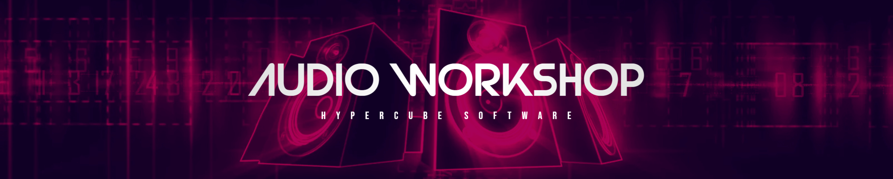

# 

# Audience

This workshop is made for **Java** developers knowing zero about MIDI and Audio.

We are targeting Windows OS but things should work on OSX in the same way.

We cover many subjects:
- An overview of MIDI and Audio landscape
- How to parse various audio file formats
- How to receive and send MIDI data
- How to play a sound
- How to put everything together and make a simple synth

# Why Java

- C++ entry level is too high and full of deadly traps.
- Python or Typescript are nice but too slow
- You can achieve cool things in JDK 17+ without too much effort
- Using the new garbage collector called [ZGC](https://www.baeldung.com/jvm-zgc-garbage-collector), you can expect to have stable real-time applications.
- There have been many improvements in the JVM landscape, especially with [GraalVM](https://www.baeldung.com/graal-java-jit-compiler). You can now convert your Java application into a native one to compete with C++.
- You can build very nice Desktop applications with [JavaFX](https://openjfx.io/). Nevertheless this workshop will cover only CLI applications to keep it simple.

# Free Tools

Depending on what you want to achieve, some tools will be required. 

⚠️ Don't install all of this right now !

- A virtual MIDI cable: [loopMidi](https://www.tobias-erichsen.de/software/loopmidi.html)
- A virtual Audio cable: [VB-Cable](https://vb-audio.com/Cable/)
- A MIDI Monitor: [MidiView](https://hautetechnique.com/midi/midiview/)
- A Virtual MIDI Keyboard: [VMPK](https://vmpk.sourceforge.io/)
- A VST Host: [Cantabile](https://www.cantabilesoftware.com/), [KushView Element](https://kushview.net/)
- An ASIO Driver for the VST Host: [ASIO4All](https://www.asio4all.org/)
- Some VST Instruments: [Odin 2](https://www.thewavewarden.com/odin2), [SurgeXT](https://surge-synthesizer.github.io/), [Vital](https://vital.audio/), [TripleCheese](https://u-he.com/products/triplecheese/), [Decent Sampler](https://www.decentsamples.com/product/decent-sampler-plugin/),[TAL-U-No-62](https://tal-software.com/products/tal-u-no-62)
- A DAW: [Bandlab Cakewalk](https://www.bandlab.com/products/cakewalk)
- An audio Editor: [Ocenaudio](https://www.ocenaudio.com/), [Audacity](https://www.audacityteam.org/)

You can seek more free items on [this site](https://plugins4free.com/).

You can found tons of free libraries for Decent Sampler on https://www.pianobook.co.uk/

- [Claustrophobic Piano](https://www.pianobook.co.uk/packs/claustrophobic-piano/) (1.5GB)
- [Frozen Glock](https://www.pianobook.co.uk/packs/frozen-glock/) (112MB)
- [Tongue Drum](https://www.pianobook.co.uk/packs/tongue-drum/) (35 MB)
- [Shivering Waves](https://www.pianobook.co.uk/packs/shivering-waves/) (19MB)

You can also download sounds for free:

- https://freesound.org/ an entire database of free sounds at any quality

# API

- [Java Sound](https://docs.oracle.com/javase/8/docs/technotes/guides/sound/index.html)
- [FF Sampled SP](https://www.tagtraum.com/ffsampledsp/) (Read various audio format using FFMpeg)
- [Jipes](https://www.tagtraum.com/jipes/) (Audio features extraction)
- [Apfloat](http://www.apfloat.org/apfloat_java/)

# Banners

Banners are generated with [Spring Boot Banner generator](https://devops.datenkollektiv.de/banner.txt/index.html) using the font `standard`.
