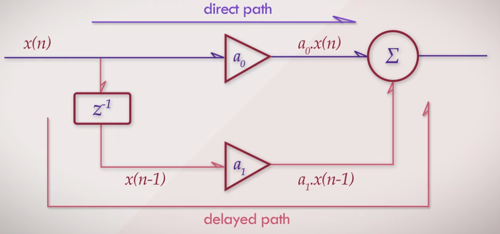

# Introduction to Digital Audio

Don't panic, despite the vast amount of things in this area there is a way to know just enough without sinking.

If you want to have top notch explanations, take a look on the work of [Akash Murthy](https://www.youtube.com/@akashmurthy), in its Youtube playlist [Digital Audio Fundamentals](https://www.youtube.com/playlist?list=PLbqhA-NKGP6B6V_AiS-jbvSzdd7nbwwCw). This is fantastic.

# Sampling

## Samples

In Digital audio we work with **samples**. but samples of what ? Well, here the thing:

> A sample correspond to the amount of voltage sent to a speaker to **push** or **pull** some air. It is a value in the range `[-n ,n]` where `n` is the biggest air pressure you can represent. The same goes when your record a sound with a microphone, the air pressure is converted to the range `[-n ,n]`
>

In Audio synthesis we often use analog jargon related to voltage. It is important to understand that this is not really correct. At some point in the audio signal chain, we convert air pressure to/from voltage and then to samples.

- The voltage is encoded in binary with a fixed size called the **Bit Depth**. Typically 16 or 24 bits.
- Each measurement is done very regularly at a frequency called the **Sampling frequency**. Typically 48Khz.

This process is called the **Pulse Code Modulation**.

## PCM

There are many ways to convert voltages to samples. 

- PCM: [Pulse Code Modulation](https://en.wikipedia.org/wiki/Pulse-code_modulation), used by all sound cards in the market. The standard.
- PWM: [Pulse Width Modulation](https://en.wikipedia.org/wiki/Pulse-width_modulation), you can play with that with any Arduino.
- PAM: [Pulse Amplitude Modulation](https://en.wikipedia.org/wiki/Pulse-amplitude_modulation), used for very high speeds (UBS4,  PCI Express 7,...)
- PPM: [Pulse Position Modulation](https://en.wikipedia.org/wiki/Pulse-position_modulation), used in RFID
- PDM: [Pulse Density Modulation](https://en.wikipedia.org/wiki/Pulse-density_modulation), used in Sony SACD. You can play that with any Playstation.

More info can be found in [this wonderful video](https://www.youtube.com/watch?v=wn71QBApCRg) from Akash Murthy.

The PCM is the de-facto standard in Audio despite the superiority of the PDM.

- **PCM**: the sampling frequency and the bit depth is fixed. It requires two important components called ADC/DAC
- **PDM**: the sampling frequency change through time, the bit depth is 1. Yes one ! No ADC/DAC are involved.

If you are interested in the difference between **Audio CD/DVD** and **Sony SACD**, take a look on Paul McGowan [here](https://www.youtube.com/watch?v=DrXaiKZDXO8).

## ADC/DAC

I'm not going into the rabbit hole here, but you just have to know those two guys are responsible to convert voltage to/from samples.

- **ADC** stands for Analog to Digital Converter
- **DAC** stands for Digital to Analog Converter
- Your sound card contains those essential components.

Both of them must run at a precise rate to record or play samples very regularly. This is the **sampling frequency** or **Sample rate**.


If you take a look on such signal, **you need to know the sampling frequency used to record it before playing it**. 

Here we send 14 samples to the sound card to generate air pressure through the speaker. The speaker should reproduce the very same sound wave in the real world.

- If we send those values every 22.67 microseconds, exactly like it was recorded, we will be able to ear the signal properly.
- If we send those values every 125 microseconds, it's gonna be ugly: the signal will be slower so the pitch will be lower
- The same goes if we send those values every 45.34 microseconds, the signal will be faster so the pitch will be higher

💡 This is why every sound file contains some information about the recording: you have to know the sampling frequency used during the record.

## Nyquist frequency

Sampling frequency, also called **Sampling Rate** determine the **quality** of your sound wave. This is pretty much the same idea than the frame rate in video: the more you take pictures, the better you see fast movements. Here in audio, the more you sample fast, the better you can ear high frequencies.

- 44.100 Khz is the CD Quality, it correspond to 1 sample each 22.67 microseconds and to 44100 samples per seconds
- 48.000 Khz is the DVD Quality, it correspond to 1 sample each 20.83 microseconds and to 48000 samples per seconds
- 8000 Khz is ugly, it correspond to 1 sample each 125 microseconds and to 8000 samples per seconds

So we send samples to a speaker at a specific sample rate. What about the pitch of this signal ? **The pitch correspond to the period of your waveform.** 

- If it is short it will be high
- If it is long it will be low


You can imagine now there is an issue with sampling:

- If you sample to slow, there is no way to reproduce high pitch
- So there is a relationship between the sample rate and the maximum frequency of your generated signal

This limit is called the [Nyquist frequency](https://en.wikipedia.org/wiki/Nyquist_frequency) and it is very VERY important. 

**The Nyquist frequency is half of your sample rate**. If your signal goes above this, you will output garbage. In a more academic way it will occur a phenomenon called **Aliasing**.

- At 44.100 Khz, you can't output a signal above 22,050Khz
- At 48Khz, you can't output a signal above 24Khz
- The best way to prevent this, is to use **filters**.

💡 Now guess what ? The Human ear stop around 20Khz, this is why the sampling rate of Audio CD is enough. There is no point to output frequencies above 20Khz. Despite all of this a lot of people continue to talk about high sampling frequencies like 96Khz or even 192Khz.

You can take a look on [this video](https://www.youtube.com/watch?v=rw-7fkEDmDw) to see a professional explanation of Aliasing by Dan Worrall:


## Volume

Volume is pretty much the same than the air pressure recorded in each samples. A sine wave in the range [-1,1] sound louder than one in the range [-0.5,0.5].

Nevertheless, they are many ways to talk about volume, this is a subject in itself called **Loudness**.

- A sample value express some kinds of "instantaneous volume"
- You can also convert samples to decibels (dB) in various ways to express a **ratio of volumes**
- You can do an average among multiple samples to express an "integrated volume"
- And finally you can take into account the human ear to talk about perceived volume.

We won't get into that right now, but to give you a picture, here is a professional metering software called [Insight](https://www.izotope.com/en/products/insight.html) displaying all kinds of loudness measurements you can imagine:


💡 You will found tons of information with Akash Murthy, in [this](https://www.youtube.com/playlist?list=PLbqhA-NKGP6DAkB4eYDsnNMQh9a9nvQh9) Youtube playlist

## Amplitude

Taking values at a regular speed is one thing, but what about the value of each samples. Are they accurate ? Not so much !

As we saw, the ADC/DAC convert voltage to a number. You convert an analog value, with infinite precision to a digital number with finite precision.

Obviously, you can't convert any voltage with an infinite precision. You have to fix it with a certain amount of bits.

- 8 bits gives you 256 possible values, that's not good at all
- 16 bits gives you 35536 possibles values, it is good
- 24 bits gives you 16777216 possibles values, it is very good
- This is called the [Bit depth](https://en.wikipedia.org/wiki/Audio_bit_depth) of the signal.

Here some examples:

- For float samples, we are in the range `[-1,1] `
- For 8 bit signed samples, we are in the range `[-0x80,0x7F] `
- For 16 bit signed samples, we are in the range `[-0x8000,0x7FFF] `
- For 24 bit signed samples, we are in the range `[-0x800000,0x7FFFFF] `
- For 8 bit unsigned samples, we are in the range `[0x00,0xFF] `
- For 16 bit unsigned samples, we are in the range `[0x0000,0xFFFF] `
- For 24 bit unsigned samples, we are in the range `[0x000000,0xFFFFFF] `

The process of converting a voltage to a digital number is called [quantization](https://en.wikipedia.org/wiki/Quantization_(signal_processing)) and it has inherently an error associated with it: this is the **quantization error**. The less bits you have, the bigger it is.

💡 Quantization error mean "I don't have enough bits to represent those little tiny variations in voltage amplitude". It produces **noise**.

It is important to understand that any sampled signal bring some noise in low amplitudes. This zone is ugly and you don't want to ear it. 

- The more bits you have, the lower is the noise floor
- If you listen **Classical music**, quantizing at 24 bits is a good idea because the music contains many sections at low volume.
- If you listen **Dubstep music**, it is so compressed that you don't need a lot of bits to play it: the volume is alway high.

So quantization brings the concept of [dynamic range](https://en.wikipedia.org/wiki/Dynamic_range) in music: 

- It correspond to the ratio between the highest sample and the lowest sample. The unit is  in dB
- The dynamic range of human hearing is roughly 140 dB. This is very good and it certainly requires more than 8 bits !

💡 For more information, take a look on [this video](https://www.youtube.com/watch?v=1KBLguIXL30&list=PLbqhA-NKGP6B6V_AiS-jbvSzdd7nbwwCw&index=5).

## Frequencies

Now we are getting into the most exiting part of digital audio. Until now, we saw sine waves, but we didn't talk so much about the content of a complex signal. What happen if you sum two different sine waves ? 2 of them, 100 of them ? 10000 of them ? Is it possible to retrieve them from the final signal ? Is it possible to remove part of them ?

We are getting into the wonders of the **frequency domain** which is the dual of the **time domain**.

- Any audio signal can be represented in the frequency domain and in the time domain
- In time domain we have an array of samples
- In frequency domain we have an array of frequencies called a **spectrum**.

Here is picture showing the duality between those two domains:


As you can see, the frequency domain require less data than the time domain to depict the signal. This is why many compression formats like MP3 work on the frequency domain to compress the sound.

Nevertheless, working in such domain is costly, so it is common to implement, let say a filter, in the time domain whereas it does something in the frequency domain.

What about precision ? Well, this is pretty much the same story than quantization in time domain: 

- In time domain the **number of bits** set the quality of the waveform: the **Bit depth**
- In frequency domain the spectrum is also divided in what is called **frequency bands**. The number of bands set the quality of the spectrum.
- The number of bands is directly related to the number of samples you are using to compute the spectrum

# File Formats

Saving audio to a file is relatively easy:

- First you need to write in the header the **Sample rate** and the **Bit depth**.
- Then you just have to write the PCM samples coming from the sound card "as is".
- If you record multiple channel at once, the samples are multiplexed by the soundcard. You keep this representation in the file.

But it is not as easy at it seems after all:

- You have to take care of the [endianness](https://en.wikipedia.org/wiki/Endianness): write a sample in **Big endian** or **Little endian**.
- Each audio format use a specific endianness, none of them write it in their header.
- You also need to know if the samples are **signed** or not (they are most of the time).

## *.pcm

This is not really a file format since there is no header. It contains only the samples so if you load that in a software, it will ask you which sample rate, bit depth and endianness must be used.

## *.wav

The standard on Windows. It contains not only the required informations about the samples but also plenty of additional metadata wich are out of the scope of this workshop. 

- Writing or reading a wav file means you have to understand the [RIFF file format](https://en.wikipedia.org/wiki/Resource_Interchange_File_Format).
- The RIFF specification can be found in PDF. It is called "*Multimedia Programming Interface and Data Specification 1.0*" by Microsoft and IBM in 1991
- The Java API can do it for you, but it is fun to write your own reader/writer
- The endianness is **Little Endian**
- 8 bit WAV are always **Unsigned**, otherwise they are **Signed**.

## *.aiff

The standard on OSX. Same thing than WAV.

- [AIFF](https://fr.wikipedia.org/wiki/Audio_Interchange_File_Format) is a direct competitor of RIFF.
- The Java API can do it for you, but it is fun to write your own reader/writer
- The endianness is **Big Endian**
- Samples are always **Signed**.

## Channels

⚠️ Don't mistake **Audio channels** and **MIDI channels**. They are completely different.

The order in which samples are multiplexed is vaguely standardized. You can found some information in ffmpeg community [here](https://trac.ffmpeg.org/wiki/AudioChannelManipulation).

```
Standard channel layouts:

NAME           DECOMPOSITION
mono           FC
stereo         FL+FR
2.1            FL+FR+LFE
3.0            FL+FR+FC
3.0(back)      FL+FR+BC
4.0            FL+FR+FC+BC
quad           FL+FR+BL+BR
quad(side)     FL+FR+SL+SR
3.1            FL+FR+FC+LFE
5.0            FL+FR+FC+BL+BR
5.0(side)      FL+FR+FC+SL+SR
4.1            FL+FR+FC+LFE+BC
5.1            FL+FR+FC+LFE+BL+BR
5.1(side)      FL+FR+FC+LFE+SL+SR
6.0            FL+FR+FC+BC+SL+SR
6.0(front)     FL+FR+FLC+FRC+SL+SR
...
```

💡 This mean if you read a stereo WAV file, the first sample is for the **left** speaker and the next one is for the **right** speaker.

Each channel has a unique name:

```
Individual channels:
NAME           DESCRIPTION
FL             front left
FR             front right
FC             front center
LFE            low frequency
BL             back left
BR             back right
FLC            front left-of-center
FRC            front right-of-center
BC             back center
SL             side left
SR             side right
TC             top center
TFL            top front left
TFC            top front center
TFR            top front right
TBL            top back left
TBC            top back center
TBR            top back right
DL             downmix left
DR             downmix right
WL             wide left
WR             wide right
SDL            surround direct left
SDR            surround direct right
LFE2           low frequency 2
TSL            top side left
TSR            top side right
BFC            bottom front center
BFL            bottom front left
BFR            bottom front right
```

## Codecs

We store/read samples as they are recorded in PCM. Obviously they could be compressed with or without quality loss by various algorithms. Those algorithms are called **Codecs**. 

- Both WAV or AIFF can store compressed audio samples. We won't use that in this workshop.
- File header contains the codec name. 
- A Lossy codec compress, but also loose audio quality
- A Lossless codec compress without loosing quality. You can retrieve the exact recorded PCM samples during playback.
- ⚠️ PCM is often called a codec, so it can be confusing. It just mean "we don't compress, we are lossless"
- The [list of Audio codecs](https://en.wikipedia.org/wiki/List_of_codecs) is just insane. [FFmpeg](https://ffmpeg.org/) is the best open source software to deal with them.

For the WAV file format, Microsoft provides plenty of informations for C programmers:

- [WAVEFORMAT](https://learn.microsoft.com/en-us/windows/win32/api/mmeapi/ns-mmeapi-waveformat) with the field `wFormatTag` containing the codec identifier, typically **WAVE_FORMAT_PCM**
- [WAVEFORMATEX](https://learn.microsoft.com/en-us/windows/win32/api/mmeapi/ns-mmeapi-waveformatex) 

For the AIFF format, Apple provides nothing.

- Wiki provides some informations about it [here](https://en.wikipedia.org/wiki/Audio_Interchange_File_Format).
- The codec identifier can be found in the chunk `COMM` 

# FFT

We need to tackle the elephant in the room: the [Fast Fourrier Transform](https://en.wikipedia.org/wiki/Fast_Fourier_transform) (FFT) which is the most important algorithm in audio processing. 

- The [Fourrier Transform](https://en.wikipedia.org/wiki/Fourier_transform) (FT) is for **analog signals**
- The [Discrete Fourrier Tranform](https://en.wikipedia.org/wiki/Discrete_Fourier_transform) (DFT) is for **digital signals**
- The FFT is a fast DFT.

## Spectrogram

The FFT allows you to compute the audio spectrum from a bunch of samples. The inverse FFT does, obviously, the inverse. This mean if you go over a sound and you generate an FFT each 1024 samples, you will get this:


The lower graphic is called a [Spectrogram](https://en.wikipedia.org/wiki/Spectrogram):

- Each point represent the amplitude of a frequency band.
- Each vertical line represents the result of a single FFT.
- If you feed the FFT with 1024 samples, you will get 1024 imaginary numbers corresponding to 512 frequency bands.
- The term **Frequency Bin** is very often used instead of frequency bands. It is used because we discretized the frequencies of the signal in the same way we discretized the signal in samples. The term **Bin** is also very common in [statistics](https://en.wikipedia.org/wiki/Histogram).

## Trade-off

You should immediately spot an issue here: There is a **tradeoff** between temporal precision and frequency precision:

- The more samples you use to feed the FFT, the more you loose temporal precision for the spectrogram but the more frequency precision you get because you have more frequency bands.
- ⚠️ This also mean an FFT have less precision in low frequency bands ! (see the exercises)

Here what happen if you pick only 32 samples: you don't have enough frequency bands but horizontally the temporal precision is great.


Here what happen if you pick 16384 samples: there are many frequency bands but the temporal precision is gross


🤪 **Crazy Side Note:**

Now guess what? This trade-off can be found everywhere in physics and it is called the [Heisenberg's uncertainty principle](https://en.wikipedia.org/wiki/Uncertainty_principle) ! You can take a look [here](https://youtu.be/MBnnXbOM5S4?list=PLlBJEuZuI83e0Yvt3OIHLT20vGh20XeHh) for more informations.

# Filters

## The zoo

We are now at the center of our subject: **audio filters**.  This is the essential tool in sound synthesis. There are many filters and each of them have a specific purpose. 

- **High pass** filter: remove all frequencies below a specific one
- **Low pass** filter: remove all frequencies above a specific one
- **Band pass** filter: remove all frequencies outside a specific range
- **Notch filter**: remove a specific frequency
- **Comb** filter : similar to a Doppler effect, when a car comes to you the pitch change. See [that](https://www.youtube.com/watch?v=L6A4j4ny5dw).
- **All pass** filter: change only the phase of multiple frequencies

The frequency threshold used by High/Low and Notch filters is called the **Cutoff Frequency**.

## Phase

The interesting part of filters is that they operate in **time domain** but have effect in the **frequency domain**. How that's possible ? Well, they play with the **phase** of the signals.


You can easily imagine that summing a signal with its inverted version (180°) you will obtain... silence ! So you remove absolutely all frequencies contained in the signal. So what is happening if you sum a signal with a different shape and phase ? Is it possible to remove only  certain frequencies ?

## Design

Now guess what ? This is pretty much how you build a simple digital filter called **Feed Forward**:

You need 4 components: a 1 sample **delay**, two **multipliers** and an **adder**. that's all.


Connect them in a specific way:



And you have it ! The game is to peek the right multiplier (namely **a0** and **a1**) to filter what you want. 

- The delay is here to mess with the **phase**.
- The **order** of the filter is the number of delays you are using. So here, we have a **first order filter**.
- With `a0 = a1 = 0.5` you will have a low pass filter at half of the Nyquist frequency.
- So `a0` and `a1` set the **Cutoff frequency** of the filter, more precisely its **frequency response**.

For more informations take a look on Akash Murphy video [here](https://www.youtube.com/watch?v=ffVcEvYvtcQ&list=PLbqhA-NKGP6Afr_KbPUuy_yIBpPR4jzWo&index=4) and also on its Youtube playlist [here](https://www.youtube.com/playlist?list=PLbqhA-NKGP6Afr_KbPUuy_yIBpPR4jzWo).

## Linear

If the filter mess with the phase you can espect a phase shift in the output signal. This is something that can be problematic in professional audio mixing and mastering. This is why there are two kind of filters:

- **Non linear** filters: introduce phase shift in the signal
- **Linear** filters: preserve the phase of the signal.

For instance one of the best **linear equalizer** in the market today is called [Pro-Q 3](https://www.fabfilter.com/products/pro-q-3-equalizer-plug-in) by FabFilters:


For a professional advice, you can take a look on [this video](https://www.youtube.com/watch?v=mytc7i0jm34) by a top notch audio engineer Dan Worrall.

## FIR vs IIR

When you design a filter you can summarize its behavior by a chart called an [impulse response](https://en.wikipedia.org/wiki/Impulse_response). It is computed sending an **impulse** through the filter and inspecting the shape of the output.

There are two kind of filters regarding their impulse response:

- [Finite Impulse response filter](https://en.wikipedia.org/wiki/Finite_impulse_response) (FIR): it means if you plot the impulse response of the filter, you have a period.
- [Infinite impulse response filter](https://en.wikipedia.org/wiki/Infinite_impulse_response) (IIR): it means there is no period. The impulse response have no ending.

Of course if the impulse response is infinite there is a risk that the sound goes up until saturation. This is called an **unstable filter**.

What we seek is to **build stable filters**. This is often called [BIBO stability](https://en.wikipedia.org/wiki/BIBO_stability): Bounded input/Bounded output.

# Physics

## Harmonics

There is a weird phenomenon in sound which is the following:

- Let say you play a waveform at 440Khz, this mean you expect to see a single frequency in your FFT around 440Kz
- If the waveform is a sine, everything is fine, you have a single peak
- If the waveform is more complex you will found other peaks which are located at a multiple of the waveform frequency !

Here an example if the waveform is a Triangle at 1000Khz:


This is not a defect, it is embed in the law of physics of our world. This what makes musical notes more or less pleasant to our ears.

- Two notes sharing the same harmonics (not all of them but just a bunch of them) sounds good togethers
- Two notes sharing nothing will sound bad.

💡 For instance the famous [Tritone interval](https://en.wikipedia.org/wiki/Tritone), was considered **evil** in classic music. See the whole story [here](https://www.npr.org/2017/10/31/560843189/the-unsettling-sound-of-tritones-the-devils-interval).

💡 In sound synthesis, we look for signals with a lot of harmonics to "shape the sound" with filters

## Aliasing

It is important to keep in mind that even your signal is below the Nyquist frequency, it may contains harmonics that goes above ! This is not necessary a bad thing in an **artistic perspective**, but it is important to understand what's going on.

For instance, all saturation plug-ins out there will introduce harmonics and some aliasing may occur.

What is more problematic if, for instance, a sound card using bad ADC/DAC which cause unwanted aliasing.

# Summary

Here essentials points:

Sampling

- Sampling relies on the technique called PCM (Pulse Code Modulation) to convert **Voltage** to digital values called **Samples**.
- A bunch of samples in itself cannot be used. You need to know the **Bit depth** and the **Sampling frequency** used during the PCM recording.
- A waveform contains many frequencies depending on its shape
- A waveform cannot be properly sampled if it contains frequencies above the **Nyquist** frequency which is 1/2 of the sampling frequency.
- Beyond the Nyquist frequency, you will get **Aliasing**.
- Converting Voltage to digital value is called **Quantization**. It implies a **Quantization error** which can be limited by various techniques.
- Quantization brings the concept of **Dynamic range** in dB: fine quantization gives you a huge dynamic range. You can play low volume sounds with high precision and high volume sounds at the same time. Useful for certain type of music (Classical, Percussive music).

File formats

- WAV and AIFF contains uncompressed PCM samples
- Their header contains informations like **Bit depth**, **Sample Rate** and **Endianness**

FFT

- You can convert a bunch of samples to a frequency spectrum with the FFT and go back with the inverse FFT.
- FTT precision get low in lower frequencies

Filters

- Filters operate in **time domain** but have effect in **frequency domain**. 
- Some clever filters preserve the phase and we call them **linear filters**, the other mess with the phase.
- A filter can be summarized with its impulse response which can be periodic or not, leading to families: FIR and IIR filters

Music

- The whole point of sound synthesis is to generate waveforms with a lot of harmonics and use various filters to "shape the sound"
- The quality of musical intervals is directly related to the amount of common harmonics you are earing.
- Aliasing is not necessary a bad thing, it is very often used artistically with digital saturation plugins.

# Exercises

I invite you to experiment with various plugins:

- Install [Element](https://kushview.net/element/), a free VST Host by Kush View.
- Install [Tone Generator](https://socalabs.com/developer-tools/tonegenerator/) from Scolalabs
- Install [MAnalyzer](https://www.meldaproduction.com/MAnalyzer) with the MfreeFXBundle from Melda Production.

In Element go in "View/Plugin Manager", set the right folders and click on "Scan"

Now connect Tone Generator to MAnalyzer:


## FFT precision

In Tone Generator, select the frequency 2460Hz, then turn the "Sine" Button to send some signal to MAnalyzer:


In MAnalyzer select the preset "High Resollution".

You should see a peek like this:


Now send a signal at 158Hz, you should see this:


As you can see, the precision is low in low frequencies. That does not mean our generator is bad, it is the FFT which is inaccurate.

## Harmonics

Generate various waveforms to see which one contains a lot of harmonics.

The winer is ... the Sawtooth ! It is widely used in sound synthesis.

## Filters

Use [MBandPass](https://www.meldaproduction.com/MBandPass) from MeldaAudio to filter out high frequencies from a Saw tooth signal. 


With 2 instances of MAnalyzer you can see the spectrum before and after the filter:


