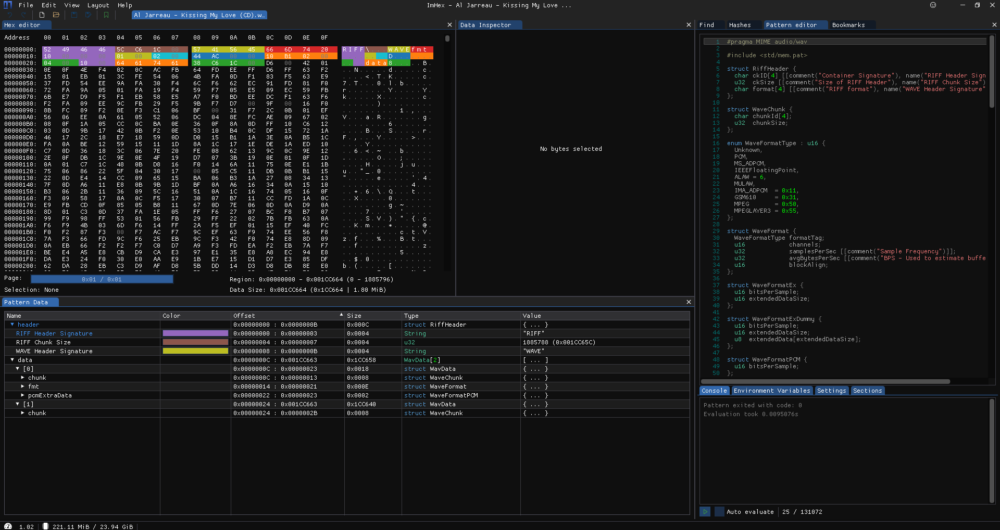
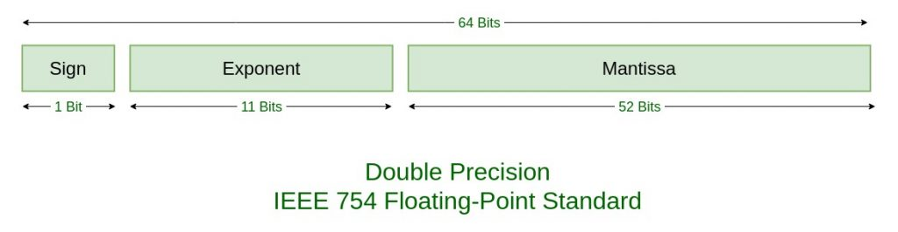
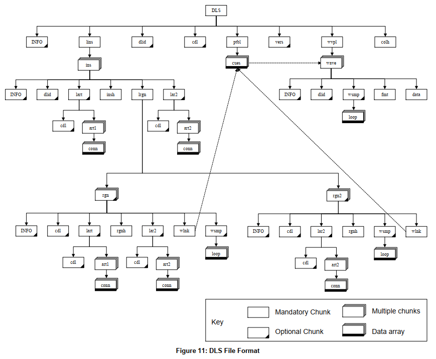

# Audio Formats

# Tools

## ImHex

[This editor](https://imhex.werwolv.net/) is mind blowing. It can colorize and parse tons of binary formats including
WAV with the use of "pattern" files.

- Open you WAV file with it
- Then go in "File/Import/Pattern File" and select `wav.hexpat`



- On the right, the pattern file can be modified on the fly
- On the top left, you have the content of your file, parsed sections are colorized according to the pattern file
- On the bottom left, you can browser the parsed data

Tons of patterns files can be found on their
github [here](https://github.com/WerWolv/ImHex-Patterns/tree/master/patterns).

## HxD

[HxD](https://mh-nexus.de/en/hxd/) is a freeware much simplier than ImHex but handle very well huge files.


# WAV

The WAV format is based on RIFF and have many possible chunks organized in a hierarchical structure.

- `cksz` is the size in bytes of the chunk
- `formType` is `WAV `
- `ckid` is the chunk identifier
- `data` is the chunk content


About data format:

- The endianness is **Little Endian**
- 8 bit WAV are always **Unsigned**, otherwise they are **Signed**.

Documentation can be found here:

- RIFF [wiki](https://en.wikipedia.org/wiki/Resource_Interchange_File_Format) with the
  official [pdf](https://www.mmsp.ece.mcgill.ca/Documents/AudioFormats/WAVE/Docs/riffmci.pdf).
- WAV [wiki](https://en.wikipedia.org/wiki/WAV)
- McGill University has a page for AIFF and WAV formats [here](https://www.mmsp.ece.mcgill.ca/Documents/AudioFormats/).

## Chunks

| Chunk ID | Sub Chunk ID | Description                                                                                                                                                                                                                                      | Documentation                                                                                                                                                                 |
|----------|--------------|--------------------------------------------------------------------------------------------------------------------------------------------------------------------------------------------------------------------------------------------------|-------------------------------------------------------------------------------------------------------------------------------------------------------------------------------|
| ` data`  |              | Where the audio is                                                                                                                                                                                                                               | RIFF spec                                                                                                                                                                     |
| ` fmt `  |              | Describe the audio format                                                                                                                                                                                                                        | RIFF spec                                                                                                                                                                     |
| ` BEXT`  |              | Broadcast WAV data, can contain various fields like ` originator`  or `description`                                                                                                                                                              | [Broadcast WAV](https://www.loc.gov/preservation/digital/formats/fdd/fdd000356.shtml), [EBU-TECH 3285 Spec](https://tech.ebu.ch/docs/tech/tech3285.pdf)                       |
| `ACID`   |              | Contains musical informations created by the software [Avid Acid Pro](https://www.magix.com/us/music-editing/acid/)                                                                                                                              | [libsndfile](https://github.com/libsndfile/libsndfile)                                                                                                                        |
| `cue  `  |              | Contains markers in the audio file                                                                                                                                                                                                               |                                                                                                                                                                               |
| `umid`   |              | Unique Material identifier (part of [SMPTE](https://en.wikipedia.org/wiki/Society_of_Motion_Picture_and_Television_Engineers) spec)                                                                                                              | [wiki](https://en.wikipedia.org/wiki/Unique_Material_Identifier)                                                                                                              |
| `iXML`   |              | Metadata. Can contain [Steinberg](https://steinberg.help/cubase_pro_artist/v9/en/cubase_nuendo/topics/export_audio_mixdown/export_audio_mixdown_file_format_wave_files_r.html) extension like `MusicalBeats`, `MusicalSignature`, `MusicalTempo` | [iXML spec](http://www.gallery.co.uk/ixml/)                                                                                                                                   |
| `_PMX`   |              | Metadata from Adobe’s Extensible Metadata Platform (XMP)                                                                                                                                                                                         | [official page](https://www.adobe.com/products/xmp.html)                                                                                                                      |
| `ID3 `   |              | Metadata in ID3 format                                                                                                                                                                                                                           | [offical Mutagen ID3 spec](https://mutagen-specs.readthedocs.io/en/latest/)                                                                                                   |
| `SMED`   |              | Opaque Soundminer Metawrapper data                                                                                                                                                                                                               |                                                                                                                                                                               |
| `LGWV`   |              | Logic Pro X data                                                                                                                                                                                                                                 |                                                                                                                                                                               |
| `ResU`   |              | Logic Pro X data                                                                                                                                                                                                                                 |                                                                                                                                                                               |
| `AFAn`   |              | Apple Binary plist serialized                                                                                                                                                                                                                    | [Apple TypedStream serialization format](https://gist.github.com/williballenthin/600a3898f43b7ad3f8aa4a5f4156941d), [plist wiki](https://en.wikipedia.org/wiki/Property_list) |
| `minf`   |              | ProTools data                                                                                                                                                                                                                                    |                                                                                                                                                                               |
| `elm1`   |              | ProTools data                                                                                                                                                                                                                                    |                                                                                                                                                                               |
| `regn`   |              | ProTools data (may be)                                                                                                                                                                                                                           |                                                                                                                                                                               |
| `CDif`   |              | Sound Forge 10 data (maybe)                                                                                                                                                                                                                      |                                                                                                                                                                               |
| `LIST`   |              |                                                                                                                                                                                                                                                  |                                                                                                                                                                               |
|          | `INFO`       | Contains many metadata like Software, Description, Genre, Author...                                                                                                                                                                              | [recordingblogs.com](https://www.recordingblogs.com/wiki/list-chunk-of-a-wave-file)                                                                                           |
|          | `adtl`       | Associated data list data. Contains subtitles, text for cue points                                                                                                                                                                               | [recordingblogs.com](https://www.recordingblogs.com/wiki/associated-data-list-chunk-of-a-wave-file)                                                                           |

## Alignment

Parsing a RIFF is easy but you have to be very careful about **word alignment** of every Chunks.

* If a chunk ID is at a odd position, there is a padding byte before the next one
* Unfortunately a lot of editors generate non-padded RIFF which are out of spec

## Source code

You will find a robust parser called `RiffReader` in  `com/hypercube/workshop/audioworkshop/files/riff` folder

**NOTE:** Optionally, this parser can fix incorrect RIFF size.

Metadata are extracted and normalized with this enum:

```java
public enum MetadataField {
    DESCRIPTION,
    BPM,
    GENRE,
    TIME_SIGNATURE,
    BARS,
    ROOT_NOTE,
    BEATS,
    VENDOR,
    COPYRIGHT,
    SOFTWARE,
    CREATED,
    KEY
}
```

See the unit test `audio-workshop/src/test/java/com/hypercube/workshop/audioworkshop/files/riff/RiffReaderTest.java` to
learn how to use the `RiffReader`.

# AIFF

AIFF, like WAV is based on RIFF format except it is in big-endian.

- The `RIFF` chunk is replaced by `FORM`
- formType is `AIFF` for PCM files and `AIFC` for compressed files


Documentation can be found here:

- [IFF](https://www.loc.gov/preservation/digital/formats/fdd/fdd000115.shtml) (EA Interchange File Format 1985)
- [McGill University](https://www.mmsp.ece.mcgill.ca/Documents/AudioFormats/AIFF/AIFF.html)

## 80 bits IEEE-754

This monster is hidden in the `sampleRate` field of the chunk `COMM`.

Java floats are only encoded in 32 bits (`float`) and 64 bits (`double`) so we have to convert a 80 bits number into 64
bits.

(Images from [geekforgeeks](https://www.geeksforgeeks.org/ieee-standard-754-floating-point-numbers/))




- Basically a IEEE-754 floating point number is made of 3 parts: the **sign**, the **exponent** and the **mantissa**
- For a 80 bit number, the exponent size is 15 bits and the mantissa is 64 bits.
- For a 64 bit number, the exponent size is 11 bits and the mantissa is 52 bits.
- For a 32 bit number, the exponent size is 8 bits and the mantissa is 23 bits.

The conversion is based on [this stackoverflow](https://stackoverflow.com/a/35670539).

```java
  public double getLongDoubleBE() throws IOException {
    long high = getShortBE(); // 16 bit exponent with sign
    long low = getLongBE(); // 64 bit mantissa
    long e = (((high & 0x7FFFL) - 16383) + 1023) & 0x7FFL; // new 12 bits exponent with sign
    long ld = ((high & 0x8000L) << 48)
            | (e << 52)
            | ((low >>> 11) & 0xF_FFFF_FFFF_FFFFL);
    return Double.longBitsToDouble(ld);
}
```

Documentation can be found here:

- IEEE-754 [wiki](https://en.wikipedia.org/wiki/IEEE_754).
- IEEE-754 specification [PDF](https://people.eecs.berkeley.edu/~wkahan/ieee754status/IEEE754.PDF).

## Source code

Our `RiffReader` is able to parse AIFF files.

See the unit test `audio-workshop/src/test/java/com/hypercube/workshop/audioworkshop/files/riff/RiffReaderTest.java` to
learn how to use it.

# DLS2

## Overview

The DLS2 (aka. **Downloadable Sound Specification Level 2**) format is mostly obsolete but yet very important. It was
designed for samplers.

- The specification can be found at **midi.org
  ** [here](https://www.midi.org/specifications-old/item/dls-level-2-specification).
- It has been extended by Tascam for their Gigastudio Sampler. This extended format is call **GigaFont** with the famous
  extension `.gig`

The DLS 2 format is based on RIFF and contains many chunks



This format is a container for many samples, located in the chunk `wvpl`, the **Wave pool**.

- For each sample, you will find the chunk `fmt` also used in WAV files.
- The chunk `*INFO` contains the name of the sample.
- The chunk `data` contains the PCM samples exactly like the WAV format.

## GIG

The Gigastudio extension involes those proprietary chunks:

- `3gri`: sample group instrument
- `3gnl`: group list
- `dnl`:  dimension list
- `prg` Program
- `3ewl`: unknown

More infos can be found in the [libgig](https://www.linuxsampler.org/libgig/) project.

# FLAC

FLAC is a popular lossless format for audio files. Documentation can be found here:

- [Official FLAC format](https://xiph.org/flac/documentation.html)
- In-depth explanation of the compression can be found on
  github [here](https://uforobot.github.io/2018/04/01/flac-format/).


We are only interested in the Meta data part which is made of multiple blocks.

## Source code

Our parser `FlacReader` extracts metadata from the Flac.

See the unit test `audio-workshop/src/test/java/com/hypercube/workshop/audioworkshop/files/flac/FlacReaderTest.java` to
learn how to use it.

# ID3 Tags

ID3 is a very popular format used to store metadata. It can be found in any Audio file format like AIFF, MP3 or WAV
embedded in a chunk or a block.

⚠️ Unfortunately the specification is a disaster. It has been reported many times (
see [this blog](https://blog.codinghorror.com/a-spec-tacular-failure)).

Documentation can be found here:

- Official specification from [Mutagen](https://mutagen-specs.readthedocs.io/en/latest/id3/index.html)
- Peter Seibel [blog entry](https://gigamonkeys.com/book/practical-an-id3-parser.html)
- [Exif](https://exiftool.org/TagNames/ID3.html) doc by Phil Harvey.

## Source code

We wrote a simple parser in `audio-workshop/src/main/java/com/hypercube/workshop/audioworkshop/files/id3/ID3Parser.java` 