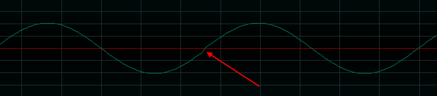
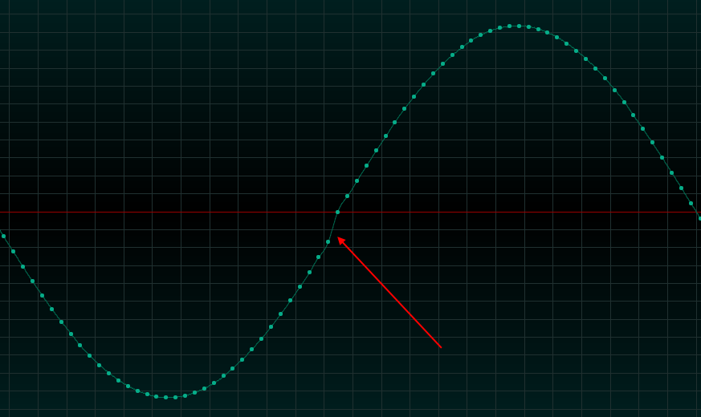

# Sine

our very first code to generate sound

# Java Audio API

The Java Audio API is in the package `avax.sound` and it is provided by the JDK. There is no need to use an external library.

## Wrap it !

In the same spirit of the Midi workshop, we are going to wrap the API around our own classes.

The Java Audio API use the class `Mixer.Info` to represent an Audio device. This is not really clear to understand so we wrap it in two classes: `AudioInputDevice` and `AudioOutputDevice`. Both classes inherit from `AbstractAudioDevice` which is just a placeholder for `Mixer.Info`

## Clip

The Java Audio API provides a simple way to play something through an audio device using the the class `Clip`.

- First you ask to the API to give you an empty Clip for a specific  `Mixer.Info` 
- Then you feed the clip with whatever you want: An Audio file, or raw audio buffers with PCM samples
- Finally you ask to the Clip to play or loop
- You have to wait an event `LineEvent.Type.STOP`  to know when to stop

That's all !

## AudioOutputLine

There is a more "low level" way to play a sound which is perfect when you want to create a synth. The idea is that you send multiple audio buffers to `AudioOutputLine` in real time and let Java Audio API send this at the proper speed to the sound card. You don't have to deal with synchronization. You just have to go fast to generate your buffers.

# Requirements

## VB-Cable

This is a free virtual audio cable by VB-Audio. Download it from [here](https://vb-audio.com/Cable/). In this way we can send what we generate to any audio application like Element.

⚠️ You need to run `VBCABLE_Setup_x64.exe` as Administrator.

## ASIO4All

This is a low latency audio driver capable of aggregating multiple audio devices in one. It will be used by Element. Download it from [here](https://www.asio4all.org/).

## Element

This is a simple VST host that we will use to modify our generated sounds. Download it from the Kushview site [here](https://kushview.net/element/).

## MFreeFXBundle

This is a free bundle of VST effects that we will use in Element. Especially:

- [MCharmVerb](https://www.meldaproduction.com/MCharmVerb): a reverb
- [MAnalyzer](https://www.meldaproduction.com/MAnalyzer): a spectrum analyzer

# AudioSine

This class demonstrate how to use our API Wrapper to play a simple sine wave.

## list

This Spring shell command list all Audio devices in the system

```bash
>java -jar target\audio-workshop-0.0.1-SNAPSHOT.jar list
INPUT  Device "Port Speakers (High Definition Audio"
INPUT  Device "Port CABLE Input (VB-Audio Virtual C"
INPUT  Device "Port CABLE Output (VB-Audio Virtual "
INPUT  Device "Port Microphone (High Definition Aud"
INPUT  Device "Primary Sound Capture Driver"
INPUT  Device "Microphone (High Definition Aud"
INPUT  Device "CABLE Output (VB-Audio Virtual "
OUTPUT Device "Primary Sound Driver"
OUTPUT Device "Speakers (High Definition Audio Device)"
OUTPUT Device "CABLE Input (VB-Audio Virtual Cable)"
```

 As you can see, VB-Audio devices are bidirectional, it's because they are virtual cables.

## file

This Spring shell command play a simple WAV file. 

```bash
>java -jar target\audio-workshop-0.0.1-SNAPSHOT.jar file -o "Primary Sound Driver" -f "sounds/forest.wav" -l 2
Channels   : 1
Encoding   : PCM_UNSIGNED
SampleRate : 48000.0
BitDepth   : 8
```

Take a look on the method `AudioOutputDevice::play`

- We use `AudioInputStream` to load the file
- This class extract all the important informations: **sample rate**, **bit depth**, **channel count** and the **codec** (`PCM_UNSIGNED`).
- Then we play the file `loopCount` times.

```java
public void play(File file,int loopCount) throws UnsupportedAudioFileException, IOException, LineUnavailableException, InterruptedException {
    AudioInputStream sound = AudioSystem.getAudioInputStream(file);
    log.info("Channels   : "+sound.getFormat().getChannels());
    log.info("Encoding   : "+sound.getFormat().getEncoding().toString());
    log.info("SampleRate : "+sound.getFormat().getSampleRate());
    log.info("BitDepth   : "+sound.getFormat().getSampleSizeInBits());
    final var clip =  AudioSystem.getClip(mixerInfo);
    clip.open(sound);
    clip.setLoopPoints(0,-1);

    Object waiter = new Object();
    addAudioListener(clip, waiter);

    clip.loop(loopCount);

    waitStopEvent(waiter);
    clip.drain();
    clip.close();
}
```

To wait for a `LineEvent` event we do that:

```java
clip.addLineListener(lineEvent->{
                if (lineEvent.getType() == LineEvent.Type.STOP)
                {
                   ...
                }
            });
```

## sine

This Spring shell command play a simple sine wave generated by code.

```bash
>java -jar target\audio-workshop-0.0.1-SNAPSHOT.jar sine -o "Primary Sound Driver"
Play note at 130.812783 Hz
Done
```

Take look on `AudioOutputDevice::play`

- This time we pass a `byte[]` buffer to the Java Audio API containing PCM samples
- We need to pass as class `AudioFormat` to explain what is inside our buffer.
- We instruct the clip to play the buffer in the very same way we played the WAV file before.

```java
 public void play(AudioFormat af, byte[] data,int loopCount) throws LineUnavailableException, InterruptedException {
        final var clip =  AudioSystem.getClip(mixerInfo);
        clip.open(af, data, 0, data.length);
        clip.setLoopPoints(0,-1);

        Object waiter = new Object();

        addAudioListener(clip, waiter);
        clip.loop(loopCount);
        waitStopEvent(waiter);

        clip.drain();
        clip.close();
    }
```

We decide to generate a wave form in 16 bits, 1 channel, 44100 Hz, Big Indian, Signed:

```java
final AudioFormat af = new AudioFormat(SAMPLE_RATE, 16, 1, true, true);
```

Then we use our class **NaiveVCO** (Voltage Control Oscillator) to generate the data.

```java
VCO vco = new NaiveVCO(100, SAMPLE_RATE, 16, ByteOrder.BIG_ENDIAN);
byte[] data = vco.generateSine(130.812783, 0.5);
```

To be more convenient, we convert a MIDI note to the frequency:

```java
VCO vco = new NaiveVCO(100, SAMPLE_RATE, 16, ByteOrder.BIG_ENDIAN);
final double freq = VCO.midiNoteToFrequency(48);
byte[] data = vco.generateSine(freq, 0.5); // Play C3
```

Generating the data is where things are interesting (see our chapter on **sound synthesis** to understand all of this):

- Don't work directly with a `byte[]`, always use `java.nio.ByteBuffer` which is fantastic.
- We work in `double`, generating amplitudes every `angleIncrementInRadians`.
- Then each sample is converted to a 16 bit Signed in Big Endian or Little Endian.

```java
public byte[] generateSine(double freq, double gain) {
    double periodDurationInSamples = sampleRate / freq;
    double samplePeriodInMs = 1000 / sampleRate;
    double periodDurationInMs = periodDurationInSamples * samplePeriodInMs;
    double angleIncrementInRadians = (2.0 * Math.PI / periodDurationInSamples);
    int nbPeriodsToGenerate = (int) Math.max(1, bufferSizeRequestedInMs / periodDurationInMs);
    int samples = (int) (periodDurationInSamples * nbPeriodsToGenerate);
    int bytesPerSample = bitDepth / 8;
    var output = ByteBuffer.allocate(samples * bytesPerSample);
    output.order(byteOrder);
    for (int i = 0; i < samples; i++) {
        double anglePos = i * angleIncrementInRadians;
        short sample = (short) (gain * Math.sin(anglePos) * 0x7FFF);
        output.putShort(sample);
    }

    return output.array();
}
```

The `gain` is just a value in the range [0,1] multiplied to the sample value generated by  `Math.sin()`

## vco

This Spring shell command play various notes with our VCO using another technique. We are using a `AudioOutputLine` instead of `Clip`. We are really really close to make a synth. The MIDI is not there for now.

```java
>java -jar target\audio-workshop-0.0.1-SNAPSHOT.jar vco ine -o "Primary Sound Driver"
Play frequency 164.81378299593297 Hz
Play frequency 184.9972113558172 Hz
Play frequency 207.65234307056366 Hz
Play frequency 220.0 Hz
Done
```

## Discontinuity

If you listen carefully, there is a repeating "click" in our naive VCO, it is related to a **discontinuity** in the signal. This is related to a lack of precision in our calculations.



You can take a look with [ocenaudio](https://www.ocenaudio.com/):



# AudioSynth

This class demonstrate how to make a synth in Java using our wrappers.

## synth

This Spring shell command wait some MIDI notes and play a sine at the right frequency.

```java
>java -jar target\audio-workshop-0.0.1-SNAPSHOT.jar synth -i -i "loopMIDI Port 1" -o "Primary Sound Driver"
Play some notes ! Use the pitch bend to exit...
MIDI: 0x903c64 Note: 60 261.625565 Hz Velocity: 100 Status: 90
MIDI: 0x803c00 Note: 0 8.175799 Hz Velocity: 0 Status: 80
MIDI: 0x903564 Note: 53 174.614111 Hz Velocity: 100 Status: 90
MIDI: 0x803500 Note: 0 8.175799 Hz Velocity: 0 Status: 80
MIDI: 0x903764 Note: 55 195.997723 Hz Velocity: 100 Status: 90
MIDI: 0x803700 Note: 0 8.175799 Hz Velocity: 0 Status: 80
MIDI: 0xe0533f Note: 0 8.175799 Hz Velocity: 0 Status: e0
MIDI: 0xe02c40 Note: 0 8.175799 Hz Velocity: 0 Status: e0
MIDI: 0xe05d41 Note: 0 8.175799 Hz Velocity: 0 Status: e0
Terminating...    
```
