# Midi Monitor

Our very first code to receive and send MIDI messages

# Java MIDI API

The Java MIDI API is in the package `javax.sound.midi` and it is provided by the JDK. There is no need to use an
external library.

## Wrap it !

I really really recommend to write your own wrapper on top of it to make your application more simple. This is what we
do in the package `com.hypercube.workshop.midiworkshop.common`.

- For the Java MIDI API, any device is a `MidiDevice.Info`. It could be nicer.
- This is why our `MidiDeviceManager` collect MIDI devices and type them properly with our own classes: `MidiOutDevice`
  and `MidiInDevice`
- We also wrap the `MidiMessage` by our own `MidiEvent` providing few utility methods.

## Confusing terminology

If you send something from A to B, you have two ways to name things:

- If B is the **device**, you consider the device as a **receiver**.
- If the output of A is the **device**, you consider the device as a **transmitter**, like a port.

Unfortunately the Java MIDI API used the second way. So a **Device** is like a port of your application. It does not
reflect the destination (A MIDI synth or a MIDI keyboard).

- A **receiver** is used to **output** MIDI.
- A **transmitter** is used to **input** MIDI.

Our wrapper `MidiDeviceManager` will fix this issue, naming things more clearly:

```java
public void collectDevices() {
    inputs.clear();
    outputs.clear();
    MidiDevice.Info[] devices = MidiSystem.getMidiDeviceInfo();
    for (MidiDevice.Info info : devices) {
        try {
            MidiDevice device = MidiSystem.getMidiDevice(info);
            if (!(device instanceof Sequencer) && !(device instanceof Synthesizer)) {
                if (device.getMaxReceivers() > 0 || device.getMaxReceivers()==-1) {
                    outputs.add(new MidiOutDevice(device));
                }
                if (device.getMaxTransmitters() > 0 || device.getMaxTransmitters()==-1) {
                    inputs.add(new MidiInDevice(device));
                }
            }

        } catch (MidiUnavailableException e) {
            System.out.println("Device " + info.getDescription() + " is not available");
        }
    }
}
```

All transmitters become a `MidiInDevice` and all receivers become a `MidiOutDevice`. Those two classes reflect the MIDI
plugs:

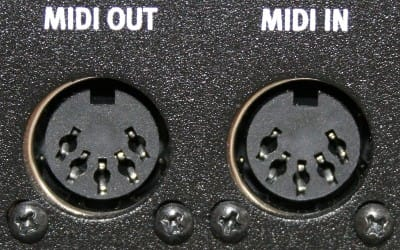

- A `MidiOutDevice` is used to output MIDI.
- A `MidiInDevice` is used to input MIDI.

This is much better in this way !

## Receive MIDI

Our class `MidiInDevice` will take care of receiving MIDI hiding all the messy terminology of the underlying API.

Imagine that, to receive a MIDI message, you have to set the receiver of the device transmitter !

```java
device.getTransmitter().setReceiver(new Receiver() {
    @Override
    public void send(MidiMessage message, long timeStamp) {
    }

    @Override
    public void close() {
    }
});
```

So we hide all of this with a simple method:

```java
public void listen(MidiListener listener) 
```

Where the `MidiListener` is just a lambda:

```java
@FunctionalInterface
public interface MidiListener {
    void onEvent(MidiEvent event);
}
```

## Send MIDI

To send a MIDI message you have to pick the receiver of the device and use the method

```java
receiver.send(msg,timestamp);
```

Don't bother with the time stamp now, it is irrelevant and does not belong to what you send on the MIDI driver.

We can build 1 byte messages like the MIDI clock event or the active sensing event:

```java
clockMessage = new ShortMessage(ShortMessage.TIMING_CLOCK);
activeSensing = new ShortMessage(ShortMessage.ACTIVE_SENSING);
```

- We will play with the first one later
- Active sensing is like a "ping", to say we are alive

You can send a 3 bytes messages like "Note On" with the following:

```java
new ShortMessage(ShortMessage.NOTE_ON, 1, 60, 127)
```

- `1`is the MIDI channel in the range [0-15]
- `60` is the midi note in the range [0-127]
- `127`is the note velocity (volume) in the range [0-127]

## Note names

It is not very handy to use numbers in the range [0,127] to talk about notes. Here few concepts to know about notes:

- The white keys on a piano are called "C,D,E,F,G,A,B" in english. In french: "do, ré, mi, fa, sol, la, si"
- The black keys on a piano are called "C#, D#, F#,G#,A#" or "Db,Eb,Gb,Ab,Bb". In french "do dièse"...., "ré bémol" ...
- `b` is called **Flat** in english and **Bémol** in french.
- `#` is called **Sharp** in english and **Dièse** in french.
- ⚠️ One single midi note can have 2 names: `Eb = D#` but we use `#` most of the time
- You may ask why the hell we use **#** and **b**. The explanation goes way beyond this workshop, right into music
  theory. Just remember you should not mix **#** and **b**. Stick to one way to name notes.
- The piano keyboard is divided in 12 notes called **octaves**. One octave is "C,C#,D,D#,E,F,F#,G,G#,A,A#,B"
- The convention to name notes is: `C#2 = C# in octave 2` where **the midi note index 0 start at octave -2**

We made a class to encapsulate all of these calculations. It is a map between the note value [0,127] and its
human-readable name

```java
MidiNote.fromValue(42).equals(MidiNote.fromName("F#1"))
```

In this way, the class `MidiNote` can be used to:

- Debug or log the midi messages related to notes.
- Write a sequence of note in a meaningful way

# Requirements

## loopMIDI

At this point you should install a virtual MIDI cable
called [loopMIDI](https://www.tobias-erichsen.de/software/loopmidi.html) .

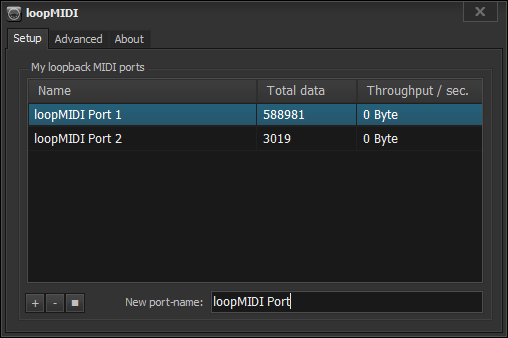

Use the "+" button to create 2 virtual cables called "loopMIDI Port 1" and "loopMIDI Port 2"

## Virtual MIDI Piano Keyboard

If you don't have a real MIDI keyboard, install [VMPK](https://vmpk.sourceforge.io/). In `tools/MIDI Connections` select
our first virtual cable: `loopMIDI Port 1` as MIDI OUT Driver.

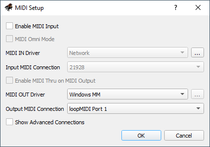

## Element

This is a simple VST host that we will use to generate some sounds. Download it from the Kushview
site [here](https://kushview.net/element/).

## Odin 2

This is a great free VSTi that will be loaded by Element. Download it from the WaveWarden
site [here](https://thewavewarden.com/odin2).

# MidiMonitor

This class demonstrate how to use our API Wrapper to monitor incoming messages in a MIDI IN Device.

## list

This Spring shell command list all MIDI devices in the system

```bash
>java -jar target\midi-workshop-0.0.1-SNAPSHOT.jar list
INPUT  Device "loopMIDI Port 1"
INPUT  Device "loopMIDI Port 2"
OUTPUT Device "Microsoft MIDI Mapper"
OUTPUT Device "loopMIDI Port 2"
OUTPUT Device "loopMIDI Port 1"
```

As you can see, loopMIDI devices are bidirectional, it's because they are virtual cables.

## monitor

This Srping shell command listen all MIDI messages from a MIDI device.

```bash
>java -jar target\midi-workshop-0.0.1-SNAPSHOT.jar monitor -i "loopMIDI Port 1"
MIDI: 0x903c64
MIDI: 0x803c00
```

Hit a piano key and you should see those two MIDI messages.

- `0x90` is for Note ON message
- `0x80` is for Note OFF message
- `0x3C` is the note number
- `0x64` is the velocity of the note (low or high volume)

I invite you to play with the keyboard to see what you receive.

## filter

This Spring shell command listen all MIDI messages from a MIDI device and send them to another one.

```
>java -jar target\midi-workshop-0.0.1-SNAPSHOT.jar filter -i "loopMIDI Port 1" -o "loopMIDI Port 2"
MIDI: 0x903c64
MIDI: 0x803c00
```

This time we are going to connect Element VST Host to our MIDI cable `loopMIDI Port 2`. It should receive what we send.

Go to `File/preferences.../MIDI` and select `loopMIDI Port 2` as MIDI

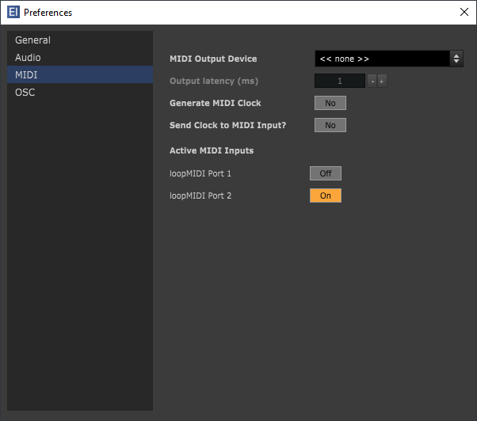

Make sure Element found Odin 2, go to `View/Plugin Manager`. Hit `Scan` button. Odin should appear in the list. Official
folders for VST are:

- VST2: `C:\Program Files\Steinberg\VstPlugins` and `C:\Program Files\VstPlugins`
- VST3: `C:\Program Files\Common Files\VST3`

Also make sure Element found your sound card, go to `File/Preferences/Audio`: hit the button `Test`

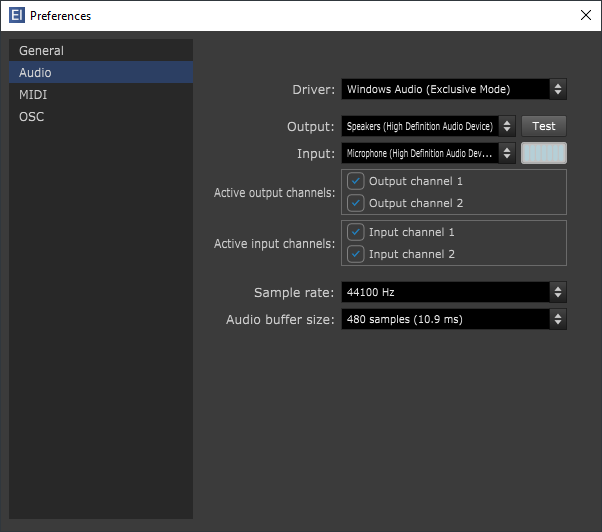

Now create this session in the Graph Editor (F2):

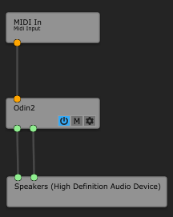

You can do the same in the Patch bay (F1):

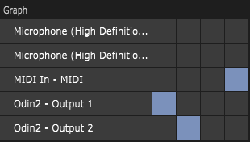

# MIDI Specification

To understand the majority of MIDI messages, you have to go to the source, at [midi.org](https://www.midi.org/) and more
especially in [this page](https://www.midi.org/specifications-old/item/table-1-summary-of-midi-message).

- MIDI messages are designed to be **very compact**
- They are composed by a first byte called **Status**, followed by 0 or n bytes of data.
- Despite the presence of bytes, you will found soon or later that values are often in 7 bits.

Here an example:

```
[0x92,0x24,0x5A] mean For Channel 3, Note ON on note C1 with Velocity 54
0x92 is the status byte
	0x90 = NOTE ON
	0x02 = Channel 3 in the range [1,16]
0x24 is the first data byte
	0x24 = Note index in the range [0,127]
0x5A is the second data byte
	0x5A = Note velocity in the range [0,127]
```

Another one:

```
[0xB2,0x79,0x00] mean For Channel 2, Reset off all midi controllers
0xB2 is the status byte
	0xB0 = CONTROL CHANGE
	0x02 = Channel 3 in the range [1,16]
0x79 is the first data byte
	0x79 = RESET ALL CONTROLLERS
0x00 is the second data byte
	0x00 = always 0
```

## Status

The status byte is divided in two parts

- 4 bits: Type of event
- 4 bits: MIDI Channel

## Channel

The concept of **MIDI Channel** is very simple and widely used by various devices. A MIDI device can use multiple MIDI
channels to play multiple different sounds and melodies at the same time. Since it is 4 bits, you can have **16 Channels
**. This kind of device was often called an Expander.

This one, for instance, a Roland/Boss DS-330 was an Expander. You can see "PART (CH)" on the top, it corresponds to a
MIDI Channel.

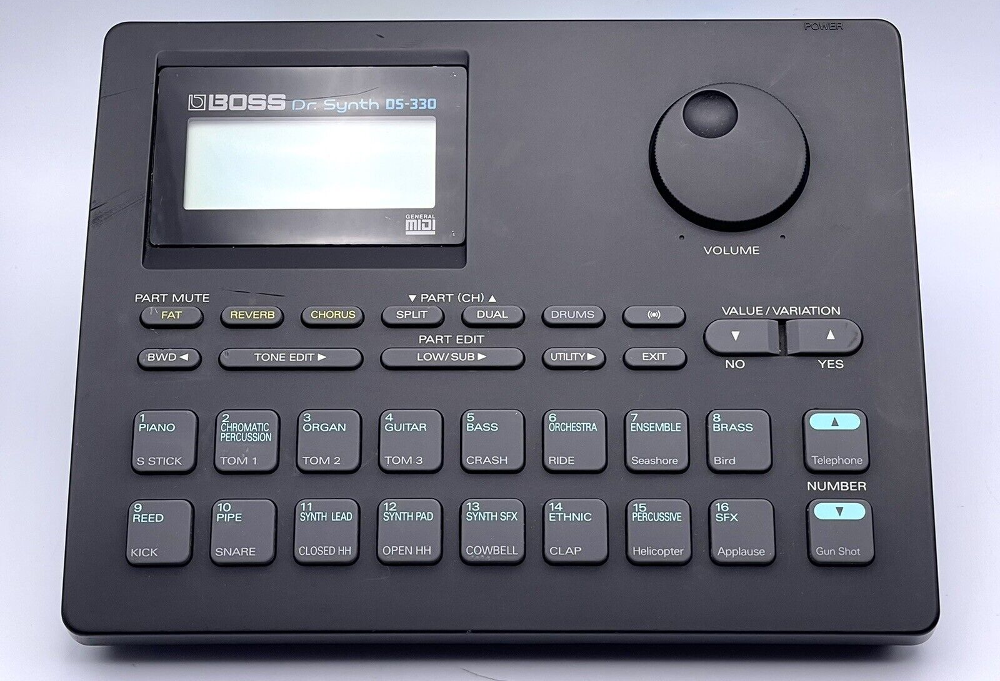

A device which is able to use multiple MIDI channels was called a **multi timbral device**. Here a Roland JV-880,
the `RxCH:01` correspond to a Midi Channel.

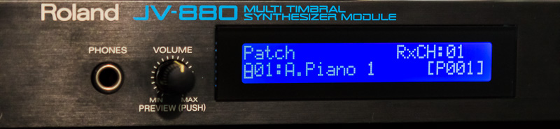

## Drums

In many MIDI device, **the channel 10 is often used for drums**. In this mode, the MIDI node correspond to a specific
drum sound.

The mapping between the MIDI node and the expected drum sound is called a **Drum Map**.

## Program Change

A program change MIDI event is used to change the sound of a specific MIDI Channel. Some devices have their proprietary
mapping but most of the time, some **standards** have been defined:

- [GM](https://en.wikipedia.org/wiki/General_MIDI) (General MIDI) define which sound is expected for a given patch
  number. It also define a standard Drum Map for the channel 10
- [GM 2](https://en.wikipedia.org/wiki/General_MIDI_Level_2)
- [GS](https://en.wikipedia.org/wiki/General_MIDI#GS_extensions) a superset of GM by Roland
- [XG](https://en.wikipedia.org/wiki/General_MIDI#XG_extensions) a superset of GM by Yamaha

With the rise of Virtual Instruments, all of this is now relatively pointless since each VSTi contains thousands of
unique sounds.

## Controllers

This is the most important thing in MIDI: you can capture a gesture and send it through MIDI.

Typically on the left of any keyboard you have a **Pitch bend** and a **Modulation wheel**:


Some devices are only dedicated to controls, like the Korg nanoKontrol2:

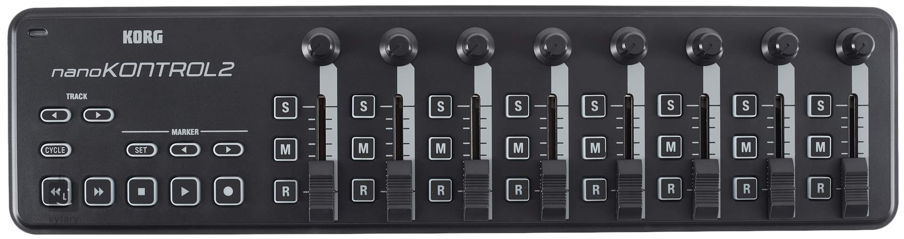

Most controls send the event **Control Change** which have 7 bits resolution:

- The controller id range is [0,127] but some of them are reserved in the range [120-127]
- The value range is [0,127]

The pitch bend has more resolution with its own event **Pitch Bend Change**. The value is encoded in 14 bits in 2
consecutive bytes.

## Panic

It is possible to lose a Note Off in some circumstances. In this case, the sound generator will play the note ...
forever ! This is why there are various messages to stop everything:

- **All Notes Off** for channel 0: `0xB07B00`
- **All Sound Off** for channel 0: `0xB07800`
- **Reset All Controllers** for channel 0: `0xB07900`

## Java API

The Java API offer many constants to deal with those events. See the class `javax.sound.midi.ShortMessage`:

```java
// Status byte defines

// System common messages

/**
 * Status byte for MIDI Time Code Quarter Frame message (0xF1, or 241).
 *
 * @see MidiMessage#getStatus
 */
public static final int MIDI_TIME_CODE = 0xF1; // 241

/**
 * Status byte for Song Position Pointer message (0xF2, or 242).
 *
 * @see MidiMessage#getStatus
 */
public static final int SONG_POSITION_POINTER = 0xF2; // 242

/**
 * Status byte for MIDI Song Select message (0xF3, or 243).
 *
 * @see MidiMessage#getStatus
 */
public static final int SONG_SELECT = 0xF3; // 243

/**
 * Status byte for Tune Request message (0xF6, or 246).
 *
 * @see MidiMessage#getStatus
 */
public static final int TUNE_REQUEST = 0xF6; // 246

/**
 * Status byte for End of System Exclusive message (0xF7, or 247).
 *
 * @see MidiMessage#getStatus
 */
public static final int END_OF_EXCLUSIVE = 0xF7; // 247

// System real-time messages

/**
 * Status byte for Timing Clock message (0xF8, or 248).
 *
 * @see MidiMessage#getStatus
 */
public static final int TIMING_CLOCK = 0xF8; // 248

/**
 * Status byte for Start message (0xFA, or 250).
 *
 * @see MidiMessage#getStatus
 */
public static final int START = 0xFA; // 250

/**
 * Status byte for Continue message (0xFB, or 251).
 *
 * @see MidiMessage#getStatus
 */
public static final int CONTINUE = 0xFB; // 251

/**
 * Status byte for Stop message (0xFC, or 252).
 *
 * @see MidiMessage#getStatus
 */
public static final int STOP = 0xFC; //252

/**
 * Status byte for Active Sensing message (0xFE, or 254).
 *
 * @see MidiMessage#getStatus
 */
public static final int ACTIVE_SENSING = 0xFE; // 254

/**
 * Status byte for System Reset message (0xFF, or 255).
 *
 * @see MidiMessage#getStatus
 */
public static final int SYSTEM_RESET = 0xFF; // 255

// Channel voice message upper nibble defines

/**
 * Command value for Note Off message (0x80, or 128).
 */
public static final int NOTE_OFF = 0x80;  // 128

/**
 * Command value for Note On message (0x90, or 144).
 */
public static final int NOTE_ON = 0x90;  // 144

/**
 * Command value for Polyphonic Key Pressure (Aftertouch) message (0xA0, or
 * 160).
 */
public static final int POLY_PRESSURE = 0xA0;  // 160

/**
 * Command value for Control Change message (0xB0, or 176).
 */
public static final int CONTROL_CHANGE = 0xB0;  // 176

/**
 * Command value for Program Change message (0xC0, or 192).
 */
public static final int PROGRAM_CHANGE = 0xC0;  // 192

/**
 * Command value for Channel Pressure (Aftertouch) message (0xD0, or 208).
 */
public static final int CHANNEL_PRESSURE = 0xD0;  // 208

/**
 * Command value for Pitch Bend message (0xE0, or 224).
 */
public static final int PITCH_BEND = 0xE0;  // 224
```

Our class `MidiOutDevice` gives some example to send various messages:

```java
void sendActiveSensing()
void sendClock()
void sendAllNoteOff(int channel)
void sendAllSoundsOff(int channel)
void sendAllcontrollersOff(int channel) 
```

# MIDI Learn

It's up to the receiver to do something with the gestures captured by MIDI controllers. Most virtual instrument today
have a feature called "**MIDI learn**" to bound a specific MIDI Controller ID to a parameter of the sound.

For instance in Odin 2, a right lick on any button show a menu "MIDI Learn":

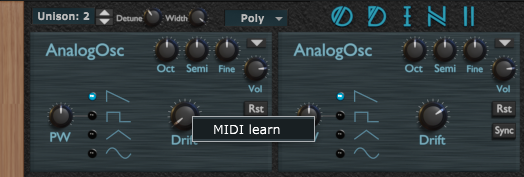

If you **move** your MIDI controller now, the VSTi will bound it to the parameter (here *Drift*).

- This is very handy with a real world MIDI controller
- This is not handy if you are a developer and want to send `Control Change` events with your code: there is no way to
  enter the controller ID in the VSTi.

# Exercises

- Send some notes and control changes to Odin programmatically
- Display the informations received from various MIDI messages: extract the midi channel, status and values by yourself.
- Use [Midi View](https://hautetechnique.com/midi/midiview/), to see if you read the data properly.
- Send 2 `Note On`, without a `Node Off` and use `All Notes Off` to stop it.
- Send 2 or 3 `Note On` to make a chord for 3 seconds, then send the related `Note Off`
