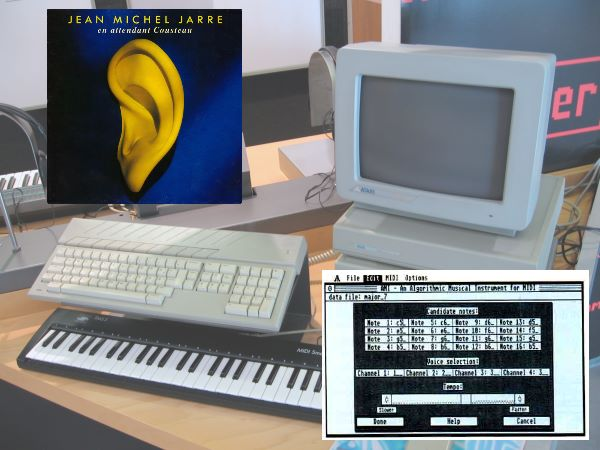
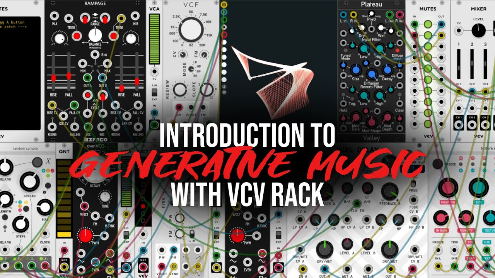

# MIDI Sequencer

# MIDI Clock

The midi specification contains a special event used to synchronize multiple devices to a unique Tempo. It is part of
the [System real-time messages](https://www.midi.org/specifications-old/item/table-1-summary-of-midi-message).

| Binary   | Hexa | Description                                                                   |
|----------|------|-------------------------------------------------------------------------------|
| 11111000 | F8   | Timing Clock. Sent 24 times per quarter note when synchronization is required |

## Accuracy

Unfortunately the way MIDI clocks are designed is not very accurate:

- If you send an **0xF8** in the middle of many note messages, there are zero chances that your timing is gonna be OK.
- The right way to do it is to use a separate MIDI cable dedicated to the clock event
- This clock event should never stop, especially when pause/continue events are used because every time you stop and
  start the clock you need few seconds to stabilize the tempo.

## 24 PPQ

This is the speed of the MIDI clock. PPQ is a crucial concept if you plan to write a sequencer.

- **PPQ** or **PPQN** means **Pulse Per Quarter Note**.
- **TPQN** is the same thing: **Ticks per Quarter Note.**
- At 120 BPM with a time signature 4/4, one bar = 120 quarter notes = 120*24 = 2880 MIDI clock pulses
- At 120 BPM with a time signature 3/8, one bar = 120 eighth note = 240 quarter notes = 240*24 = 5760 MIDI clock pulses

## Beats vs Pulse

Don't be confused between **Beats** and **Pulses**: A beat depends on the time signature.

- The time signature must be read as `<bar duration> = <nb beat> * <whole note duration> / <diviser>`
- 4/4 mean 1 bar = 4 beats of 1/4 of a whole = 4 quarter notes
- 3/2 means 1 bar = 3 beats of 1/2 of a whole = 3 double notes
- 6/8 means 1 bar = 6 beats of 1/8 of a whole = 6 height notes

## Sequencer Resolution

The MIDI clock use 24 PPQ. That does not mean the sequencer should do the same.

- Most professional sequencers run at a resolution of 480 or 960 PPQ.
- Some hardware devices are limited to 96 PPQ

# MIDIClockType

We define an `enum` to implement two types of clocks:

```java
public enum MidiClockType {
    SEQ,
    TMR,
    NONE
}
```

## Sequencer based

This clock uses a `javax.sound.midi.Sequencer` from the Java Sound API to generate a track full of **0xF8** properly
looped.

⚠️ The `Sequencer` always try to send few messages at the end of the loop to prevent any infinite notes. This is a good
idea EXCEPT when you try to send a clock regularly ! This is why we will prevent this behavior using a
custom `Receiver` (see the constructor of `SequencerBasedMidiClock`)

## Timer based

This clock uses the JDK `System.nanoTime()` to build a decent clock pulse in an active loop.

⚠️ You may be tempted to use `LockSupport.parkNanos`. I invite you to try. This does not work. The latency involved by
this call will destroy your accuracy.

This implementation is really tricky and a little bit experimental: we must take into account the cost of sending the *
*0xF8**, called `avgSendDurationInNanoSec`, this is why you will see a method `calibrate()`:

```java
private void calibrate() {
    int nb = 1000;
    long start = System.nanoTime();
    for (int i = 0; i < nb; i++) {
    	clock.sendActiveSensing();
    }
    long end = System.nanoTime();
    avgSendDurationInNanoSec = (end - start) / nb;
}
```

We use the active sensing (**0xFE**) to perform the measurement which is equivalent to a ping.

# Signaling

We use the JDK facilities to allow any thread to wait for the next clock.

```java
signal.notifyAll(); // used to notify the clock pulse
```

```java
signal.wait(); // used to wait for the clock pulse
```

# MidiSequencer

This is our wrapper around the JDK `javax.sound.midi.Sequencer`. It is tightly coupled to the use of our clocks so you
really need 2 MIDI OUT DEVICE:

- One `MidiOutDevice` will be used by the clock to send a `0xF8`
- Another `MidiOutDevice` will be used by the sequencer to send the notes and other MIDI events.

## Play a MIDI File

`public void setSequence(InputStream in)` can be used for that. Just pass a `FileInputStream` to it.

## Play a programmatic sequence

`public void setSequence(MidiSequence sequence, boolean infiniteLoop)` can be used for that. You need to build
a `MidiSequence`  by code.

# Generative Music

Writing a sequence by code open you the gate of generative music. Your imagination is the limit.

This field started in 1990 with Jean Michel Jarre with the ambient
track [Waiting for Cousteau](https://www.youtube.com/watch?v=i8z9iZOiMEw) entirely generated on Atari ST with the
software called "Algorithmic Musical Instrument":



Today, in 2023, people are doing pretty much the same with softwares
like [VCV Rack](https://www.youtube.com/watch?v=CmaYA38ADoo).



## MidiSequence

This class is our wrapper around the JDK `javax.sound.midi.Sequence`

- You can use real note names instead of midi indexes in the range [0,127].
- Expressing time and duration would be a nightmare without our class `RelativeTimeUnit` (more info later)

You can write a simple sequence like this:

```java
private void generateTrack2(MidiSequence seq) 
{
    final int trackId = 0;
    final RelativeTimeUnit _2Bar = _1_1.mult(2);
    final RelativeTimeUnit _4Bar = _1_1.mult(4);
    final RelativeTimeUnit _6Bar = _1_1.mult(6);
    seq.addNote(trackId, "C2", 0, _2Bar);
    seq.addNote(trackId, "A#2", _2Bar, _2Bar);
    seq.addNote(trackId, "F2", _4Bar, _2Bar);
    seq.addNote(trackId, "G2", _6Bar, _2Bar);
}
```

This code play a sequence of 4 notes. Each note duration is 2 bars.

Under the hood, `MidiSequence` will do all the translation in MIDI Clock timings.

## RelativeTimeUnit

In music every timings are relative to the tempo. There is no such a thing like "play a note for 1 second". Everything
is a fraction of time:

- A quarter is 1/4 of a whole and its duration is calculated from the tempo in **BPM**.
- If you express a duration in bars, it's even more complicated because you have to take into account the **Time
  Signature**.

So, `RelativeTimeUnit` is nothing more than a class implementing fractions arithmetic.

- `RelativeTimeUnit.mult()`
- `RelativeTimeUnit.div()`
- `RelativeTimeUnit.plus()`
- `RelativeTimeUnit.minus()`

You can now create complex rythmic patterns using those methods:

```java
private void generateTrack3(MidiSequence seq) 
{
        final int trackId = 2;
        // Kick and Snare
        for (int i = 0; i < 8; i++) {
            seq.addNote(trackId, "C1", _1_1.mult(i), RelativeTimeUnit._1_8);
            seq.addNote(trackId, "D1", _1_1.mult(i).plus(_1_2), RelativeTimeUnit._1_8);
            seq.addNote(trackId, "C1", 90, _1_1.mult(i + 1).minus(_1_8), RelativeTimeUnit._1_8);
        }
	   // HitHat
        for (int i = 0; i < 64; i++) {
            String note = "F#1";
            if (i % 2 == 0) {
                note = "G#1";
            }
            if ((i + 1) % 16 == 0) {
                note = "A#1";
            }
            seq.addNote(trackId, note, 64, _1_8.mult(i), RelativeTimeUnit._1_8);
        }
    }
```

For instance:

```java
seq.addNote(trackId, "C1", 90, _1_1.mult(i + 1).minus(_1_8), RelativeTimeUnit._1_8);
```

Mean: play a note **C1** at velocity 90 with a duration of 1/8 (eight note) just before one eight note before the end of
the bar.

Note that the convertion in ticks (MIDI clock pulse) occurs in the class MidiSequence, not in RelativeTimeUnit:

```java
private int toTick(RelativeTimeUnit duration) {
	return tickPerWhole * duration.numerator() / duration.denominator();
}
```
