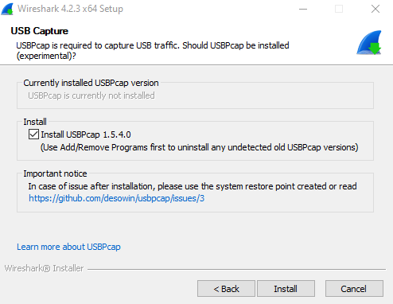
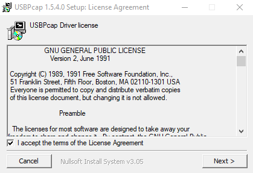
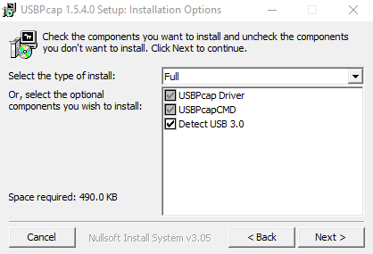
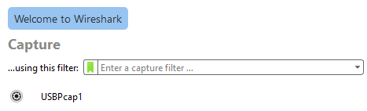
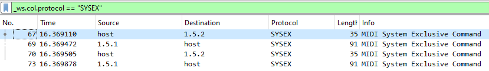
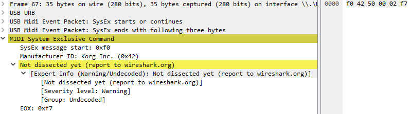
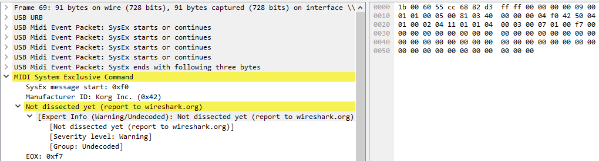

# MIDI System Exclusive

This is a very special kind of MIDI messages which open the door to vendor specific content.

- They can be used to save and restore the settings of a device
- They can be used to modify settings which are not visible on the front panel of the device

Unfortunately, most messages are not properly documented so this area requires a lot of **reverse engineering**.

# Overview

## Basic

A SysEx is a train of bytes delimited by `0xF0` and `0xF7`.

```
F0 .... content .... F7
F0: SysEx START
F7: SysEx END
```

## Standard

There is a subset of messages which are part of the standard MIDI specification. 

- **Non-Real Time** SysEx header: `F0 7E`
- **Real-Time** SysEx header: `F0 7F`
- **Reserved for non-commercial use**: `F0 7D`

The overall format is:

```
F0 hh ii cc .... F7
hh: header (7E, 7F or 7D)
ii: DEVICE ID, 7F = broadcast
cc: Command
```

**Non real-time Commands**:

```
01: GM Dump header
02: GM Dump data
03: Sample Dump Standard (SDS)
04: -
05: Loop Point Transmission
06: General Information
07: File dump
08: -
09: GM System
...
```

The command **06 General Information** gives you access to sub-commands. We will take a look on one of them: **Inquiry Request**

```
F0 7E ii 06 cc F7
7E: NON REALTIME SysEx
ii: DEVICE ID, 7F = broadcast
06: General Information
cc: Sub Command
```

More info can be found [here](https://www.lim.di.unimi.it/IEEE/MIDI/SOT4.HTM).

## Device ID

The concept of **Device ID** is used to target a specific hardware in case you have more than one identical (same brand, same model). It was called **SysEx channel** but recent specifications prefer Device ID. The special value `0x7F` is used to target any device, it is like a **broadcast**.

⚠️ Do not mistake the **Device ID** with the **Model ID**. The Model ID is fixed and designate a specific hardware. The Device ID can be changed at will by the end user.

## Manufacturer ID

Since one byte is not enough, a special encoding is used to provides 16 bit identifiers when needed:

```
nn        8 bits identifier if not 0
00 mm nn  16 bit identifiier if 0
```

Examples:

- **Roland** is `0x41`
- **Korg** is `0x42`
- **Behringer** is `0x00 0x20 0x32`

You can found various manufacturer lists on the Internet: [here](http://midi.teragonaudio.com/tech/midispec/id.htm), [here](https://electronicmusic.fandom.com/wiki/List_of_MIDI_Manufacturer_IDs) and [here](https://studiocode.dev/doc/midi-manufacturers/).

## Inquiry Message

This message is used to get informations from a device. It is part of the **General Information** command.

```
F0 7E ii 06 01 F7
7E: NON REALTIME SysEx
ii: DEVICE ID, 7F = broadcast
06: General Information
01: Sub Command: Identity Request (Inquiry)
```

Here a response from a **Korg NanoKey 2** controller

```
F0 7E 00 06 02 42 11 01 01 00 03 00 01 00 F7
7E: NON REALTIME SysEx
00: Device ID
06: General Information
02: Identity Response
42: Manufacturer ID => KORG
11 01 01 00 03 00 01 00 => KORG Specific response
```

Here a response from a **AKAI MPK 261** keyboard

```
F0 7E 00 06 02 47 25 00 19 00 01 00 00 00 00 12 7F 7F 41 31 32 31 30 31 31 35 35 37 32 35 30 37 37 00 F7
7E: NON REALTIME SysEx
00: Device ID
06: General Information
02: Identity Response
47: Manufacturer ID => AKAI
25 00 19 00 01 00 00 00 00 12 7F 7F 41 31 32 31 30 31 31 35 35 37 32 35 30 37 37 00 => AKAI Specific response
```

👉 Unfortunately this message is not always recognized.

# Uncharted territory

We are interring now in vendor specific SysEx.

- Pain Level 0: This involve digging in device owner manuals, knowing they are sometimes wrong
- Pain Level 1: Sometimes you have to found hidden SysEx commands used by closed-source applications
- Pain Level 2: Sometimes you have to reverse yourself the memory layout of your device

## Wireshark

[This tool](https://www.wireshark.org/) was primary designed to capture network packets, but it is now able to also capture USB packets and more especially **MIDI over USB**.

So it is perfect to "spy" what a proprietary application, dedicated to your hardware, does.

During the installation select "**Install USBCap**"



This will trigger the USBCap installer:



Select "Full":



Reboot, run WireShark and select "USBPcap1" as capture interface:



Now in the filter type `_ws.col.protocol == "SYSEX"`, this will display only MIDI SysEx messages over USB

## Example

Now it is time to run any editor for your MIDI device, let say [Korg Kontrol Editor](https://www.korg.com/us/support/download/product/1/133/), with the device **nanoKEY 2**

In the filter type `_ws.col.protocol == "SYSEX"`



You just have to click on any message to see the content:



Here the payload appear on the right: `F0 42 50 00 02 F7`. Sometimes Wireshark is able to understand the entire message, sometimes not. 

In this example, we can get information on Korg website about [nanoKEY2 MIDI Implementation](https://www.korg.com/us/support/download/manual/0/156/2709/)

```
F0 42 50 00 02 F7

F0: SysEx START
42: Manufacturer ID Korg
50: Search Device
00: Request
02: Echo back ID
F7: Sysex END
```

The next message is the response:



```
F0 42 50 01 00 02 11 01 01 00 03 00 01 00 F7

F0   : SysEx START                      
42   : Manufacturer ID Korg
50   : Search Device                              
01   : Reply                                      
00   : MIDI Global Channel  ( Device ID )   
02   : Echo Back ID                               
11 01: Model ID (nanoKey)
01 00: Member ID
03 00: Minor Version
01 00: Major Version 
F7   :Sysex END                           
```

👉 Note the presence of **Little endian** values: LSB first, MSB last. For instance **Major Version** value is `0x0001`, not `0x0100`

# Roland

Roland provides a relative good amount of information regarding their SysEx. 

- You will find SysEx descriptions at the end of any owner manual
- Unfortunately sometimes the information is wrong, especially on parameters addresses.
- They basically use SysEx to access to various **memory addresses** in the device in Read or Write.

The overall format of a command looks like this:

```
F0 41 dd mm cc ... F7
41: Manufacturer ID 'Roland'
dd: Device ID
mm: Model ID
cc: Command ID
```

Two types of communication are provided with their relative commands:

- **One Way** Transfer
  - `0x11 RQ1`: Data Request
  - `0x12 DT1`: Data Response
- **Handshaking** Transfer
  - `0x40 WSD`: Wait To Send Data
  - `0x41 RQD`: Request Data
  - `0x42 DAT`: Data Set
  - `0x43 ACK`: Acknowledge
  - `0x45 EOD`: End of Data
  - `0x4E ERR`: Communication Error
  - `0x4F RJC`: Rejection

## Packed bytes

Roland use this very specific format to encode 21 bit **addresses** and **sizes** into the SysEx message.

- The main idea is to produce bytes witch are always below `0x80`, so the first bit on the left is always Zero.
- This mean a 21 bits address like `0x1FFFFF` will be encoded in `0x7F7F7F` in the SysEx.
- I call this format **packed bytes**, because regular bytes are packed into 7 bit bytes

💀 This is, of course, a real pain to deal with: Try to add sizes to addresses to see what I mean.

## Nibbles

Roland use also **half bytes**, also called [Nibbles](https://en.wikipedia.org/wiki/Nibble) to store information in the device memory.

- This mean `0x7F` will be encoded into `0x070F`
- Don't worry, there is no such thing as packed Nibbles. This is painful enough like this.

Typically, you will found this encoding in **Bulk Dump** in their **Sound Canvas** devices.

## Bulk Dumps

Bulk Dumps is the term used by Roland to talk about **saving** and **restoring** device settings.

- When you trigger a dump from the device panel, a Bulk Dump is sent to your computer
- You can also programmatically query such dump with a `RQ1` message

Given what we saw, you are now ready to understand the calculations found in various Roland owner manuals. 

For instance the [Sound Canvas 55 Manual](https://en.wikipedia.org/wiki/Roland_SC-55) say this:

> Bulk Dump:
>
> PATCH ALL = (64 + (112 * 16)) = 0x740 bytes
>
> 0x740 * 2 (Nibbles) = 1D 00

First thing to understand: A bulk size is in **packed format**. So `0x1D00`  must be translated to the real size.

```
0x1D00 = 00011101 00000000
         00001110 10000000 // shift 1 bit on the right
       = 0xE80
       = 3712 bytes
```

So the bulk size is `3712` and we know the content is **nibbles** so the real size is 

```
3712 / 2 = 1856
         = 0x740
```

💀 Because of this, most of the documentation provided by Roland is a real nightmare to understand properly.

- They mix unpacked sizes with normal sizes
- They mix hexadecimal with decimal representation
- They mix nibble sizes with normal sizes

You have to understand that:

- Some memory sections are dedicated to Bulk dumps and are encoded in Nibbles
- Some memory sections are using regular bytes

For instance in their **Sound Canvas**:

- The address `0x400000` contains the **system parameters** in bytes
- The address `0x480000` contains the same thing in nibbles for a Bulk Dump

Most of the time they will describe precisely the first memory section, without explaining precisely the layout of the second section. Just know that everything will be **twice larger**. That's all.

# AKAI

AKAI doesn't provide a lot of information. This is the worst case. You can dump the memory with a SysEx but you have to understand yourself the layout.

# Behringer

Behringer provide a little bit of information but they don't provide all of it. You are supposed to use their closed-source application to edit parameters of your device (typically this is the case for their [Neutron](https://en.wikipedia.org/wiki/Neutron_(synthesizer))). In this case, with the right tool, you can discover which SysEx are send by their application.

## Dump Request

```
F0 00 20 32 28 7F 05 F7

F0      : SysEx START
00 20 32: Manufacturer ID Behringer
7F      : DEVICE ID (Broadcast)
05      : Dump request
F7      : Sysex END
```


# Korg

Similar to Behringer, Korg won't give you much information about their SysEx. You have to use their closed-source application to edit device settings. In this case, with the right tool, you can discover which SysEx are send by their application.

Nevertheless you can found some information for various devices:

- [nanoKEY MIDI Implementation ](https://www.korg.com/us/support/download/manual/1/250/2712/) (surprisingly nothing is provided for [nanoKEY Studio](https://www.korg.com/us/support/download/product/0/551/))
- [nanoKEY2 MIDI Implementation](https://www.korg.com/us/support/download/manual/0/156/2709/)
- [nanoKontrol MIDI Implemntation](https://www.korg.com/us/support/download/manual/1/252/2713/)
- [nanoKontrol2 MIDI Implementation](https://www.korg.com/us/support/download/manual/0/159/2710/)
- [Korg M1 Owner Manual](https://www.korg.com/us/support/download/manual/1/139/1685/)

## Overview

Most Korg SysEx follow this scheme:

```
F0 42 xy yy ... F7

F0: SysEx START
42: Manufacturer ID Korg
 x: Format
 y: Device ID, also called Global Channel
 ...
F7: Sysex END
```

The content of the message depend of the **format** value.

- x = 3, format used by old models like a Korg **M1** or **Triton**
- x = 4, format used by recent models like a **NanoKey2** or **nanoKONTROL2**

We will focus on the last one.

## Models ID

Depending on the message, a **Model ID** appear in 16 bit or 24 bits.  You can also consider 32 bit ids if you include the **Sub ID**.

```
32 bit Model ID = 0x00mmmmss
mmmm = 16 bits Model ID
ss = Sub ID

NanoKey      = 0x00010200
NanoKey2     = 0x00011101
nanoKONTROL  = 0x00010400
nanoKONTROL2 = 0x00011300
```

## Member ID

The Member ID is the Korg Sub ID on 16 bits. Originally, it comes from standard **Inquiry messages**.

## Search Device

This message is used to identify recent Korg devices (NanoKey2, nanoKONTTROL2...). It is very close to the standard **Inquiry Message** we saw earlier.

Request:

```
F0 42 50 00 02 F7

F0: SysEx START
42: Manufacturer ID Korg
50: Search Device
00: Request
02: Echo back ID
F7: Sysex END
```

Response:

```
F0 42 50 01 00 02 11 01 01 00 03 00 01 00 F7

F0   : SysEx START                      
42   : Manufacturer ID Korg
50   : Search Device                              
01   : Reply                                      
00   : MIDI Global Channel  ( Device ID )   
02   : Echo Back ID                               
11 01: Model ID (nanoKey 2) in little endian
01 00: Member ID in little endian
03 00: Minor Version in little endian
01 00: Major Version in little endian
F7   : Sysex END        
```

Given the 16 bit **Model ID** and the 16 bit **Member ID** we can forge the 32 bit **Model ID** for the nanoKey2: `0x00011101`

The version in this example is **1.3**

## Data Dump

This message is used to **retrieve settings** from recent Korg devices (NanoKey2, nanoKONTTROL2...).

Request:

```
F0 42 40 00 01 11 01 1F 10 00 F7

F0         : SysEx START                      
42         : Manufacturer ID Korg
40         : Format and Device ID (4 = Format, 0 = Deivce ID)
00 01 11 01: Model ID (nanoKey2)
1F         : Data Dump Command
10         : Data Dump Request
00         : -
F7         : Sysex END   
```

Response:

```
F0 42 40 00 01 11 01 7F 4B 40 7A 00 7F 02 7F 7F
7F 7F 71 7F 40 01 7F 7F 7F 7F 03 7F 7F 01 01 00
00 7F 06 02 7F 7F 01 40 00 00 7C 7F 00 7F 7F 7F
7F 7F 7F 7F 7F 7F 7F 7F 7F 7F 7F 7F 7F 7F 7F 7F
7F 7F 7F 7F 7F 7F 7F 7F 7F 7F 7F 7F 7F 7F 7F 7F
7F 7F 01 7F F7

F0         : SysEx START                      
42         : Manufacturer ID Korg
40         : Device ID (0x4g where g = id)
00 01 11 01: Model ID (nanoKey2)
7F         : Data Dump Command
4B         : Data Dump size + 1
40         : Data Dump Type: Scene
...
0x4A bytes of content
...
```

# Yamaha

## Jargon

| Name                              | Description                                                  |
| --------------------------------- | ------------------------------------------------------------ |
| **Voice** Mode or **Single** Mode | Monotimbral mode. you can play only one preset               |
| **Performance** Mode              | Multi-timbral mode where you can play multiple presets in stack/layer or in keyboard split for a single midi channel |
| **Multi** Mode                    | Multi-timbral mode where 1 preset is assign to a specific midi channel |

Sometimes, the multi mode and the performance mode are the same:

- The TX-81z for instance, use Performance mode to talk about Multi mode
- The TG-33 talk about Multi-mode only

## Overview

Yamaha bulk requests are typed with ASCII identifiers like  `LM  0066SY`, `LM  0065VC` or `LM  0065DR`

- `LM` stands for "load memory" (apparently).
- Unlike Roland, memory locations are not pointed by addresses but by a tuple `<identifier,memory type,memory number>`
- Unlike Roland, there is no checksum in the request

Overall format is:

```
F0 43 2c 20 7A <IDENTIFIER> 0000000000000000000000000000 <MEMORY TYPE> <MEMORY NUMBER> F7
43: Yamaha
 c: receive channel typically 0x0
```

## TG-500

| Bulk request type | Identifier   | memory type       | memory number |
| ----------------- | ------------ | ----------------- | ------------- |
| Normal Voice      | `LM  0065VC` | 0x00: internal 1  | 0-62          |
|                   |              | 0x03: internal 2  | 0-62          |
|                   |              | 0x7F: edit buffer | 0-62          |
| Drum Voice        | `LM  0065DR` | 0x00: internal 1  | 63            |
|                   |              | 0x03: internal 2  | 63            |
|                   |              | 0x7F: edit buffer | 63            |
| Performance       | `LM  0065PF` | 0x00              | 0-63          |
| Multi             | `LM  0065MU` | 0x00              | 0-9           |
| System setup      | `LM  0066SY` | 0x00              | 0             |
| Sample            | `LM  0040SA` | 0x00              | 0-63          |

Payload Example:

```
F0 43 20 7A <IDENTIFIER>         0000000000000000000000000000 <MEMORY TYPE> <MEMORY NUMBER> F7
F0 43 20 7A 4C4D2020303036355643 0000000000000000000000000000 03            04              F7
F0 43 20 7A LM  0065VC           0000000000000000000000000000 03            04              F7
=> Request a Bulk Dump for device 0x20 of the "Normal Voice" from "Internal 2", "number 4"
```

## TG-33

| Bulk request type | Identifier   |
| ----------------- | ------------ |
| Voice             | `LM  0012VC` |
| Voice Edit Buffer | `LM  0012VE` |
| Multi             | `LM  0012MU` |
| System            | `LM  0012SY` |

Payload Example:

```
F0 43 20 7A <IDENTIFIER>         0000000000000000000000000000 <MEMORY TYPE> <MEMORY NUMBER> F7
F0 43 20 7A 4C4D2020303036355643 0000000000000000000000000000 03            04              F7
F0 43 20 7A LM  0065VC           0000000000000000000000000000 03            04              F7
=> Request a Bulk Dump for device 0x20 of the "Normal Voice" from "Internal 2", "number 4"
```

## TX-81z

TX-81z follow a different scheme:

```1
F0 43 2c 20 <BULK TYPE> <IDENTIFIER> F7
43: Yamaha
 c: receive channel typically 0x0
BULK TYPE : 0x03, 0x04 or 0x7E
IDENTIFIER: no always required
```

This device is compatible with Yamaha DX-21/27/100 model so the memory is divided in two parts:

- **VCED** (Voice Edit): is common to all models
- **ACED** ( Additional Voice Edit): is specific to the TX-81z

The **presets** memory is divided in 6 sections:

| Memory                      | Number of presets | Note                            |
| --------------------------- | ----------------- | ------------------------------- |
| Edit Buffer                 | 1                 | RAM: Lost when power down       |
| I (user memory, "initials") | 32                | EEPROM: Lost if battery is dead |
| A1                          | 32                | ROM                             |
| A2                          | 32                | ROM                             |
| A3                          | 32                | ROM                             |
| A4                          | 32                | ROM                             |
| **TOTAL**                   | **160**           |                                 |

Bulk requests:

| Bulk request type                                            | Bulk Type | Identifier   |
| ------------------------------------------------------------ | --------- | ------------ |
| **VCED**:  Vocie Edit Buffer (for backward compatibility, does not include ACED) | 0x03      | N/A          |
| **VMEM**: Voice Memory Bulk (ACED+VCED for 32 presets "I")   | 0x04      | N/A          |
| **SCED**: ACED + VCED Edit buffer                            | 0x7E      | `LM  8976AE` |
| **PCED**: Performance Edit Buffer                            | 0x7E      | `LM  8976PE` |
| **PMEM**: 32 Performance Bulk (24 internals + 8 initials)    | 0x7E      | `LM  8976PM` |
| **SYS:** System Data                                         | 0x7E      | `LM  8976S0` |
| **SYS: **Program Change Table                                | 0x7E      | `LM  8976S1` |
| **SYS: **Effect Data                                         | 0x7E      | `LM  8976S2` |
| **Micro Tune**: Octave                                       | 0x7E      | `LM  MCRTE0` |
| **Micro Tune**: Full Keyboard                                | 0x7E      | `LM  MCRTE1` |

Payload Example:

```
F0 43 20 7E <IDENTIFIER>         F7
F0 43 20 7E 4C4D2020383937364145 F7
F0 43 20 7E LM  8976AE           F7
=> Request a Bulk Dump for device 0x20 of the "SCED"
```

# Midi Library

Since dealing with SysEx is very painfull, we provide two Java classes to help:

- `SysExBuilder` is able to parse strings containing complex payloads, including ranges, strings and macro. It produces real MidiEvents ready to be sent.
- `MidiLibrary` is able to provide a library of queries for various midi devices. 

Both works together to let you query various midi devices without too much pain.

We made an separate maven project called **MBT (Midi-Backup-Translator)** based on those two classes to give you an example of what you can do.

Here an typical definition of a Midi device in the library for the `Yamaha TG-500`:

```yaml
deviceName: "TG-500"
brand: "Yamaha"
macros:
  - "System Setup()           : 142 : F0 43 20 7A 'LM  0066SY' 0000000000000000000000000000 00 00      F7"
  - "Voice Internal 1(voice)  : 0F0 : F0 43 20 7A 'LM  0065VC' 0000000000000000000000000000 00 voice   F7"
  - "Voice Internal 2(voice)  : 0F0 : F0 43 20 7A 'LM  0065VC' 0000000000000000000000000000 03 voice   F7"
  - "Voice Edit Buffer(voice) : 0F0 : F0 43 20 7A 'LM  0065VC' 0000000000000000000000000000 7F voice   F7"
  - "Drum voice Internal 1()  : 2C5 : F0 43 20 7A 'LM  0065DR' 0000000000000000000000000000 00 3F      F7"
  - "Drum voice Internal 2()  : 2C5 : F0 43 20 7A 'LM  0065DR' 0000000000000000000000000000 03 3F      F7"
  - "Drum voice Edit Buffer() : 2C5 : F0 43 20 7A 'LM  0065DR' 0000000000000000000000000000 7F 3F      F7"
  - "Performance(perf)        : 122 : F0 43 20 7A 'LM  0065PF' 0000000000000000000000000000 00 perf    F7"
  - "Multi(channel)           : 120 : F0 43 20 7A 'LM  0065MU' 0000000000000000000000000000 00 channel F7"
  - "AllMulti()               : Multi([0-15])"
  - "AllVoiceInternal1()      : Voice Internal 1([0-62])"
  - "AllVoiceInternal2()      : Voice Internal 2([0-62])"
  - "AllVoiceEditBuffer()     : Voice Edit Buffer([0-62])"
  - "AllPerformances()        : Performance([0-63])"
  
```

👉 Take a look on the MBT manual to learn more.

# Synth internals

## Overview

Our Midi Library is fine if you plan to do Backup and Restore queries, but when it comes to make a real synth editor, you need to understand every bit of the SysEx response. This is where you need a real memory map of the synth given a SysEx.

👉 Actually the Midi Library is independent of the following API, but things will change in the future.

We need many things to handle SysEx:

- A parser, which is able to found which manufacturer and which model is involved
- A memory map to describe the content of the device
- A dumper, which is able to convert the device memory to readable text
- Utilities to handle checksums and packed bytes

## Bytes in Java

It is very unfortunate that Java does not handle **unsigned bytes**. A `byte` is always signed  so it can be negative. 

- This is why we prefer to return represent a byte with `int`, so the value is never negative.
- The class ` SysExReader` take care of this conversion:

```java
public int getByte() {
    return buffer.get() & 0xFF;
}
```

## MemoryMaps

First thing first, we need to consider a device memory as a group of small memory areas. It is not contiguous.

- Each memory area has an address and optionally a size (which is recalculated)
- Size and addresses are in packed bytes or not
- We call a memory area a `MemoryMap`, so a `*.mmap` file contains multiple `MemoryMap`.

### File format

Here how to write your map file:

```
@Model Boss DS-330
@Packed

@400000-000100 Zone 1
{
	... one or more fields ...
}

@400100 Zone 2
{
	... one or more fields ...
}
```

- `@Model` is used to name the memory map
- `@Packed` is used to indicate addresses and sizes are in packed format (used by Roland in their manuals).
- `@400100 Zone 2` define an area in the device memory without its size.
- `@400000-000100 Zone 1` is the same but indicate its size.
- `#` can be used to put a comment

⚠️ Our parser is very simple so the syntax is very rigid. It is not possible to put '{' in the same line of a memory area definition

### NIBBLES

If a memory zone use NIBBLES, you just have to do this:

```
@480000-001D10 NIBBLES Bulk Dump
{
    BulkSystemParams
    BulkCommonPatchParams
    byte reserved[14]
    BulkPatchParams[16 block]
}
```

The parser will take care of all the conversions. So when you write `byte reserved[14]` the parser automatically understand `byte` is in fact 2 `nibble bytes` in the memory. So the real size will be 2*14 = 28 bytes instead of 14.

⚠️I found **fine tuning** parameters never use NIBBLES even they are in the middle of a Bulk Dump. We don't handle that for now. You will read `0400` instead of `00040000`

## Hexadecimal

All values are in hexadecimal except the dimensions of arrays.

## Enums

Enums can be used to express which values are allowed for a field

```
enum Switch
{
	Off
	On
}
```

Implicitly 0 if `Off` and 1 is `On`

It is typically used to list all the reverb types:

```
enum ReverbType
{
	ROOM_1
	ROOM_2
	ROOM_3
	HALL_1
	HALL_2
	GATE
	DELAY
	CROSS_DELAY
}
```

## Fields

A `MemoryArea` is made of memory fields.

- A memory field can be a **string** with a given size
- It can be an **array**, multidimentional or not. Optionally, each dimension can have a name.
- It can be a bunch of **bytes**
- It can be a **struct** which is also a set of memory fields

The overall format is:

```bash
<type or size> <field name>                                                     # for regular fields
<type or size> <field type> [<dimension size> <optional dimension name>,...]    # for arrays
```

### Raw types

```bash
byte  My Field Name 1 # Size = 1 byte
short My Field Name 2 # Size = 2 bytes
int   My Field Name 3 # Size = 4 bytes
long  My Field Name 4 # Size = 8 bytes
0C    My Field Name 5 # Size = 12 bytes
```

### Arrays

You can define an array like this:

```
01 Tune[128 Note]
```

This is an array of 128 entries of size 1 byte. The dimension is called `Note`.

```
PatchParams[16 block]
```

This is an array of 16 types **struct**. 

- The field don't have a name
- The dimension of the array is called `block`. 
- The struct name is called `PatchParams`. 
- The total size in bytes is  `sizeof(PatchParams) * 16` .

```
Tone[5 Part, 4 Section]
```

This is an array with 2 dimensions. 

- The first dimension is called `Part` 
- The second dimension is called `Section`. 
- The array type is called `Tone`

###  Strings

```
String Information[20]
```

- This is a string of size 20. 
- Like arrays, 20 is not in Hexadecimal

### Enums

```
PedalSwitchFunction Pedal Switch 1 Function
```

This is a field of type **Enum**. 

- It uses the enum called `PedalSwitchFunction` and its size is 1 byte.
- The name of the field is `Pedal Switch 1 Function`

## Dump

The class `DeviceMemoryDumper` will reveal the memory content of a device in readable text. 

- It uses the **visitor pattern**, so you can do anything you want with the memory content
- The method `dumpMemory` use a visitor to save everything to disk
- The CLI command `dumpMemory` use another visitor to forge SysEx requests to get the value from a real device

Here an example for a Roland D-70:

```
-------------------------------------
Roland D-70 Memory dump
-------------------------------------
Internal Memory Core 0x000000 (packed: 0x000000) 0x0000A8 (packed: 0x000128) BYTES
-------------------------------------
0x000000 (packed: 0x000000)=40              Internal Memory Core/SystemSetup/Master Tune
0x000001 (packed: 0x000001)=10              Internal Memory Core/SystemSetup/Control Channel
0x000002 (packed: 0x000002)=10              Internal Memory Core/SystemSetup/Unit Number
0x000003 (packed: 0x000003)=00 Off          Internal Memory Core/SystemSetup/Rx SysEx
0x000004 (packed: 0x000004)=00 Hold         Internal Memory Core/SystemSetup/Hold Pedal Function
0x000005 (packed: 0x000005)=00 MODULATION   Internal Memory Core/SystemSetup/Switch Pedal Function
0x000006 (packed: 0x000006)=01 On           Internal Memory Core/SystemSetup/Midi Out Link Mode
0x000007 (packed: 0x000007)=01 On           Internal Memory Core/SystemSetup/Local Mode
0x000008 (packed: 0x000008)="Ch 1      "    Internal Memory Core/[0]/MidiChannel/Name
0x000012 (packed: 0x000012)="Ch 2      "    Internal Memory Core/[1]/MidiChannel/Name
0x00001C (packed: 0x00001C)="Ch 3      "    Internal Memory Core/[2]/MidiChannel/Name
0x000026 (packed: 0x000026)="Ch 4      "    Internal Memory Core/[3]/MidiChannel/Name
0x000030 (packed: 0x000030)="Ch 5      "    Internal Memory Core/[4]/MidiChannel/Name
0x00003A (packed: 0x00003A)="Ch 6      "    Internal Memory Core/[5]/MidiChannel/Name
0x000044 (packed: 0x000044)="Ch 7      "    Internal Memory Core/[6]/MidiChannel/Name
0x00004E (packed: 0x00004E)="Ch 8      "    Internal Memory Core/[7]/MidiChannel/Name
0x000058 (packed: 0x000058)="Ch 9      "    Internal Memory Core/[8]/MidiChannel/Name
0x000062 (packed: 0x000062)="Ch 10     "    Internal Memory Core/[9]/MidiChannel/Name
0x00006C (packed: 0x00006C)="Ch 11     "    Internal Memory Core/[10]/MidiChannel/Name
0x000076 (packed: 0x000076)="Ch 12     "    Internal Memory Core/[11]/MidiChannel/Name
0x000080 (packed: 0x000100)="Ch 13     "    Internal Memory Core/[12]/MidiChannel/Name
0x00008A (packed: 0x00010A)="Ch 14     "    Internal Memory Core/[13]/MidiChannel/Name
0x000094 (packed: 0x000114)="Ch 15     "    Internal Memory Core/[14]/MidiChannel/Name
0x00009E (packed: 0x00011E)="Ch 16     "    Internal Memory Core/[15]/MidiChannel/Name
...
```

The Dump display addresses in **normal** and **packed** format, followed by the **content** and the **path**. As you can see when the field use an **Enum**, the enum value is displayed instead of the byte value (things like `On`, `Off`, `Hold` or `MODULATION`)

👉Given this dump, you can easily compare what you read with what the device manual tells you.

# SysEx parser

As an example, we provide a SysEx parser in the CLI with the command "parse".

## FORCE_DEVICE

- Because Roland use the same model ID for many Sound Canvas, you have to use `-DFORCE_DEVICE` to specify the right model.
- If the device is not a Sound Canvas, you don't need this setting

## parse

This command is able to parse a SysEx file and dump the corresponding device memory.

```
java -jar target\midi-workshop-0.0.1-SNAPSHOT.jar parse -i "sysex/Roland/D-70/D-70 reset.syx" -o "target/D-70 reset.dump.txt"
```

For complex files (Roland dumps), you need a corresponding map for the device otherwise an error will be thrown.

If the SysEx is a standard inquiry message you should get this:

```
Identity Response for KORG (device id: 0): 11 01 01 00 03 00 01 00
```

If it is a Sound Canvas (The **Boss DS-330** is a Sound Canvas) you need to do that:

```
java -DFORCE_DEVICE=DS-330 -jar target\midi-workshop-0.0.1-SNAPSHOT.jar parse -i "sysex/Roland/DS-330/Boss-DS-330-All.syx" -o "target/DS-330.dump.txt"
```

