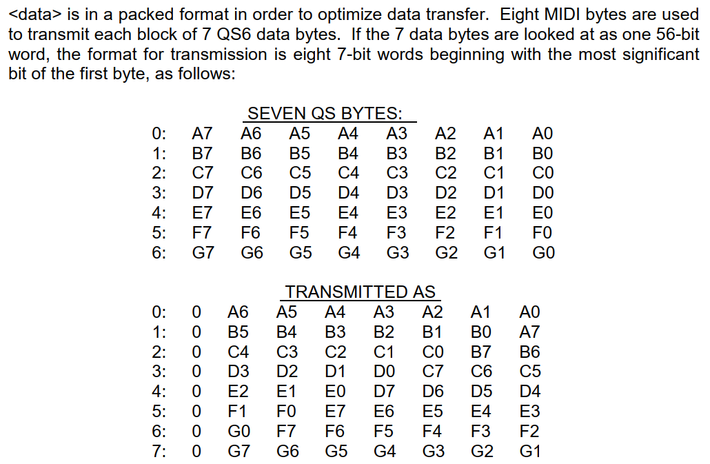

# MIDI System Exclusive

This is a very special kind of MIDI messages which open the door to vendor specific content.

- They can be used to **save** and **restore** the settings of a device
- They can be used to modify settings which are not visible on the front panel of the device

Unfortunately, most messages are not properly documented so this area requires a lot of **reverse engineering**.

👉 I built an API to handle all of this complexity. See chapter [Devices Library](#devices-library)

# JDK Bugs

If things was not already hard, we have also hidden bugs in some JDK related to receiving or sending SysEx.

- The bugs are all about long SysEx messages and how big is the OS driver buffer for the device.
- Basically some JDK are not happy when the OS driver decide to deliver a SysEx in multiple chunk of bytes.

Here what to know:

- There is an insane bug receiving big SysEx in `javax.sound.midi.MidiMessage` if it is too big for the OS driver
  - `javax.sound.midi.MidiMessage#getMessage()` give you a WRONG byte buffer with a FAKE final 0xF7 !
  - Fortunately `javax.sound.midi.SysexMessage#getData()` give you the right buffer so it is possible to understand you are receiving a **partial SysEX**
  - 👉 Our class `SysExMidiListener` take care of reconstructing the complete SysEx for you so you don't have to worry about all of this.
- Below JDK 23, sending big SysEx to a device may also send garbage. It happened to me with a Yamaha TG-500
  - Actually I compile in JDK 21 because of the mixture JavaFX/SceneBuilder/Intelliji/SpringBoot
  - But at runtime, the application should run in JDK 23

# Overview

## Hexadecimal

I hope you are fluent in Hexadecimal, because SysEx use them a lot.

- Hexadecimal is a different way to describe numbers using 16 symbols instead of 10.
- **Decimal** use 0,1,2,3,4,5,6,7,8,9
- **Hexadecimal** use 0,1,2,3,4,5,6,7,8,9,A,B,C,D,E,F
- Using both at the same time can be confusing. 10 in hexadecimal is not the same than 10 in decimal.
  - `$` and `0x` are often used to indicate an Hexadecimal number
  - Some device manuals don't use such prefixes so it is very easy to do mistakes
- Hexadecimal is great because one symbol take exactly 4 bits. It is called a **Nibble**.
- Expressing SysEx payloads in decimal would be a nightmare compared to Hexadecimal.

## Basics

A SysEx is a train of bytes delimited by `0xF0` and `0xF7`. 

- ⚠️The content NEVER use the first bit on the left, which is called MSB (Most significant bit). It has to be 0.
- You have the guaranty that all bytes in the content are in the range `[0-127]` or `[0x00-0x7F]`

```
F0 .... content .... F7
F0: SysEx START
F7: SysEx END
```

## The standard

There is a subset of messages which are part of the standard MIDI specification. 

- **Non-Real Time**: `F0 7E ... F7`
- **Real-Time** : `F0 7F ... F7`
- **Reserved for non-commercial use**: `F0 7D ... F7`

The overall format is:

```
F0 hh ii cc .... F7
hh: header (7E, 7F or 7D) for (Non-real time,real-time, reserved)
ii: DEVICE ID, 7F = broadcast/any
cc: Command
```

**Non real-time Commands**:

```
01: GM Dump header
02: GM Dump data
03: Sample Dump Standard (SDS)
04: -
05: Loop Point Transmission
06: General Information
07: File dump
08: -
09: GM System
...
```

The command **06 General Information** gives you access to sub-commands. We will take a look on one of them: **Inquiry Request**

```
F0 7E ii 06 cc F7
7E: NON REALTIME SysEx
ii: DEVICE ID, 7F = broadcast
06: General Information
cc: Sub Command
```

More info can be found [here](https://www.lim.di.unimi.it/IEEE/MIDI/SOT4.HTM).

## Device ID

The concept of **Device ID** is used to target a specific hardware in case you have more than one identical (same brand, same model). It was called **SysEx channel** but recent specifications prefer Device ID. The special value `0x7F` is used to target any device, it is like a **broadcast**.

⚠️ Do not mistake the **Device ID** with the **Model ID**. The Model ID is fixed and designate a specific hardware. The Device ID can be changed at will by the end user.

## Manufacturer ID

Since one byte is not enough, a special encoding is used to provides 16 bit identifiers when needed:

```
nn        8 bits identifier if not 0
00 mm nn  16 bit identifiier if 0
```

Examples:

- **Roland** is `0x41`
- **Korg** is `0x42`
- **Behringer** is `0x00 0x20 0x32`
- **Novation** is `0x00 0x20 0x29`

You can found various manufacturer lists on the Internet: [here](http://midi.teragonaudio.com/tech/midispec/id.htm), [here](https://electronicmusic.fandom.com/wiki/List_of_MIDI_Manufacturer_IDs) and [here](https://studiocode.dev/doc/midi-manufacturers/).

## Inquiry Message

This message is used to get informations from a device. It is part of the **General Information** command.

```
F0 7E ii 06 01 F7
7E: NON REALTIME SysEx
ii: DEVICE ID, 7F = broadcast
06: General Information
01: Sub Command: Identity Request (Inquiry)
```

Here a response from a **Korg NanoKey 2** controller

```
F0 7E 00 06 02 42 11 01 01 00 03 00 01 00 F7
7E: NON REALTIME SysEx
00: Device ID
06: General Information
02: Identity Response
42: Manufacturer ID => KORG
11 01 01 00 03 00 01 00 => KORG Specific response
```

Here a response from a **AKAI MPK 261** keyboard

```
F0 7E 00 06 02 47 25 00 19 00 01 00 00 00 00 12 7F 7F 41 31 32 31 30 31 31 35 35 37 32 35 30 37 37 00 F7
7E: NON REALTIME SysEx
00: Device ID
06: General Information
02: Identity Response
47: Manufacturer ID => AKAI
25 00 19 00 01 00 00 00 00 12 7F 7F 41 31 32 31 30 31 31 35 35 37 32 35 30 37 37 00 => AKAI Specific response
```

👉 Unfortunately this message is not always recognized.

## Edit Buffer

It is important to understand how devices handle their memory:

- Read Only Factory patches are in [ROM](https://en.wikipedia.org/wiki/Read-only_memory)
- Writeable Factory patches are in [EEPROM](https://en.wikipedia.org/wiki/EEPROM)
- Unsaved modifications are in [RAM](https://en.wikipedia.org/wiki/Random-access_memory)

When you select a patch from the factory patches, the device **copy** its content from ROM to RAM. This is commonly called the **Edit Buffer**

- If you **turn off** the device, the Edit Buffer is lost because it is in RAM
- Most of the time, the device offer you to **store** the Edit Buffer into an EEPROM slot
- Once saved, the EEPROM keep its content even the device is turned off.
- Some old devices need a CR2032 battery to keep EEPROM data.

How ROM/EEPROM/RAM is used depend on the device.

- Sometimes all factory patches are in EEPROM, sometimes only part of them. Typically the "User bank" is an EEPROM.
- Sometimes the device use 2 Edit buffers, one for regular patches, and another for drum patches.
- Sometimes the edit buffer is not immediately overriden when you change a patch, so it can be confusing.

👉 SysEx messages are used to read or write from/into EEPROM or RAM chips.

## Checksums

Some brands (Roland) use a checksum inside the SysEx message. This is not something hard to handle but you need to take care of this:

- A checksum is a number which must be added to the content of the SysEx in order to make 0. If not, a transmission error is detected.
- If your checksum is wrong, the device will never accept your message
- You need to know which portion of the payload is subject to the checksum, it is not always the same unfortunately
- Some checksum are more complex to compute than a simple addition, they involve XOR operation (bit inversion)

It is very handy to describe a checksum like this: `CK8`. It means "build a checksum with the last 8 bytes"

```
F041104611 00000000 00000110 CK8 F7
```

This mean the checksum is performed on `00000000 00000110` only.

## Decoding Key

Most devices keep things simple using only 7 bits of their memory to fit the restriction of MIDI SysEx. So what you receive is directly readable.

Unfortunately not all of them do that. So you have to convert 7 bit data to 8 bit data using a **Decoding Key** to retrieve a meaningful memory structure.

- The key is provided in the device documentation, for instance in Korg TR-Rack MIDI spec
- Sometimes the key is completely wrong, for instance in Alesis QS6.1 service manual. In this case this is a nightmare.

A decoding key looks like this:

```yaml
# Korg TR-Rack decoding key
decodingKey:
  start: 6
  end: 1
  key:
    - 0 G7 F7 E7 D7 C7 B7 A7
    - 0 A6 A5 A4 A3 A2 A1 A0
    - 0 B6 B5 B4 B3 B2 B1 B0
    - 0 C6 C5 C4 C3 C2 C1 C0
    - 0 D6 D5 D4 D3 D2 D1 D0
    - 0 E6 E5 E4 E3 E2 E1 E0
    - 0 F6 F5 F4 F3 F2 F1 F0
    - 0 G6 G5 G4 G3 G2 G1 G0
```

In this example, we start from byte 6 and we end just before `F7``

- `start` indicate where the decoding start in the MIDI response (from 0, where `F0` is)
- `end` indicate where the decoding end, from the end (the final `F7` byte). This upper bound is included.
- Most of the time `end` is 1, but sometimes we can use 2 to skip also the final checksum (see [M-Audio Venom](#venom))

8 bytes of MIDI contain 7 bytes of device memory. So the decoding operate 8 bytes after 8 bytes. Reading 56 significant bits.

- We name those 7 memory bytes A,B,C,D,E,F,G
- We name each of their bit from left to right 7,6,5,4,3,2,1,0
- This is called "MSB first" notation.
- You have also "LSB first" notation where 0 is the first bit on the left

So when you read the decoding key:

- `0 G7 F7 E7 D7 C7 B7 A7` means the very first MIDI byte contains the most significant bits of the next 7 device memory bytes.
-  `0` is here to say "this bit irrelevant" because MIDI SysEx bytes use only 7 bits of data.
- `0 A6 A5 A4 A3 A2 A1 A0` means the second MIDI byte contains 7 bit of the first byte in the device memory. So the first bit is missing and can be found in the previous MIDI byte.
- ...

What you want is to reconstruct the device memory which is:

```
A7 A6 A5 A4 A3 A2 A1 A0
B7 B6 B5 B4 B3 B2 B1 B0
C7 C6 C5 C4 C3 C2 C1 C0
D7 D6 D5 D4 D3 D2 D1 D0
E7 E6 E5 E4 E3 E2 E1 E0
F7 F6 F5 F4 F3 F2 F1 F0
G7 G6 G5 G4 G3 G2 G1 G0
```

Our method `ManufacturerSysExParser#unpackMidiBuffer()` implement the algorithm to decode all of this.

The decoding key can be horrible, this is the case of the Alesis QS6.1. I successfully reverted it after hours of trial and errors:

```yaml
decodingKey:
  start: 7
  end: 1
  key:
    - 0 A1 A2 A3 A4 A5 A6 A7
    - 0 B2 B3 B4 B5 B6 B7 A0
    - 0 C3 C4 C5 C6 C7 B0 B1
    - 0 D4 D5 D6 D7 C0 C1 C2
    - 0 E5 E6 E7 D0 D1 D2 D3
    - 0 F6 F7 E0 E1 E2 E3 E4
    - 0 G7 F0 F1 F2 F3 F4 F5
    - 0 G0 G1 G2 G3 G4 G5 G6
```

The manual was wrong:



# Uncharted territory

We are interring now in vendor specific SysEx.

- Pain Level 0: This involve digging in device owner manuals, knowing they are sometimes wrong
- Pain Level 1: Sometimes you have to found hidden SysEx commands used by closed-source applications
- Pain Level 2: Sometimes you have to reverse yourself the memory layout of your device

## Wireshark

[This tool](https://www.wireshark.org/) was primary designed to capture network packets, but it is now able to also capture USB packets and more especially **MIDI over USB**.

So it is perfect to "spy" what a proprietary application, dedicated to your hardware, does.

During the installation select "**Install USBCap**"


This will trigger the USBCap installer:


Select "Full":


Reboot, run WireShark and select "USBPcap1" as capture interface:


Now in the filter type `_ws.col.protocol == "SYSEX"`, this will display only MIDI SysEx messages over USB

## Example

Now it is time to run any editor for your MIDI device, let say [Korg Kontrol Editor](https://www.korg.com/us/support/download/product/1/133/), with the device **nanoKEY 2**

In the filter type `_ws.col.protocol == "SYSEX"`


You just have to click on any message to see the content:


Here the payload appear on the right: `F0 42 50 00 02 F7`. Sometimes Wireshark is able to understand the entire message, sometimes not. 

In this example, we can get information on Korg website about [nanoKEY2 MIDI Implementation](https://www.korg.com/us/support/download/manual/0/156/2709/)

```
F0 42 50 00 02 F7

F0: SysEx START
42: Manufacturer ID Korg
50: Search Device
00: Request
02: Echo back ID
F7: Sysex END
```

The next message is the response:


```
F0 42 50 01 00 02 11 01 01 00 03 00 01 00 F7

F0   : SysEx START                      
42   : Manufacturer ID Korg
50   : Search Device                              
01   : Reply                                      
00   : MIDI Global Channel  ( Device ID )   
02   : Echo Back ID                               
11 01: Model ID (nanoKey)
01 00: Member ID
03 00: Minor Version
01 00: Major Version 
F7   :Sysex END                           
```

👉 Note the presence of **Little endian** values: LSB first, MSB last. For instance **Major Version** value is `0x0001`, not `0x0100`

# Roland

Roland provides a relative good amount of information regarding their SysEx. 

- You will find SysEx descriptions at the end of any owner manual
- Unfortunately sometimes the information is wrong, especially on parameters addresses.
- They basically use SysEx to access to various **memory addresses** in the device in Read or Write.

The overall format of a command looks like this:

```
F0 41 dd mm cc ... F7
41: Manufacturer ID 'Roland'
dd: Device ID
mm: Model ID
cc: Command ID
```

Two types of communication are provided with their relative commands:

- **One Way** Transfer
  - `0x11 RQ1`: Data Request
  - `0x12 DT1`: Data Response
- **Handshaking** Transfer
  - `0x40 WSD`: Wait To Send Data
  - `0x41 RQD`: Request Data
  - `0x42 DAT`: Data Set
  - `0x43 ACK`: Acknowledge
  - `0x45 EOD`: End of Data
  - `0x4E ERR`: Communication Error
  - `0x4F RJC`: Rejection

## Packed bytes

Roland use this very specific format to encode 21 bit **addresses** and **sizes** into the SysEx message.

- The main idea is to produce bytes witch are always below `0x80`, so the first bit on the left is always Zero.
- This mean a 21 bits address like `0x1FFFFF` will be encoded in `0x7F7F7F` in the SysEx.
- I call this format **packed bytes**, because regular bytes are packed into 7 bit bytes

💀 This is, of course, a real pain to deal with: Try to add sizes to addresses to see what I mean.

## Nibbles

Roland use also **half bytes**, also called [Nibbles](https://en.wikipedia.org/wiki/Nibble) to store information in the device memory.

- This mean `0x7F` will be encoded into `0x070F`
- Don't worry, there is no such thing as packed Nibbles. This is painful enough like this.

Typically, you will found this encoding in **Bulk Dump** in their **Sound Canvas** devices.

## Bulk Dumps

Bulk Dumps is the term used by Roland to talk about **saving** and **restoring** device settings.

- When you trigger a dump from the device panel, a Bulk Dump is sent to your computer
- You can also programmatically query such dump with a `RQ1` message

Given what we saw, you are now ready to understand the calculations found in various Roland owner manuals. 

For instance the [Sound Canvas 55 Manual](https://en.wikipedia.org/wiki/Roland_SC-55) say this:

> Bulk Dump:
>
> PATCH ALL = (64 + (112 * 16)) = 0x740 bytes
>
> 0x740 * 2 (Nibbles) = 1D 00

First thing to understand: A bulk size is in **packed format**. So `0x1D00`  must be translated to the real size.

```
0x1D00 = 00011101 00000000
         00001110 10000000 // shift 1 bit on the right
       = 0xE80
       = 3712 bytes
```

So the bulk size is `3712` and we know the content is **nibbles** so the real size is 

```
3712 / 2 = 1856
         = 0x740
```

💀 Because of this, most of the documentation provided by Roland is a real nightmare to understand properly.

- They mix unpacked sizes with normal sizes
- They mix hexadecimal with decimal representation
- They mix nibble sizes with normal sizes

You have to understand that:

- Some memory sections are dedicated to Bulk dumps and are encoded in Nibbles
- Some memory sections are using regular bytes

For instance in their **Sound Canvas**:

- The address `0x400000` contains the **system parameters** in bytes
- The address `0x480000` contains the same thing in nibbles for a Bulk Dump

Most of the time they will describe precisely the first memory section, without explaining precisely the layout of the second section. Just know that everything will be **twice larger**. That's all.

# AKAI

AKAI doesn't provide a lot of information. This is the worst case. You can dump the memory with a SysEx but you have to understand yourself the layout

## MPK

Here how to query a MPK-249 or a MPK-261

```
F0 47 dd dd 20 00 03 ss aa aa F7
example:
F0 47 00 25 20 00 03 50 00 18 F7

F0 : SysEx START
47 : AKAI
dd : 00 24 : MPK-249
dd : 00 25 : MPK-261
ss : how many bytes to read
aa : where to read in memory
F7 : Sysex END
```

# Behringer

Behringer provide a little bit of information but they don't provide all of it. You are supposed to use their closed-source application to edit parameters of your device (typically this is the case for their [Neutron](https://en.wikipedia.org/wiki/Neutron_(synthesizer))). In this case, with the right tool, you can discover which SysEx are send by their application.

## Dump Request

```
F0 00 20 32 28 7F 05 F7

F0      : SysEx START
00 20 32: Manufacturer ID Behringer
7F      : DEVICE ID (Broadcast)
05      : Dump request
F7      : Sysex END
```


# Korg

Similar to Behringer, Korg won't give you much information about their SysEx. You have to use their closed-source application to edit device settings. In this case, with the right tool, you can discover which SysEx are send by their application.

Nevertheless you can found some information for various devices:

- [nanoKEY MIDI Implementation ](https://www.korg.com/us/support/download/manual/1/250/2712/) (surprisingly nothing is provided for [nanoKEY Studio](https://www.korg.com/us/support/download/product/0/551/))
- [nanoKEY2 MIDI Implementation](https://www.korg.com/us/support/download/manual/0/156/2709/)
- [nanoKontrol MIDI Implemntation](https://www.korg.com/us/support/download/manual/1/252/2713/)
- [nanoKontrol2 MIDI Implementation](https://www.korg.com/us/support/download/manual/0/159/2710/)
- [Korg M1 Owner Manual](https://www.korg.com/us/support/download/manual/1/139/1685/)

## Overview

Most Korg SysEx follow this scheme:

```
F0 42 xy yy ... F7

F0: SysEx START
42: Manufacturer ID Korg
 x: Format
 y: Device ID, also called Global Channel
 ...
F7: Sysex END
```

The content of the message depend of the **format** value.

- x = 3, format used by old models like a Korg **M1** or **Triton**
- x = 4, format used by recent models like a **NanoKey2** or **nanoKONTROL2**

We will focus on the last one.

## Models ID

Depending on the message, a **Model ID** appear in 16 bit or 24 bits.  You can also consider 32 bit ids if you include the **Sub ID**.

```
32 bit Model ID = 0x00mmmmss
mmmm = 16 bits Model ID
ss = Sub ID

NanoKey      = 0x00010200
NanoKey2     = 0x00011101
nanoKONTROL  = 0x00010400
nanoKONTROL2 = 0x00011300
```

## Member ID

The Member ID is the Korg Sub ID on 16 bits. Originally, it comes from standard **Inquiry messages**.

## Search Device

This message is used to identify recent Korg devices (NanoKey2, nanoKONTTROL2...). It is very close to the standard **Inquiry Message** we saw earlier.

Request:

```
F0 42 50 00 02 F7

F0: SysEx START
42: Manufacturer ID Korg
50: Search Device
00: Request
02: Echo back ID
F7: Sysex END
```

Response:

```
F0 42 50 01 00 02 11 01 01 00 03 00 01 00 F7

F0   : SysEx START                      
42   : Manufacturer ID Korg
50   : Search Device                              
01   : Reply                                      
00   : MIDI Global Channel  ( Device ID )   
02   : Echo Back ID                               
11 01: Model ID (nanoKey 2) in little endian
01 00: Member ID in little endian
03 00: Minor Version in little endian
01 00: Major Version in little endian
F7   : Sysex END        
```

Given the 16 bit **Model ID** and the 16 bit **Member ID** we can forge the 32 bit **Model ID** for the nanoKey2: `0x00011101`

The version in this example is **1.3**

## Data Dump

This message is used to **retrieve settings** from recent Korg devices (NanoKey2, nanoKONTTROL2...).

Request:

```
F0 42 40 00 01 11 01 1F 10 00 F7

F0         : SysEx START                      
42         : Manufacturer ID Korg
40         : Format and Device ID (4 = Format, 0 = Deivce ID)
00 01 11 01: Model ID (nanoKey2)
1F         : Data Dump Command
10         : Data Dump Request
00         : -
F7         : Sysex END   
```

Response:

```
F0 42 40 00 01 11 01 7F 4B 40 7A 00 7F 02 7F 7F
7F 7F 71 7F 40 01 7F 7F 7F 7F 03 7F 7F 01 01 00
00 7F 06 02 7F 7F 01 40 00 00 7C 7F 00 7F 7F 7F
7F 7F 7F 7F 7F 7F 7F 7F 7F 7F 7F 7F 7F 7F 7F 7F
7F 7F 7F 7F 7F 7F 7F 7F 7F 7F 7F 7F 7F 7F 7F 7F
7F 7F 01 7F F7

F0         : SysEx START                      
42         : Manufacturer ID Korg
40         : Device ID (0x4g where g = id)
00 01 11 01: Model ID (nanoKey2)
7F         : Data Dump Command
4B         : Data Dump size + 1
40         : Data Dump Type: Scene
...
0x4A bytes of content
...
```

## Decoding Key

Some vintage devices like the TR-Rack, use all 8 bits of their memory which is not compatible with the 7 bit requirement of SysEx. So the SysEx must use an encoding to convert a stream of bytes. This was explained earlier in the chapter [Decoding Key](#decoding-key)

# Yamaha

## Jargon

| Name                              | Description                                                  |
| --------------------------------- | ------------------------------------------------------------ |
| **Voice** Mode or **Single** Mode | Monotimbral mode. you can play only one preset               |
| **Performance** Mode              | Multi-timbral mode where you can play multiple presets in stack/layer or in keyboard split for a single midi channel |
| **Multi** Mode                    | Multi-timbral mode where 1 preset is assign to a specific midi channel |

Sometimes, the multi mode and the performance mode are the same:

- The TX-81z for instance, use Performance mode to talk about Multi mode
- The TG-33 talk about Multi-mode only

## Manuals

Yamaha did a fantastic job to provide all manuals for all devices including the old ones. You can get them in their library [here](https://usa.yamaha.com/support/manuals/index.html).

## Overview

Yamaha bulk requests are typed with ASCII identifiers like  `LM  0066SY`, `LM  0065VC` or `LM  0065DR`

- `LM` stands for "load memory" (apparently).
- Unlike Roland, memory locations are not pointed by addresses but by a tuple `<identifier,memory type,memory number>`
- Unlike Roland, there is no checksum in the request

Overall format is:

```
F0 43 2c 20 7A <IDENTIFIER> 0000000000000000000000000000 <MEMORY TYPE> <MEMORY NUMBER> F7
43: Yamaha
 c: receive channel typically 0x0
```

## TG-500

The TG-500 (rack version of the SY-85) is weird because it uses **2 edit buffers**: one for voices and one for drums.

- If you select a normal voice and ask for the drum edit buffer you won't get any response
- You have to select the right edit buffer given the current patch
- How to know if the current patch is a voice or a drum ? 
  - Voice 63 is ALWAYS a drum. that's all.
  - Voices from 0-62 are regular voices

| Bulk request type | Identifier   | memory type         | memory number |
| ----------------- | ------------ | ------------------- | ------------- |
| Normal Voice      | `LM  0065VC` | `0x00`: internal 1  | 0-62          |
|                   |              | `0x03`: internal 2  | 0-62          |
|                   |              | `0x7F`: edit buffer | 0-62          |
| Drum Voice        | `LM  0065DR` | `0x00`: internal 1  | 63            |
|                   |              | `0x03`: internal 2  | 63            |
|                   |              | `0x7F`: edit buffer | 63            |
| Performance       | `LM  0065PF` | `0x00`              | 0-63          |
| Multi             | `LM  0065MU` | `0x00`              | 0-9           |
| System setup      | `LM  0066SY` | `0x00`              | 0             |
| Sample            | `LM  0040SA` | `0x00`              | 0-63          |

Payload Example:

```
F0 43 20 7A <IDENTIFIER>         0000000000000000000000000000 <MEMORY TYPE> <MEMORY NUMBER> F7
F0 43 20 7A 4C4D2020303036355643 0000000000000000000000000000 03            04              F7
F0 43 20 7A LM  0065VC           0000000000000000000000000000 03            04              F7
=> Request a Bulk Dump for device 0x20 of the "Normal Voice" from "Internal 2", "number 4"
```

## TG-33

| Bulk request type | Identifier   |
| ----------------- | ------------ |
| Voice             | `LM  0012VC` |
| Voice Edit Buffer | `LM  0012VE` |
| Multi             | `LM  0012MU` |
| System            | `LM  0012SY` |

Payload Example:

```
F0 43 20 7A <IDENTIFIER>         0000000000000000000000000000 <MEMORY TYPE> <MEMORY NUMBER> F7
F0 43 20 7A 4C4D2020303036355643 0000000000000000000000000000 03            04              F7
F0 43 20 7A LM  0065VC           0000000000000000000000000000 03            04              F7
=> Request a Bulk Dump for device 0x20 of the "Normal Voice" from "Internal 2", "number 4"
```

## TX-81z

TX-81z follow a different scheme:

```1
F0 43 2c 20 <BULK TYPE> <IDENTIFIER> F7
43: Yamaha
 c: receive channel typically 0x0
BULK TYPE : 0x03, 0x04 or 0x7E
IDENTIFIER: no always required
```

This device is compatible with Yamaha DX-21/27/100 model so the memory is divided in two parts:

- **VCED** (Voice Edit): is common to all models
- **ACED** ( Additional Voice Edit): is specific to the TX-81z

The **presets** memory is divided in 6 sections:

| Memory                      | Number of presets | Note                            |
| --------------------------- | ----------------- | ------------------------------- |
| Edit Buffer                 | 1                 | RAM: Lost when power down       |
| I (user memory, "initials") | 32                | EEPROM: Lost if battery is dead |
| A1                          | 32                | ROM                             |
| A2                          | 32                | ROM                             |
| A3                          | 32                | ROM                             |
| A4                          | 32                | ROM                             |
| **TOTAL**                   | **160**           |                                 |

Bulk requests:

| Bulk request type                                            | Bulk Type | Identifier   |
| ------------------------------------------------------------ | --------- | ------------ |
| **VCED**:  Vocie Edit Buffer (for backward compatibility, does not include ACED) | 0x03      | N/A          |
| **VMEM**: Voice Memory Bulk (ACED+VCED for 32 presets "I")   | 0x04      | N/A          |
| **SCED**: ACED + VCED Edit buffer                            | 0x7E      | `LM  8976AE` |
| **PCED**: Performance Edit Buffer                            | 0x7E      | `LM  8976PE` |
| **PMEM**: 32 Performance Bulk (24 internals + 8 initials)    | 0x7E      | `LM  8976PM` |
| **SYS:** System Data                                         | 0x7E      | `LM  8976S0` |
| **SYS: **Program Change Table                                | 0x7E      | `LM  8976S1` |
| **SYS: **Effect Data                                         | 0x7E      | `LM  8976S2` |
| **Micro Tune**: Octave                                       | 0x7E      | `LM  MCRTE0` |
| **Micro Tune**: Full Keyboard                                | 0x7E      | `LM  MCRTE1` |

Payload Example:

```
F0 43 20 7E <IDENTIFIER>         F7
F0 43 20 7E 4C4D2020383937364145 F7
F0 43 20 7E LM  8976AE           F7
=> Request a Bulk Dump for device 0x20 of the "SCED"
```

This device does not understand the bank select MIDI message, so if you plan to scan all patches programmatically, it's gonna be fun:

- The default Program Change table give you only acces to bank I,A,B,C
- You need to make another one to access to bank D and Performances !

So if you want to select ANY patch, you need to send a SYEX to redefined the program change table. Something like this:

```
F0 43 00 7E 02 0A 'LM  8976S1' 01 00 01 01 01 02 01 03 01 04 01 05 01 06 01 07 01 08 01 09 01 0A 01 0B 01 0C 01 0D 01 0E 01 0F 01 10 01 
11 01 12 01 13 01 14 01 15 01 16 00 17 00 18 00 19 00 1A 00 1B 00 1C 00 1D 00 1E 00 1F 01 20 01 21 01 22 01 23 01 24 01 25 01 26 01 27 01
28 01 29 01 2A 01 2B 01 2C 01 2D 01 2E 01 2F 01 30 01 31 01 32 01 33 01 34 01 35 01 36 01 37 00 38 00 39 00 3A 00 3B 00 3C 00 3D 00 3E 00
3F 00 40 00 41 00 42 00 43 00 44 00 45 00 46 00 47 00 48 00 49 00 4A 00 4B 00 4C 00 4D 00 4E 00 4F 00 50 00 51 00 52 00 53 00 54 00 55 00
56 00 57 00 58 00 59 00 5A 00 5B 00 5C 00 5D 00 5E 00 5F 00 60 00 61 00 62 00 63 00 64 00 65 00 66 00 67 00 68 00 69 00 6A 00 6B 00 6C 00
6D 00 6E 00 6F 00 70 00 71 00 72 00 73 00 74 00 75 00 76 00 77 00 78 00 79 00 7A 00 7B 00 7C 00 7D 00 7E 00 7F CK266 F7
```

Wonderful isn't it ? Our **MPM** (Midi Patch Manager) handle this can of craziness.

## CS1x

This device uses 3 modes:

- **Performance**: use keyboard split or stacked sounds
- **XG** or **Multi**: you play up to 16 sounds per MIDI channel
- **TG300B**: General Midi standard to play midi files

⚠️Sadly there is no "Voice Mode" where you can just audit all possible patches.

The CS1x is a strange beast because it uses the **same model ID than the Yamaha  QS-300** but have a different memory content at the same time.

- "Native" SysEx requests use the QS-300 model ID `0x4B`
- "XG" Dump requests use the XG model ID `0x4C`

SysEx specification is available in page 21 of the document "CS1X DATA LIST" which can be downloaded from the Yamaha library [here](https://usa.yamaha.com/files/download/other_assets/9/318059/CS1xE2.pdf). Unfortunately it is not very clear to read.

The overall format looks like this:

```bash
F0 ii td mm aa aa aa F7

ii = Yamaha identifier = $43
t  = request type: 
	0 = Dump update
	1 = Parameter update
	2 = Dump request
	3 = Parameter request	
d  = device id = 0
mm =  model id
	$4B = Native, CS1X, performance mode
	$4C = XG, multi mode

aa = memory address

F043104B ... F7 # typical performance command
F043204C ... F7 # typical multi command
```

The memory layout for **performance mode** looks like this (See table `<2-1>` in the manual):

```
SYSTEM 
50 00 00 CS1x System

Current Performance (Edit buffer)
60 00 00 Current Performance Common
60 01 00 Current Performance Layer1
60 02 00 Current Performance Layer1
60 03 00 Current Performance Layer1
60 04 00 Current Performance Layer1

User Performance 1 
70 00 00 User Performance Common
71 00 00 User Performance Layer1
72 00 00 User Performance Layer2
73 00 00 User Performance Layer3
74 00 00 User Performance Layer4
...
User Performance 128
70 7F 00 User Performance Common
71 7F 00 User Performance Layer1
72 7F 00 User Performance Layer2
73 7F 00 User Performance Layer3
74 7F 00 User Performance Layer4
```

The memory layout for multi mode looks like this (See table `<1-1>` in the manual)::

```
MULTI PART 
08 00 00 Multi Part 1
...
08 0F 00 Multi Part 16
08 10 00 Reserved
```

Here some examples:

```bash
# change mode
# See table <2-2> in the manual
F043104B 50 00 06 mode F7
mode: 
	$03 = Performance mode
	$01 = XG mode (Multi)

# Edit buffer for Performance (Common parameters including performance name)
# Table <2-3> in the manual
F043204B 60 00 00 F7

# Edit buffer for Performance layer
# Table <2-4> in the manual
F043204B 60 layer 00 F7
layer: [1-4]

# Edit buffer for Multi part
# Table <1-5> in the manual
F043204C 08 part 00 F7
part: [0-15], the midi channel
```

Having fun: 

Since this device don't have a "Voice Mode", I made a `CS1XPresetGenerator` to generate SysEx for all possible voices of the device. Using MPM (Midi Preset Manager) it is now possible to audit all voices of the CS1x. I invite you to take a look on this class.

# Novation

Novation does not provide SysEx specification for their latest devices.

- They rely a lot on NRPN messages instead, which is a good idea to **write** into the device memory. But how to **read** ?
- Fortunately SysEx have been discovered to **read** the memory of the devices

```
F0 bb bb bb dd dd cc ..COMMAND.. F7
bb = brand = 00 20 29 = Novation
dd = device
    01 11 = Summit
    03 01 = Mininova
    01 20 = SuperNova
    01 21 = Nova
    33 00 = Bass station II
    03 03 = automap SLMKII
    02 0C = Launchpad X
    01 60 = Circuit
cc = device id (7F = any)
COMMAND = depend on the device
```

## Mininova

This device is one of those where all patches are in EEPROM so you can override everything. Fortunately a factory reset will return the patches to their default.

The COMMAND to request a patch memory is:

```
40 tt 00 00 bb pp
tt = type of patch 00=current edit buffer 01=ROM memory
bb = bank number 00 for edit buffer, [1-3] otherwise
pp = patch number [0-127]
```

Query the edit buffer:

```
F0 002029 03017F 40 000000 00 00 F7
```

Query bank patches:

```
F0 002029 03017F 41 010000 bank prg F7
# query patch 0 of bank 1
F0 002029 03017F 41 010000 01 00 F7 
# query patch 1 of bank 2
F0 002029 03017F 41 010000 02 01 F7 
```

The COMMAND to reboot the device in Firmware mode is:

```
F0 00 20 29 00 71 00 1E 00 00 01 01 06 09 F7
```

⚠️ This command will turn off the MIDI driver "Mininova" and start as special one called "Novation Mininova". It's like the Mininova change its USB ID.

This special mode is useful if you plan to do a factory reset.

## Summit

There is no official documentation for SysEx. Someone found a way to reverse it [here](https://docs.google.com/spreadsheets/d/1l2pmChldan5rKX16_9F1Q6kN67XePRF1hlxebOXR3lk/edit?gid=241618355#gid=241618355).

The COMMAND to request a patch memory is:

```
0133 40 000000 bank prg

bank 00 prg 00 => Edit Buffer
bank [1-4], prg [0-127] => Patches
```

Example to get the Edit buffer::

```
F0 002029 01 11 0133 40 000000 00 00 F7
```

The COMMAND to request a multi memory is:

```
0133 43 000000 bank prg
bank 00 prg 00 => Edit Buffer for Multi
bank [1-4], prg [0-127] => Multi
```

Example to get the Multi of bank 1, prg 2:

```
F0 002029 01 11 0133 42 000000 01 02 F7
```

THE COMMAND to request the multi edit buffer is:

```
0133 43 000000 00 00
```

Example:

```
F0 002029 01 11 0133 42 000000 00 00 F7
```

# Alesis

Alesis devices use all 8 bits of their memory which is not compatible with the 7 bit requirement of SysEx. So the SysEx must use an encoding to convert a stream of bytes. This was explained earlier in the chapter [Decoding Key](decoding-key)

## QS6.1

Get the current patch:

```
F0 00 00 0E 0E 03 00 F7
```

Get the current mix:

```
F0 00 00 0E 0E 0F 64 F7
```

The QS6.1 decoding key is wrong in the service manual. 

The memory layout is not limited to bytes. It is very compact so you need to read or write bit per bit. Very painfull.

## Micron

No SysEx specification for this device unfortunately. BUT, you can found a perl script written by Bret Victor himself in 2004 when he invented the Micron.

This script is called `ion_program_decoder.pl` and contains precious informations on the SysEx for the ION which is the big brother of the Micron (same device, more buttons).

💀How the Micron handle banks is insane.
 - On the device and in the manual there is PURPOSELY NO BANK CONCEPT (see chapter 18 page 31 'store a copy ?')
 - There is absolutely no official information on the real midi banks (Red,Green,Blue,Yellow,Edit terminology)
 - The mapping between the device memory and the control change contains holes !
 - So to get the complete list you have to brute force the 127 programs and see if the device respond to SYSEX

| Bank Name | Bank Select Number | Valid Program Change |
| --------- | ------------------ | -------------------- |
| Red       | 0                  | 10-92;94-127         |
| Green     | 1                  | 0-127                |
| Blue      | 2                  | 0-127                |
| Yellow    | 3                  | 0-127                |
| Edit      | 4                  | 0-66;68;70-95        |

Get the current patch:

```
F0 00 00 0E 26 41 bank 00 prg F7
bank 0=Red, bank 1=Green, bank 2=Blue, bank 3=Yellow (user), bank 4=Edit bank
prg = [0-3] for edit bank, [0-127] otherwise
```

Like the QS6.1 a **decoding key** must be used. The Micron key is very standard, in fact, it is the same than the Korg TR-rack whereas the QS6.1 key is pure madness.

# Evolution

## EVS-1

The EVS-1 is an interesting relic. MIDI specification can be found [here](// Install the all-trusting trust manager
        SSLContext sc = null;), unfortunately it is incomplete or wrong.

This synth use the following jargon:

- **Sound** = a preset or patch
  - Sounds 0 to 19 are writable: **user sounds**
  - Sounds 20 to 99 are in ROM: **factory sounds**
  - Sound 98 and 99 are PCM drum kits, then don't have settings you can query
- **Group** = a multi

⚠️Sadly this device does not support bank select messages, so you have to deal with a **Program Change table** like in the Yamaha TX-81z. Fortunately the default table allows you to select all sounds. Things get messy if you plan to select groups.

Request are in the form:

```
F000200801 20 tt <optional param> F7

tt = request type
<optional param> = "sound id" ou "group id"

"sound id" is in the range [0-97] because 98 and 99 are drum kits, they are excluded
```

| REQUEST TYPE | DESCRIPTION              | Example                  |
| ------------ | ------------------------ | ------------------------ |
| 00           | Single sound             | `F000200801 20 00 00 F7` |
| 01           | All sounds               | `F000200801 20 01 F7`    |
| 02           | Single group             | `F000200801 20 02 00 F7` |
| 03           | All groups               | `F000200801 20 03 F7`    |
| 04           | Program change table     | `F000200801 20 04 F7`    |
| 05           | Utility data             | `F000200801 20 05 F7`    |
| 06           | Undocumented but works ! | `F000200801 20 06 F7`    |
| 07           | Current group            | `F000200801 20 07 F7`    |

⚠️The undocumented part: **Strings are encoded with nibbles**

```
04 0A 07 05 06 0D 07 00 02 00 04 02 07 02 06 01 07 03 07 03
=
4A    75    6D    70    20    42    72    61    73    73
=
J     u     m     p     ' '   B     r     a     s     s
```

If you request the sound 00 with `F000200801 20 00 00 F7`:

- The sound name is at offset `$0A`, not `$80` as stated in the doc.
- You need to read 20 bytes to get 10 characters despite what is said in the doc.

Writing into the device also involve **nibbles**:

**Parameter Change** request is in the form:

```
F000200801 00 pp xx 04 v1 v2 F7

pp = param number
	00 : sound 00 name
	01 : sound 01 name
	...
	13 : sound 19 name
	14 : sound 00 settings
	15 : sound 01 settings
	...
xx = param offset
v1 = high nibble
v2 = low nibble
value = (v1<<4 | v2)
```

For instance to set the sound 03 name to 'Jump Brass'

```
F000200801 00 03 00 04 0A F7 => ASCII 4A => J
F000200801 00 03 01 07 05 F7 => ASCII 75 => u
F000200801 00 03 02 06 0D F7 => ASCII 6D => m
...
```

For instance to change the envelope settings of sound 00:

```
$14 = param 20 = sound data
offsets:
00 = Attack Rate
01 = Attack Level
02 = Decay Rate
03 = Decay Level
04 = Release Rate
05 = Release Level

F000200801 00 14 01 07 06 F7 => set Attack Level to $76
F000200801 00 14 00 0D 09 F7 => set Attack Rate to $D9
```

# M-Audio

## Venom

VENOM MIDI implementation can be found in the manual [here](https://synth.market/media/shop_items_docs/M_Audio_Venom_UG_EN.pdf).

- Note the error page 91, Chapter "ACK", `0x7F` Command ID is **ACK**, not **Cancel** as stated
- The Venom use packed data, so a decoding key is required. It is a regular one (same as Korg), not a crazy one (like Alesis). This was explained earlier in the chapter [Decoding Key](#decoding-key)

**Inquiry Request** and response:

```
F0 7E 00 06 01 F7
F0 7E 7F 06 02 00 01 05 63 0E 04 41 31 31 35 34 F7
               00 01 05                          => M-Audio manufacturer ID
                        63 0E 04 41              => Unknown (Venom ID ?)
                                   " 1  1  5  4" => Firmware 1.15.4
```

**Requests format**:

```
F0 00 01 05 21 00 cc aa aa aa ck F7
   00 01 05       => M-Audio manufacturer ID
            21    => Venom ID
               00 => Device ID
cc:
 00 Request ASCII code firmware version
 01 Request Data Dump
 02 Write Data Dump
 05 Recall Patch
 06 Store Patch
 09 Restore factory defaults
 7D Cancel data transfer
 7E Transfer received successfully (ACK), used when checksums are involved
 7F Transfer received unsuccessfully (NAK), used when checksums are involved
aa: memory address
ck: checksum (for dump only)
```

**Memory map**:

```
xx:
	00 = All Pacthes
	01 = Individual Patch
yy:	
	Patch number when xx = 01
	00 otherwise
zz: 
	packed 14 bit offset
	$0134 = 0000000100110100 packed 
	      =  0000001 0110100
	      =   00000010110100 unpacked
	      = $B4
	      = param 180 as stated in the doc
```


| Address  | Section                 | Field                        |
| -------- | ----------------------- | ---------------------------- |
| `00....` | Edit Buffer Dump        |                              |
| `000000` |                         | Global Edit Dump             |
| `000100` |                         | Single Edit Dump             |
| `000200` |                         | Multi Edit Dump              |
| `000300` |                         | Multi Part1 Edit Dump        |
| `000400` |                         | Multi Part2 Edit Dump        |
| `000500` |                         | Multi Part3 Edit Dump        |
| `000600` |                         | Multi Part4 Edit Dump        |
| `000700` |                         | Effect Edit Dump             |
| `000800` |                         | Arp Header Single Edit Dump  |
| `000900` |                         | Arp Header Part1 Edit Dump   |
| `000A00` |                         | Arp Header Part2 Edit Dump   |
| `000B00` |                         | Arp Header Part3 Edit Dump   |
| `000C00` |                         | Arp Header Part4 Edit Dump   |
| `000D00` |                         | Arp Pattern Single Edit Dump |
| `000E00` |                         | Arp Pattern Part1 Edit Dump  |
| `000F00` |                         | Arp Pattern Part2 Edit Dump  |
| `001000` |                         | Arp Pattern Part3 Edit Dump  |
| `001100` |                         | Arp Pattern Part4 Edit Dump  |
| `01xxyy` | Single Patch Dump       |                              |
| `02xxyy` | Multi Patch Dump        |                              |
| `03xxyy` | Arpeg Data Dump         |                              |
| `04xxyy` | Arpeg Pattern Dump      |                              |
| `05xxyy` | Single Name String      |                              |
| `06xxyy` | Multi Name String       |                              |
| `07xxyy` | Arpeg Name String       |                              |
| `08zzzz` | Edit Global Param       | 14 bit values                |
| `09zzzz` | Edit Single Param       | 14 bit values                |
| `0Azzzz` | Edit Multi Param        | 14 bit values                |
| `0Bzzzz` | Edit Multi Part1 Param  | 14 bit values                |
| `0Czzzz` | Edit Multi Part2 Param  | 14 bit values                |
| `0Dzzzz` | Edit Multi Part3 Param  | 14 bit values                |
| `0Ezzzz` | Edit Multi Part4 Param  | 14 bit values                |
| `0Fzzzz` | Edit Effect Param       | 14 bit values                |
| `10zzzz` | Edit Arpeg Single Param | 14 bit values                |
| `11zzzz` | Edit Arpeg Part1 Param  | 14 bit values                |
| `12zzzz` | Edit Arpeg Part2 Param  | 14 bit values                |
| `13zzzz` | Edit Arpeg Part3 Param  | 14 bit values                |
| `14zzzz` | Edit Arpeg Part4 Param  | 14 bit values                |

**Firmware version** request and response:

```shel
F0 00 01 05 21 00 00 F7

F0 00 01 05 21 7F 76 65 6E 6F 6D 20 31 2E 31 ... F7
   00 01 05                                   => M-Audio manufacturer ID
            21                                => Device Class ID
               7F                             => ACK ?
                   76 65 6E 6F 6D 20 31 2E 31 => ASCII

venom 1.15.4-3904 by pmaresh on Thu Sep 29 09:53:21 2011 
*** (c) [2009] Avid Technology, Inc.  All rights reserved. 
*** Programmed by: Mark Palmer , Arp Code by Frank-Ulrich Bartscht 
*** S0-49 Velocity 00.05 by mpalmer 
***
```

Fun fact: `pmaresh` is **Peter Maresh**, a DSP programmer from Alesis now at [Apple](https://www.zoominfo.com/p/Peter-Maresh/1937666090)

**Edit Buffer** request and response:

```
F0 00 01 05 21 00 01 00 00 00 F7

response:
F0 00 01 05 21 7F 02 00 00 00 00 40 40 40 00 78 00 01 00 7F 01 7F 02 00 7F 7F 00 00 40 0B 01 7F 00 00 7B F7
                              <--- PACKED DATA -----------------------------------------------------> CK
Unpacked Data:
40 40 40 00 78 00 01 7F 01 7F 02 00 7F 7F 00 40 0B 01 7F 00 00
```

**Single PatchName** request and response:

```
F0 00 01 05 21 00 01 05 01 00 F7

Response:
F0 00 01 05 21 7F 02 05 01 00 00 56 65 6E 6F 6D 6F 75 00 73 20 20 5C F7
                              <--- PACKED DATA -----------------> CK

Unpacked Data:
56 65 6E 6F 6D 6F 75 73 20 20 00 00 00 00
V  e  n  o  m  o  u  s                         
```

**Single PatchName Param** request and response:

```
Request first character of Single Patch name:
As stated in the doc, $013C is the 14 bits address of the value, but we need to pack it
013C =    000001 00111100
     =  .0000010 .0111100 (expand every 7 bits)
     =  00000010 00111100 (Packed MIDI format where bit 8 has to be 0)
     = $13C

F0 00 01 05 21 00 01 09 01 3C F7

Response:     
F0 00 01 05 21 7F 02 09 01 3C 00 56 F7

0056 is the packed 14 bit value which is 56, the ASCII code of the first letter of the patch 'Venomous'
```


# Devices Library

I spent a considerable amount of my time to build this, hoping it will be helpful for those like me, who are using (vintage) hardware devices.

## Main idea

The main idea of the **Devices Library** is to define what is important about an hardware device in a single YAML file.

- This file can be easily read in any programming language
- It contains the SYSEX spec of the device including the "decoding key" to convert 7 bit MIDI data to 8 bit data.
- It defines how the device select patches and, believe me, there are a lot of ways 🤭
- It resolves the lack of information on SysEx which can be found here and there.

Optionally, it is possible to override such file in order to separate what is **dependent of your own setup** and what is not.

- For a given `Mininova.yaml` we define a `Mininova-user.yaml` to specify the MIDI ports of the device
- In this way you can install the latest library update without loosing your MIDI ports

Here a typical example: `DS-330-user.yml`

```yaml
deviceName: "DS-330"
brand: "Boss"
inputMidiDevice: "2- MIDISPORT Uno In"
outputMidiDevice: "2- MIDISPORT Uno Out"
```

In the same spirit you can add another file for the presets:

- For a given `Mininova.yaml` we define a `Mininova-presets.yaml` to add the list of thousands device patches
- In this way we can auto-generate the preset list without touching the core specification of the device
- You can make your own list in another file like `Mininova-user-presets.yaml` 

At runtime, when the API load the library, those 3 files will be merged together providing everything required by the applciation.

👉 Take a look on the file `devices-library/Template.yml` to have more insights.

## Macros

Since dealing with SysEx is very painful, we provide two Java classes to help:

- `SysExBuilder` is able to parse strings containing complex payloads, including ranges, strings and macro. It produces real MidiEvents ready to be sent.
- `MidiLibrary` is the core API for the devices library. It read the YAML from disk and send/receive messages from/to the devices

Both works together to let you query various midi devices without too much pain.

We made 2 maven projects to demonstrate the use of the library:

- **MBT (Midi-Backup-Translator)** based on those two classes to give you an example of what you can do. It is a simple CLI.
- **MPM (Midi-Preset-Manager)** is a much more complex application with UI in JavaFX to manage the presets of all your devices

Here an typical definition of a Midi device in the library for the `Yamaha TG-500`:

```yaml
deviceName: "TG-500"
brand: "Yamaha"
macros:
  - "System Setup()           : 142 : F0 43 20 7A 'LM  0066SY' 0000000000000000000000000000 00 00      F7"
  - "Voice Internal 1(voice)  : 0F0 : F0 43 20 7A 'LM  0065VC' 0000000000000000000000000000 00 voice   F7"
  - "Voice Internal 2(voice)  : 0F0 : F0 43 20 7A 'LM  0065VC' 0000000000000000000000000000 03 voice   F7"
  - "Voice Edit Buffer(voice) : 0F0 : F0 43 20 7A 'LM  0065VC' 0000000000000000000000000000 7F voice   F7"
  - "Drum voice Internal 1()  : 2C5 : F0 43 20 7A 'LM  0065DR' 0000000000000000000000000000 00 3F      F7"
  - "Drum voice Internal 2()  : 2C5 : F0 43 20 7A 'LM  0065DR' 0000000000000000000000000000 03 3F      F7"
  - "Drum voice Edit Buffer() : 2C5 : F0 43 20 7A 'LM  0065DR' 0000000000000000000000000000 7F 3F      F7"
  - "Performance(perf)        : 122 : F0 43 20 7A 'LM  0065PF' 0000000000000000000000000000 00 perf    F7"
  - "Multi(channel)           : 120 : F0 43 20 7A 'LM  0065MU' 0000000000000000000000000000 00 channel F7"
  - "AllMulti()               : Multi([0-15])"
  - "AllVoiceInternal1()      : Voice Internal 1([0-62])"
  - "AllVoiceInternal2()      : Voice Internal 2([0-62])"
  - "AllVoiceEditBuffer()     : Voice Edit Buffer([0-62])"
  - "AllPerformances()        : Performance([0-63])"
  
```

👉 Take a look on the MBT manual to learn more.

## Patches

### Factory patches

The library provide all the necessary to query patches on a device:

Mode

- The device **mode** distinguish banks. Typically "Multi mode" or "Voice mode". You have often a button for it on the front panel of the device.
- The mode have a **mode select** command which is often a SysEx.

Bank

- The **bank** contains patches and belongs to a mode. It has a **bank select** command.
- The bank have a **preset domain**. It is simply a range of numbers pointing to a patch.
- The bank have a specific query to retrieve the name of a patch

Patch

- A **patch** belongs to a bank. It has a **program change** command. It also belongs to a category.

Category

- **Categories** belongs to the device but you can also have categories per mode.
- A **category** can use aliases when it is not available in the device memory. This is often the case for Yamaha. They use codes in the patch name.

How to select a preset ? The `presetFormat` is used for that.

```
NO_BANK_PRG      : Does not send bank select, send only Program Change
BANK_MSB_PRG     : Send CC "BANK Select MSB" only, then Program Change
BANK_LSB_PRG     : Send CC "BANK Select LSB" only, then Program Change
BANK_MSB_LSB_PRG : Send CC "BANK Select MSB" then "BANK Select LSB", then Program Change
BANK_PRG_PRG     : Send 2 Program Change. This weird mode is used in the Yamaha TG-77
```

Here an example for the Yamaha TG-33:

```yaml
presetFormat: BANK_MSB_LSB_PRG
deviceModes:
  Multi:
    command: setMultiMode()
    banks:
      "Preset 1 Multis":
        command: $0010
        queryName: getMultiName()
        presetDomain: 64-79
  Voice:
    command: setVoiceMode()
    banks:
      "Preset 1 Voices":
        command: $0002
        queryName: getVoiceName()
        presetDomain: 0-63
      "Preset 2 Voices":
        command: $0005
        queryName: getVoiceName()
        presetDomain: 0-63
      "Internal Voices":
        command: $0000
        queryName: getVoiceName()
        presetDomain: 0-63
    categories:
      - "Piano: AP"
      - "Keyboard: KY"
      - "Brass: BR"
      - "Wind: WN"
      - "String: ST"
      - "Guitar: GT"
      - "Bass: BA"
      - "Ensemble: ME"
      - "Organ: OR"
      - "Ethnic: FI"
      - "Synth Pad: SP"
      - "Synth Lead: SL"
      - "Synth Comp: SC"
      - "Combination : CO"
      - "Choir: CH"
      - "Chromatic Percussion: TP"
      - "Drum: DR"
      - "Percussion: MI"
      - "Sound FX: SE"
      - "Sequence: SQ"
```

Because we are using `BANK_MSB_LSB_PRG`, the bank select command will use 2 bytes: 

```yaml
command: $0005 
# $00 = BANK SELECT MSB
# $05 = BANK SELECT LSB
```

### SysEx patches

The devices library support **external patches** in SysEx format.

- Each file is supposed to be a single patch
- We provide an importer to extract patches from SysEx banks in `.MID` or `.SYX`
- The SysEx is supposed to modify only the device edit buffer (see chapter [overrides](#overrides))

They must be placed in the right folder:

```
library root/brand/device name/mode name/brank name/patch1.syx
library root/brand/device name/mode name/brank name/patch2.syx
library root/brand/device name/mode name/brank name/...
library root/brand/device name.yaml
```

The name of the SysEx is very important: `prefix [spec] name.syx` and `spec` can be `[command,category]` or just [category]`

```
000 [000000,Piano] AP Grand.syx
044 [000000,String] ST Treml.syx
258 [004000,Organ] OR Rock.syx
3F00-024 [Synth Comping] Nble.syx
```

- `prefix` is just informative and can help to sort patches
- `command` is optional and used to enforce a specific edit buffer in the device selecting a factory patch (performance, multi, voice...)
- `category` should match one of the category defined in the YAML file.

## Mappers

Mappers is one of the best feature of the library. This is a way to EXTRACT fields from a SysEx response.

Our `MidiPresetCrawler` use this to generate automatically the presets of a device.

Unfortunately this does not work for all devices because some of them (Roland Sound Canvas) does not provide patch names in the SysEx responses.

`presetNaming` indicate if we can use mappers or not:

```
STANDARD     : it is possible to get the patch name with SysEx
SOUND_CANVAS : Patch names are hardcoded in java application
```

Here an example for the Novation Summit:

```yaml
presetNaming: STANDARD
mappers:
  PatchMapper:
    fields:
      name:
        type: STRING
        offset: $0F
        size: 16
      category:
        type: CATEGORY
        offset: $1F
```

The mapper is bound a specific macro like this:

```yaml
macros:
  - "EditBuffer()               : F0 002029 03017F 40 000000 00 00 F7"
  # bank is [1,3] , prg is in [0,127]
  - "BankPatch(bank,prg)        : F0 002029 03017F 41 010000 bank prg F7"
  - "PatchName() : EditBuffer() : PatchMapper"
```

So when we query the macro `PatchName()` the message `F0 002029 03017F 40 000000 00 00 F7` will be send to the device and the mapper `PatchMapper` will scan the response.

- At offset `$1F` we should found a byte containing the code of a category
- At offset `$0F` we should found 16 bytes for the name of the current patch

Of course the category code must be an existing category index:

```yaml
categories:
  - None # match category code 0
  - Arp  # match category code 1
  - Bass # match category code 2
  - Bell # ...
  - Classic
  - DrumPerc
  - Keyboard
  - Synth Lead
  - Motion Synth
  - Synth Pad
  - Synth Poly
  - Sound FX
  - String
  - External Input
  - Vocoder/Tune
```

$05 is intended to be `DrumPerc`

Sometimes the patch name is in a weird format. This is the case with Alesis. they are stored in LSB first. here how to extract the name:

```yaml
      name:
        type: ALESIS_STRING
        unit: BIT
        offset: 8
        size: 10
```

By default the offset is in bytes, but here we change the unit to BIT to indicate we want to read the `ALESIS_STRING` bit per bit (in reverse order) at bit `$8`. The size remain in bytes.

In the same spirit we can extract a category code from only 6 bits:

```yaml
      category:
        type: CATEGORY
        unit: BIT
        lsbFirst: true
        offset: 81
        size: 6
```

Here we jump at bit 81 to read 6 bits in reverse order.

As you can see Mappers are very powerful but require a good understanding of the memory layout of the device.

## Overrides

This is **unique feature** is very handy: the ability to **modify imported SysEx** banks in order to operate ONLY on the device **edit buffer**.

- Most SysEx are delivered as `.MID` or `.SYX` files and contains MIDI messages that modify the EEPROM of the device.
- In 80s it was great but in 2025 with infinite storage in our PC this is not what we want
- What we want is to store patches on hard drive and override ONLY the Edit Buffer in device RAM.
- The Overrides do that. 

The class `PatchImporter` use those overrides to import patch banks into the library. As an example you can take a look on `MidiPresetCrawler` to see how it is used.

### Offsets

Here an example for the Novation Mininova:

```yaml
patchOverrides:
  - name: Default
    overrides:
      - offset: $07 # Edit Buffer message
        value: 00
      - offset: $0B # BANK
        value: 00
      - offset: $0C # PRG
        value: 00
```

This override modify 3 bytes in the payload to force the message to modify only the edit buffer. Of course this requires a deep understanding of the message structure.

### Condition

Sometimes the override is conditional because you can have multiple kind of messages. This is the case for the Yamaha TG-500:

```yaml
condition:
      offset: $06
      value: "'LM  0065DR'" # Drum Voice Patch
```

Here we check if the payload contains `LML  0065DR` at offset `$06`. If it is the case, the override is performed.

### Mode

Sometimes you need to force a specific mode. Remember patches belongs to a bank and banks belongs to a device mode.

```yaml
patchOverrides:
  - name: Performances
    mode: PerformanceMode
```

This will import the SysEx file in the right folder in the library

### Command

In the same spirit than `mode`, you can force a specific command to be executed before the SysEx patch is send (This does not happen during import of course)

```yaml
patchOverrides:
  - name: Performances
    command: $004000
```

For the Yamaha TG-500, we use `BANK_MSB_LSB_PRG` so `$004000` mean:

- Send a bank select MSB: `$00`
- Send a bank select LSB: `$40`
- Send a control change: `$00`

This command will select the first performance in order to switch the device in performance mode. If we skip this step, the edit buffer will not match the one in the SysEx (here `'LM  0065PF'`).

### Checksum

Since we modify the payload, the checksum need to be recomputed.

```yaml
 - offset: $ED
   value: CK231 # Checksum
```

Here we know the checksum is at position $ED and we instruct to compute it with the 231 previous bytes.

### Example

Here a complex example for the Yamaha TG-500. This device use multiple edit buffers so it is very complex.

- We define 3 different overrides conditioned to specific values in the payload: **Performance**, **Normal Voices** or **Drum Voices**
- When one of those overrides matches, it enforces the right Edit Buffer with a `command`
  - `$004000` select the first performance
  - `$000000` select the first voice
  - `$00003F` select the first drum kit
- Finally the checksum is updated

```yaml
patchOverrides:
  - name: Performances
    mode: PerformanceMode
    command: $004000
    condition:
      offset: $06
      value: "'LM  0065PF'" # Performance Patch
    overrides:
      - offset: $1E
        value: $7F # memory type: Edit Buffer
      - offset: $1F
        value: $00 # memory number
      - offset: $120
        value: CK282 # Checksum
  
  - name: Voices
    mode: VoiceMode
    command: $000000
    condition:
      offset: $06
      value: "'LM  0065VC'" # Voice Patch
    overrides:
      - offset: $1E
        value: $7F # memory type: Edit Buffer
      - offset: $1F
        value: $00 # memory number
      - offset: $ED
        value: CK231 # Checksum
  
  - name: Drum Voices
    mode: VoiceMode
    command: $00003F
    condition:
      offset: $06
      value: "'LM  0065DR'" # Drum Voice Patch
    overrides:
      - offset: $1E
        value: $7F # memory type: Edit Buffer
      - offset: $2C3
        value: CK701 # Checksum
```

# Memory Maps

## Overview

Our Devices Library is fine if you plan to do Backup and Restore queries, but when it comes to make a real synth editor, you need to understand every bit of the SysEx response. This is where you need a real memory map of the synth given a SysEx.

👉 Actually the Devices Library is independent of the following API, but things will change in the future.

👉 All of this API is actually in pause because the devices library is much more important to my use right now.

We need many things to handle SysEx:

- A parser, which is able to found which manufacturer and which model is involved
- A memory map to describe the content of the device
- A dumper, which is able to convert the device memory to readable text
- Utilities to handle checksums and packed bytes

## Bytes in Java

It is very unfortunate that Java does not handle **unsigned bytes**. A `byte` is always signed  so it can be negative. 

- This is why we prefer to return represent a byte with `int`, so the value is never negative.
- The class ` SysExReader` take care of this conversion:

```java
public int getByte() {
    return buffer.get() & 0xFF;
}
```

## MemoryMaps

First thing first, we need to consider a device memory as a group of small memory areas. It is not contiguous.

- Each memory area has an address and optionally a size (which is recalculated)
- Size and addresses are in packed bytes or not
- We call a memory area a `MemoryMap`, so a `*.mmap` file contains multiple `MemoryMap`.

### File format

Here how to write your map file:

```
@Model Boss DS-330
@Packed

@400000-000100 Zone 1
{
	... one or more fields ...
}

@400100 Zone 2
{
	... one or more fields ...
}
```

- `@Model` is used to name the memory map
- `@Packed` is used to indicate addresses and sizes are in packed format (used by Roland in their manuals).
- `@400100 Zone 2` define an area in the device memory without its size.
- `@400000-000100 Zone 1` is the same but indicate its size.
- `#` can be used to put a comment

⚠️ Our parser is very simple so the syntax is very rigid. It is not possible to put '{' in the same line of a memory area definition

### NIBBLES

If a memory zone use NIBBLES, you just have to do this:

```
@480000-001D10 NIBBLES Bulk Dump
{
    BulkSystemParams
    BulkCommonPatchParams
    byte reserved[14]
    BulkPatchParams[16 block]
}
```

The parser will take care of all the conversions. So when you write `byte reserved[14]` the parser automatically understand `byte` is in fact 2 `nibble bytes` in the memory. So the real size will be 2*14 = 28 bytes instead of 14.

⚠️I found **fine tuning** parameters never use NIBBLES even they are in the middle of a Bulk Dump. We don't handle that for now. You will read `0400` instead of `00040000`

## Hexadecimal

All values are in hexadecimal except the dimensions of arrays.

## Enums

Enums can be used to express which values are allowed for a field

```
enum Switch
{
	Off
	On
}
```

Implicitly 0 if `Off` and 1 is `On`

It is typically used to list all the reverb types:

```
enum ReverbType
{
	ROOM_1
	ROOM_2
	ROOM_3
	HALL_1
	HALL_2
	GATE
	DELAY
	CROSS_DELAY
}
```

## Fields

A `MemoryArea` is made of memory fields.

- A memory field can be a **string** with a given size
- It can be an **array**, multidimentional or not. Optionally, each dimension can have a name.
- It can be a bunch of **bytes**
- It can be a **struct** which is also a set of memory fields

The overall format is:

```bash
<type or size> <field name>                                                     # for regular fields
<type or size> <field type> [<dimension size> <optional dimension name>,...]    # for arrays
```

### Raw types

```bash
byte  My Field Name 1 # Size = 1 byte
short My Field Name 2 # Size = 2 bytes
int   My Field Name 3 # Size = 4 bytes
long  My Field Name 4 # Size = 8 bytes
0C    My Field Name 5 # Size = 12 bytes
```

### Arrays

You can define an array like this:

```
01 Tune[128 Note]
```

This is an array of 128 entries of size 1 byte. The dimension is called `Note`.

```
PatchParams[16 block]
```

This is an array of 16 types **struct**. 

- The field don't have a name
- The dimension of the array is called `block`. 
- The struct name is called `PatchParams`. 
- The total size in bytes is  `sizeof(PatchParams) * 16` .

```
Tone[5 Part, 4 Section]
```

This is an array with 2 dimensions. 

- The first dimension is called `Part` 
- The second dimension is called `Section`. 
- The array type is called `Tone`

###  Strings

```
String Information[20]
```

- This is a string of size 20. 
- Like arrays, 20 is not in Hexadecimal

### Enums

```
PedalSwitchFunction Pedal Switch 1 Function
```

This is a field of type **Enum**. 

- It uses the enum called `PedalSwitchFunction` and its size is 1 byte.
- The name of the field is `Pedal Switch 1 Function`

## Dump

The class `DeviceMemoryDumper` will reveal the memory content of a device in readable text. 

- It uses the **visitor pattern**, so you can do anything you want with the memory content
- The method `dumpMemory` use a visitor to save everything to disk
- The CLI command `dumpMemory` use another visitor to forge SysEx requests to get the value from a real device

Here an example for a Roland D-70:

```
-------------------------------------
Roland D-70 Memory dump
-------------------------------------
Internal Memory Core 0x000000 (packed: 0x000000) 0x0000A8 (packed: 0x000128) BYTES
-------------------------------------
0x000000 (packed: 0x000000)=40              Internal Memory Core/SystemSetup/Master Tune
0x000001 (packed: 0x000001)=10              Internal Memory Core/SystemSetup/Control Channel
0x000002 (packed: 0x000002)=10              Internal Memory Core/SystemSetup/Unit Number
0x000003 (packed: 0x000003)=00 Off          Internal Memory Core/SystemSetup/Rx SysEx
0x000004 (packed: 0x000004)=00 Hold         Internal Memory Core/SystemSetup/Hold Pedal Function
0x000005 (packed: 0x000005)=00 MODULATION   Internal Memory Core/SystemSetup/Switch Pedal Function
0x000006 (packed: 0x000006)=01 On           Internal Memory Core/SystemSetup/Midi Out Link Mode
0x000007 (packed: 0x000007)=01 On           Internal Memory Core/SystemSetup/Local Mode
0x000008 (packed: 0x000008)="Ch 1      "    Internal Memory Core/[0]/MidiChannel/Name
0x000012 (packed: 0x000012)="Ch 2      "    Internal Memory Core/[1]/MidiChannel/Name
0x00001C (packed: 0x00001C)="Ch 3      "    Internal Memory Core/[2]/MidiChannel/Name
0x000026 (packed: 0x000026)="Ch 4      "    Internal Memory Core/[3]/MidiChannel/Name
0x000030 (packed: 0x000030)="Ch 5      "    Internal Memory Core/[4]/MidiChannel/Name
0x00003A (packed: 0x00003A)="Ch 6      "    Internal Memory Core/[5]/MidiChannel/Name
0x000044 (packed: 0x000044)="Ch 7      "    Internal Memory Core/[6]/MidiChannel/Name
0x00004E (packed: 0x00004E)="Ch 8      "    Internal Memory Core/[7]/MidiChannel/Name
0x000058 (packed: 0x000058)="Ch 9      "    Internal Memory Core/[8]/MidiChannel/Name
0x000062 (packed: 0x000062)="Ch 10     "    Internal Memory Core/[9]/MidiChannel/Name
0x00006C (packed: 0x00006C)="Ch 11     "    Internal Memory Core/[10]/MidiChannel/Name
0x000076 (packed: 0x000076)="Ch 12     "    Internal Memory Core/[11]/MidiChannel/Name
0x000080 (packed: 0x000100)="Ch 13     "    Internal Memory Core/[12]/MidiChannel/Name
0x00008A (packed: 0x00010A)="Ch 14     "    Internal Memory Core/[13]/MidiChannel/Name
0x000094 (packed: 0x000114)="Ch 15     "    Internal Memory Core/[14]/MidiChannel/Name
0x00009E (packed: 0x00011E)="Ch 16     "    Internal Memory Core/[15]/MidiChannel/Name
...
```

The Dump display addresses in **normal** and **packed** format, followed by the **content** and the **path**. As you can see when the field use an **Enum**, the enum value is displayed instead of the byte value (things like `On`, `Off`, `Hold` or `MODULATION`)

👉Given this dump, you can easily compare what you read with what the device manual tells you.

## SysEx parser

As an example, we provide a SysEx parser in the CLI with the command "parse".

### FORCE_DEVICE

- Because Roland use the same model ID for many Sound Canvas, you have to use `-DFORCE_DEVICE` to specify the right model.
- If the device is not a Sound Canvas, you don't need this setting

### parse

This command is able to parse a SysEx file and dump the corresponding device memory.

```
java -jar target\midi-workshop-0.0.1-SNAPSHOT.jar parse -i "sysex/Roland/D-70/D-70 reset.syx" -o "target/D-70 reset.dump.txt"
```

For complex files (Roland dumps), you need a corresponding map for the device otherwise an error will be thrown.

If the SysEx is a standard inquiry message you should get this:

```
Identity Response for KORG (device id: 0): 11 01 01 00 03 00 01 00
```

If it is a Sound Canvas (The **Boss DS-330** is a Sound Canvas) you need to do that:

```
java -DFORCE_DEVICE=DS-330 -jar target\midi-workshop-0.0.1-SNAPSHOT.jar parse -i "sysex/Roland/DS-330/Boss-DS-330-All.syx" -o "target/DS-330.dump.txt"
```

