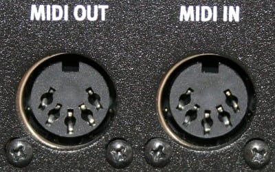

# MIDI vs Audio

It is very important to distinguish those two guys.

- **MIDI** is a way to send notes and gesture between devices but not sound. It's just little messages made of a **bunch
  of bytes**.
- **Audio** is just sound, there is no concept of notes or gesture here. It's a **stream of bytes** which must be very
  fast

💡 Since MIDI is a protocol, you can download the specification from the official
site [MIDI Association](https://www.midi.org/).

# In Real Life

## Connectors

A MIDI Plug is a [DIN connector](https://en.wikipedia.org/wiki/DIN_connector) transmitting bytes at 31.25 kbps. It has
been introduced in 1980 and it is still used today by musicians.

On the other side a typical Audio plug is a 3.5mm TRS connector transmitting **analogue sound** from a typical digital
signal at 1411 kbps (CD quality).

💡 So keep in mind **this is two different worlds in term of constraints**:

- MIDI is slow at 31.25 kbps
- Audio is really fast. It can run from 705.6 kbps (16 bits mono at 44.1Khz) to 13824 kbps (24 bits 5.1 Surround 96Khz)

This is why Audio applications are most of the time written in C++, but thanks to
the [JIT](https://en.wikipedia.org/wiki/Just-in-time_compilation), Java can do it as we will see !

## Devices

A typical setup, without a computer is the following:

- On the left you are using a MIDI keyboard which **does not produce sound**. It sends MIDI data to a Sound device so *
  *it produces MIDI data**.
- On the right this is a sound device which is capable of converting MIDI data to Audio. **It produces sound**.

# In Virtual Life

## USB

Nowadays it is very common to transmit MIDI or Audio over anything. So everything is virtual. You still transmit MIDI at
31.25 kbps but now, on a USB C connector which can go up to 10 Gbps.

The sound generator is now your PC and at some point you should see a "virtual MIDI input" in the settings despite there
is not a single DIN Connector in your setup.

- You play on a MIDI controller
- The computer receive MIDI over USB and transmit the data through **virtual MIDI cables**
- The MIDI data goes into virtual sound generators: The virtual instruments generate digital audio as output.
- The computer now deal with **virtual audio cables** and send the digital audio signal to an audio interface
- The audio interface (inside or outside the computer) convert the digital audio signal into **real analog signal** for
  the speakers

## Midi controller

As you saw, the Midi controller is the only thing "real" in this setup. You can buy one for 50€ and have fun, but it is
perfectly possible to use a virtual one ([VMPK](https://vmpk.sourceforge.io/) for instance).

## Virtual  instruments

Virtual instruments are the kings of this game. There are tons and tons of them at your disposal. Among many formats one
is clearly the most used: The [VST](https://en.wikipedia.org/wiki/Virtual_Studio_Technology) introduced by Steinberg in
1996.

# What you need to know

A VST is nothing more than a DLL which can be loaded into an application called a **Host**. Because of that:

- ⚠️ There is **no way** you can write a VST in Java because you can't load multiple JVM in the same process (The same
  goes for C# with the CLR).
- Nevertheless you can write a **standalone application** using virtual cables (MIDI and/or Audio) in Java.
- Thanks to the virtual cables, you can avoid the complexity of writing a complete application in one shot.
    - We can write some MIDI code and let the audio generated by an external application
    - We can write some AUDIO code and forget about MIDI
    - At the end we will do both at the same time.

# MIDI history

Created by Dave Smith in 1981, the MIDI is pretty impressive in the sense it is still relevant today.

Imagine that, Hans Zimmer (multi awarded composer of many blockbusters soundtracks), still use MIDI during his mega-concerts:

Those are two Native Instrument Keyboard S61 with Midi DIN Socket.

